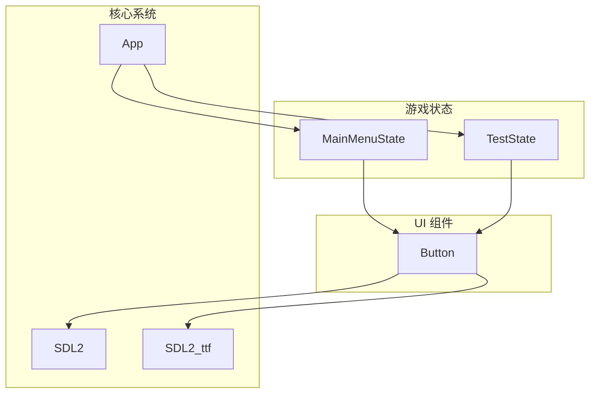
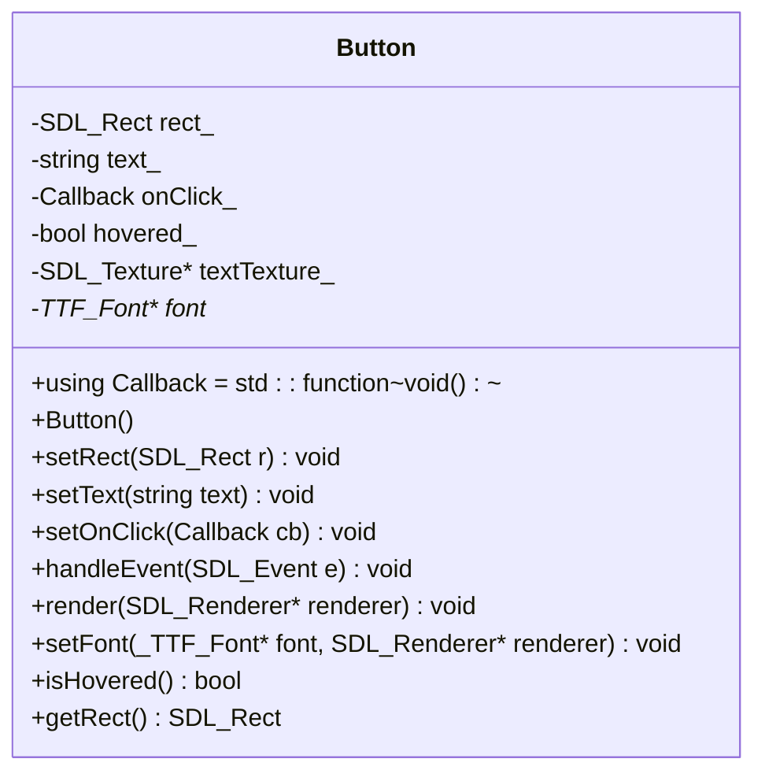
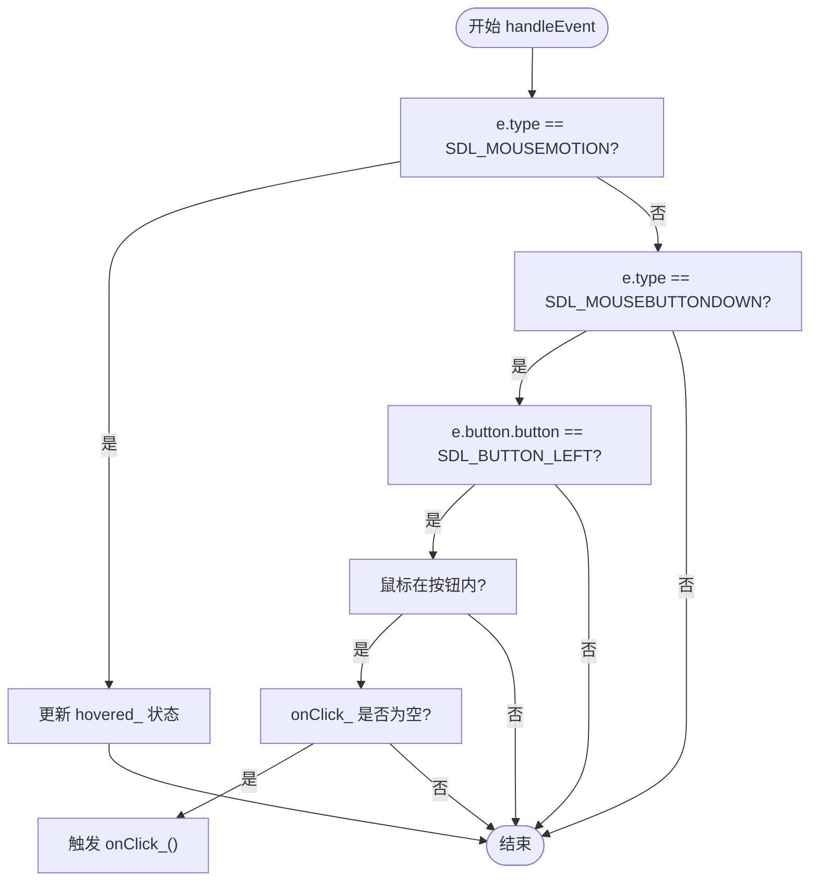
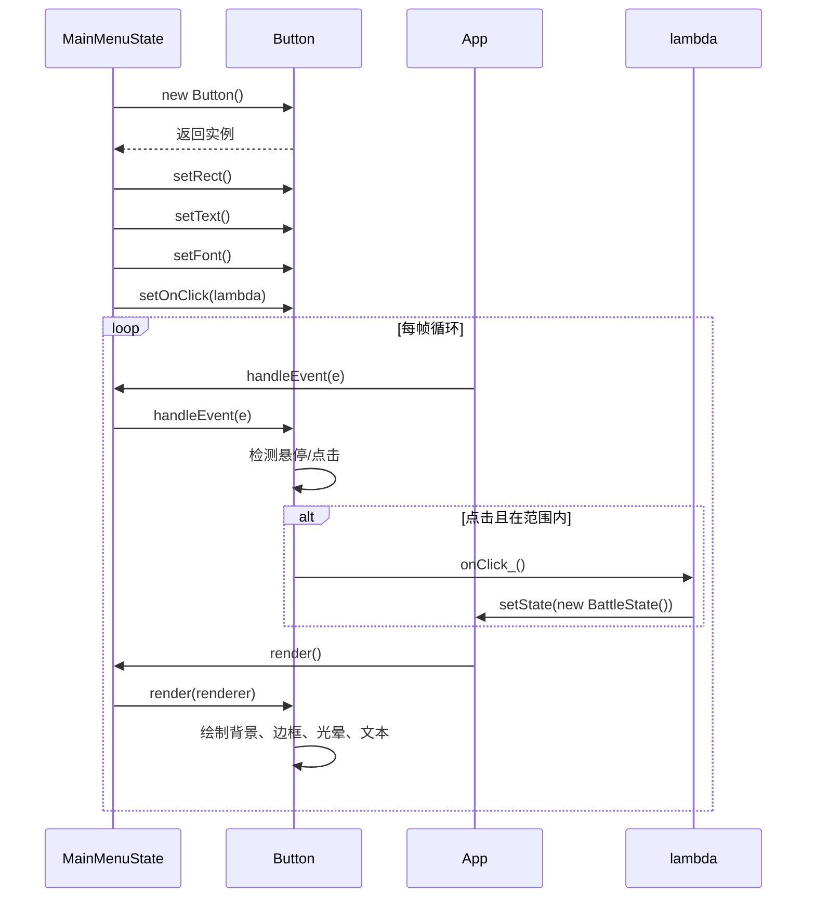
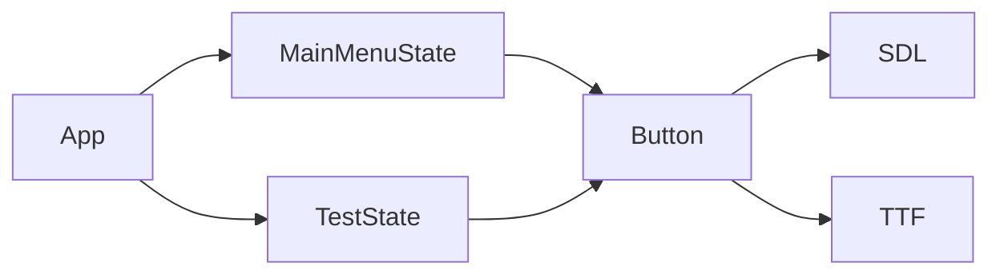

# UI组件系统

<cite>
**本文档中引用的文件**  
- [Button.h](file://Tracer/src/ui/Button.h)
- [Button.cpp](file://Tracer/src/ui/Button.cpp)
- [MainMenuState.cpp](file://Tracer/src/states/MainMenuState.cpp)
- [MainMenuState.h](file://Tracer/src/states/MainMenuState.h)
- [TestState.cpp](file://Tracer/src/states/TestState.cpp)
- [TestState.h](file://Tracer/src/states/TestState.h)
</cite>

## 目录
1. [简介](#简介)
2. [项目结构](#项目结构)
3. [核心组件](#核心组件)
4. [架构概述](#架构概述)
5. [详细组件分析](#详细组件分析)
6. [依赖分析](#依赖分析)
7. [性能考虑](#性能考虑)
8. [故障排除指南](#故障排除指南)
9. [结论](#结论)

## 简介
本文档旨在为`Button`类提供权威的技术文档，作为游戏`Tracer`中UI组件系统的核心部分。`Button`类封装了按钮的视觉表现、交互逻辑与事件响应机制，广泛应用于主菜单、测试界面等状态中。文档将深入解析其设计原理、使用方法、扩展可能性及当前系统的局限性。

## 项目结构
项目采用分层结构，将核心逻辑、游戏状态与UI组件分离。`Button`类位于`ui`目录下，是独立的UI控件。`states`目录下的各个状态类（如`MainMenuState`、`TestState`）负责创建和管理`Button`实例，实现具体的用户交互逻辑。

**Section sources**
- [Button.h](file://Tracer/src/ui/Button.h#L0-L32)
- [Button.cpp](file://Tracer/src/ui/Button.cpp#L0-L156)

## 核心组件
`Button`类是UI系统的核心，负责处理鼠标悬停、点击等交互，并通过回调函数实现业务逻辑解耦。它利用SDL2和SDL2_ttf库进行图形渲染和文本绘制，具备科技感的视觉特效。

**Section sources**
- [Button.h](file://Tracer/src/ui/Button.h#L0-L32)
- [Button.cpp](file://Tracer/src/ui/Button.cpp#L0-L156)

## 架构概述
UI系统采用组合模式，`Button`作为基础组件被`State`类聚合。`State`类在`onEnter`阶段创建`Button`对象，设置其位置、文本、字体和回调函数。在`handleEvent`和`render`阶段，`State`将事件和渲染请求转发给`Button`实例。

**Diagram sources**
- [Button.h](file://Tracer/src/ui/Button.h#L0-L32)
- [MainMenuState.cpp](file://Tracer/src/states/MainMenuState.cpp#L0-L401)
- [TestState.cpp](file://Tracer/src/states/TestState.cpp#L0-L260)

## 详细组件分析

### Button类分析
`Button`类的设计遵循单一职责原则，专注于按钮的交互与渲染。

#### 类图

**Diagram sources**
- [Button.h](file://Tracer/src/ui/Button.h#L0-L32)

#### 构造函数与初始化
`Button`的构造函数为默认构造函数，所有属性通过`set`系列方法进行初始化。这提供了极大的灵活性，允许在运行时动态配置按钮。

**Section sources**
- [Button.h](file://Tracer/src/ui/Button.h#L14)
- [Button.cpp](file://Tracer/src/ui/Button.cpp#L7)

#### 交互行为分析
`Button`的交互行为由`handleEvent`方法实现，该方法处理两种事件：`SDL_MOUSEMOTION`和`SDL_MOUSEBUTTONDOWN`。

- **悬停检测**：当鼠标移动时，计算鼠标坐标是否在按钮的`rect_`范围内，更新`hovered_`状态。
- **点击检测**：当鼠标左键按下时，同样检测坐标，若在范围内且`onClick_`回调函数已设置，则调用该回调。

**Diagram sources**
- [Button.cpp](file://Tracer/src/ui/Button.cpp#L33-L50)

#### 视觉特征与渲染流程
`Button`的`render`方法负责绘制其科技感的外观。

- **基础颜色**：根据`hovered_`状态选择深蓝或浅蓝作为填充色。
- **边框**：绘制明亮的蓝色边框。
- **悬停特效**：当`hovered_`为真时，通过`SDL_BLENDMODE_ADD`混合模式绘制多层光晕和角点光点，营造出强烈的发光效果。
- **文本绘制**：使用`SDL_ttf`将文本渲染到`textTexture_`，并在按钮中心绘制。悬停时，会额外绘制多层偏移的、半透明的文本阴影，形成类似CSS `text-shadow`的光晕效果。

**Section sources**
- [Button.cpp](file://Tracer/src/ui/Button.cpp#L52-L156)

### 典型使用模式
`Button`的典型使用模式在`MainMenuState`和`TestState`中体现。

#### 在MainMenuState中的使用
`MainMenuState`在`onEnter`方法中批量创建5个按钮。前4个为主功能按钮，通过`setOnClick`直接绑定回调函数。第5个为测试按钮，其逻辑在`handleEvent`中硬编码处理。

**Diagram sources**
- [MainMenuState.cpp](file://Tracer/src/states/MainMenuState.cpp#L72-L142)
- [Button.cpp](file://Tracer/src/ui/Button.cpp#L52-L156)

#### 在TestState中的使用
`TestState`创建了一个包含多个按钮的网格。它没有为每个按钮设置`onClick_`回调，而是在`handleEvent`中统一处理点击事件，通过检查点击坐标来确定是哪个按钮被点击，然后设置一个`pendingTarget_`标志，在`update`阶段再进行状态切换，避免了在事件处理中直接销毁当前对象的风险。

**Section sources**
- [TestState.cpp](file://Tracer/src/states/TestState.cpp#L126-L152)
- [TestState.cpp](file://Tracer/src/states/TestState.cpp#L154-L185)

## 依赖分析
`Button`类依赖于SDL2和SDL2_ttf库，用于图形渲染和字体处理。它被`MainMenuState`和`TestState`等游戏状态类所依赖，作为用户交互的入口。`State`类通过`App`对象获取`SDL_Renderer`和窗口信息。

**Diagram sources**
- [Button.h](file://Tracer/src/ui/Button.h#L1-L5)
- [MainMenuState.h](file://Tracer/src/states/MainMenuState.h#L1-L68)
- [TestState.h](file://Tracer/src/states/TestState.h#L1-L41)

## 性能考虑
- **纹理缓存**：`Button`类将文本渲染结果缓存为`SDL_Texture`，避免了每帧都重新渲染文本，提高了渲染效率。
- **事件过滤**：`handleEvent`方法只处理鼠标事件，减少了不必要的事件遍历开销。
- **潜在优化**：`render`方法在悬停时会创建多个临时的`SDL_Surface`和`SDL_Texture`用于光晕效果，这可能在大量按钮同时悬停时造成性能瓶颈，可考虑预生成光晕纹理。

## 故障排除指南
- **按钮不显示**：检查是否调用了`setRect`和`setFont`，并确保字体文件路径正确。
- **点击无反应**：检查`setOnClick`是否被正确调用，以及回调函数内部逻辑是否正确。
- **文本乱码**：确保使用`TTF_RenderUTF8_Blended`并传入UTF-8编码的字符串。
- **内存泄漏**：确保在销毁`Button`实例前，相关的`SDL_Texture`和`_TTF_Font`（如果由`Button`管理）已被正确释放。目前`Button`只管理`textTexture_`，字体由外部管理。

**Section sources**
- [Button.cpp](file://Tracer/src/ui/Button.cpp#L19-L28)
- [Button.cpp](file://Tracer/src/ui/Button.cpp#L52-L156)

## 结论
`Button`类是一个功能完整、视觉效果出色的UI组件，其设计清晰，易于使用。通过`Callback`机制实现了良好的解耦。当前系统仅支持按钮，未来可基于此模式抽象出`UIComponent`基类，派生出`TextBox`、`Slider`等组件，构建一个完整的UI框架。`TestState`中延迟状态切换的模式也值得在其他复杂交互中借鉴。