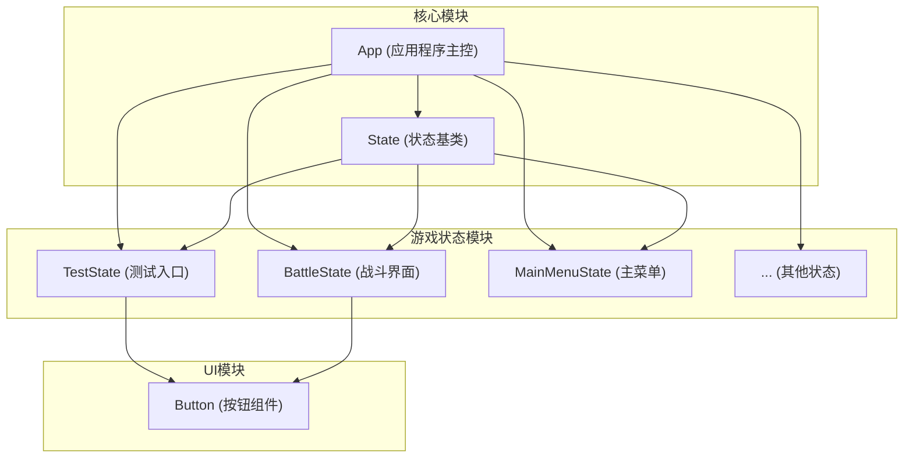
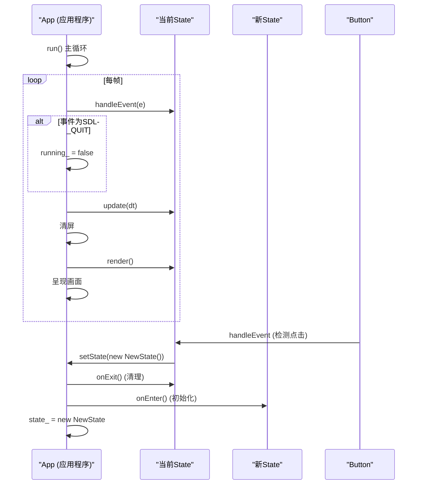
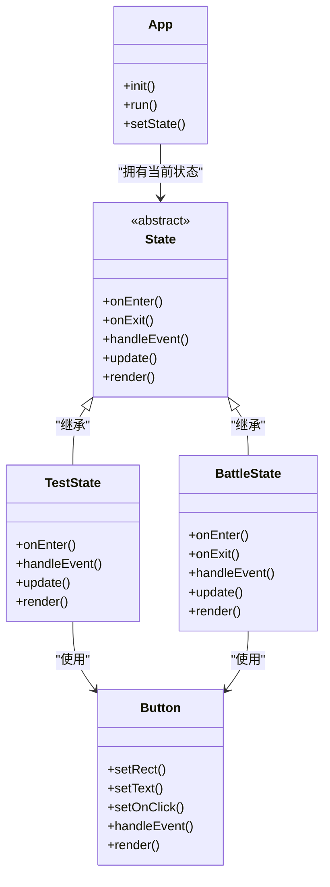

# 开发与调试指南

<cite>
**本文档中引用的文件**  
- [TestState.cpp](file://Tracer\src\states\TestState.cpp)
- [TestState.h](file://Tracer\src\states\TestState.h)
- [Button.cpp](file://Tracer\src\ui\Button.cpp)
- [Button.h](file://Tracer\src\ui\Button.h)
- [State.h](file://Tracer\src\core\State.h)
- [App.cpp](file://Tracer\src\core\App.cpp)
- [App.h](file://Tracer\src\core\App.h)
- [BattleState.cpp](file://Tracer\src\states\BattleState.cpp)
- [BattleState.h](file://Tracer\src\states\BattleState.h)
</cite>

## 目录
1. [简介](#简介)
2. [项目结构](#项目结构)
3. [核心组件](#核心组件)
4. [架构概览](#架构概览)
5. [详细组件分析](#详细组件分析)
6. [依赖分析](#依赖分析)
7. [性能考虑](#性能考虑)
8. [故障排除指南](#故障排除指南)
9. [结论](#结论)

## 简介
本文档旨在为开发者提供一份高效、友好的开发与调试操作指南，重点介绍如何利用 `TestState` 作为调试入口，快速验证游戏各功能模块。通过本指南，开发者将掌握新增游戏状态的标准流程、UI元素添加方法、日志与断点调试技巧，以及常见陷阱的规避策略。

## 项目结构

项目采用清晰的模块化结构，主要分为 `core`、`states` 和 `ui` 三个目录：

- `core/`：包含应用程序核心类 `App` 和游戏状态基类 `State`。
- `states/`：存放所有具体的游戏状态实现，如 `BattleState`、`MainMenuState` 等。
- `ui/`：包含用户界面组件，如 `Button`。



**图示来源**
- [App.h](file://Tracer\src\core\App.h#L7-L27)
- [State.h](file://Tracer\src\core\State.h#L6-L14)
- [TestState.h](file://Tracer\src\states\TestState.h#L6-L10)
- [BattleState.h](file://Tracer\src\states\BattleState.h#L13-L15)

**本节来源**
- [App.h](file://Tracer\src\core\App.h)
- [State.h](file://Tracer\src\core\State.h)
- [TestState.h](file://Tracer\src\states\TestState.h)
- [BattleState.h](file://Tracer\src\states\BattleState.h)

## 核心组件

### TestState：调试入口
`TestState` 是一个专门用于开发和调试的特殊游戏状态。它提供了一个包含所有其他游戏状态跳转按钮的界面，使开发者无需通过正常游戏流程即可直接进入任意状态进行独立测试。

其核心功能包括：
- **集中式入口**：通过一个网格布局的按钮列表，提供通往所有游戏状态的快捷方式。
- **延迟状态切换**：在 `handleEvent` 中记录待切换的目标，在 `update` 中执行实际的状态切换，避免在事件处理过程中销毁当前对象导致的未定义行为。
- **资源管理**：在析构函数中正确释放字体、纹理和按钮等动态分配的资源。

**本节来源**
- [TestState.cpp](file://Tracer\src\states\TestState.cpp#L1-L260)
- [TestState.h](file://Tracer\src\states\TestState.h#L6-L42)

### Button：UI基础组件
`Button` 类是构建用户界面的基础组件，封装了按钮的渲染、事件处理和回调逻辑。

其主要特性包括：
- **事件处理**：`handleEvent` 方法处理鼠标悬停和点击事件。
- **视觉反馈**：根据悬停状态 (`hovered_`) 改变按钮颜色，并在悬停时渲染蓝色荧光效果。
- **文本渲染**：支持通过 `setFont` 方法设置字体，并自动创建文本纹理。
- **回调机制**：使用 `std::function<void()>` 作为回调类型，允许在按钮被点击时执行任意函数。

**本节来源**
- [Button.cpp](file://Tracer\src\ui\Button.cpp#L1-L156)
- [Button.h](file://Tracer\src\ui\Button.h#L8-L31)

## 架构概览

系统采用基于状态机的架构，由 `App` 类作为主控，管理当前的 `State` 对象。



**图示来源**
- [App.cpp](file://Tracer\src\core\App.cpp#L50-L77)
- [State.h](file://Tracer\src\core\State.h#L6-L14)
- [Button.cpp](file://Tracer\src\ui\Button.cpp#L40-L50)

## 详细组件分析

### 如何利用TestState进行调试

`TestState` 是开发和调试的起点。它通过在 `onEnter` 方法中创建一系列按钮，每个按钮对应一个游戏状态。

**工作流程**：
1.  **进入状态**：当 `App` 调用 `TestState::onEnter` 时，它会加载字体、创建标题纹理，并初始化一个包含所有测试按钮的网格。
2.  **处理事件**：`handleEvent` 方法会处理返回按钮和所有测试按钮的鼠标事件。当检测到测试按钮被点击时，它不会立即切换状态，而是将目标状态的索引存储在 `pendingTarget_` 成员变量中。
3.  **更新状态**：在 `update` 方法中，`TestState` 检查 `pendingTarget_`。如果其值不为 `-1`，则根据该值创建相应的新状态对象，并通过 `app.setState()` 将其设置为 `App` 的新状态。
4.  **渲染界面**：`render` 方法负责绘制深色背景、标题、返回按钮和所有测试按钮。

这种“延迟切换”机制是安全的，因为它避免了在事件处理函数中直接销毁当前 `TestState` 对象。

**本节来源**
- [TestState.cpp](file://Tracer\src\states\TestState.cpp#L50-L260)

### 如何添加新的测试按钮

要为一个新实现的游戏状态添加测试入口，只需在 `TestState` 的按钮标签列表中添加一个新的条目。

**步骤**：
1.  在 `TestState::onEnter` 方法中找到 `buttonLabels` 向量。
2.  在向量末尾添加新状态的中文名称，例如 `u8"新状态名称"`。
3.  在 `handleEvent` 方法的 `switch` 语句中，为新按钮的索引添加一个 `case` 分支，并设置 `pendingTarget_` 为该索引。
4.  在 `update` 方法的 `switch` 语句中，为 `pendingTarget_` 的该值添加一个 `case` 分支，并在其中创建新状态的实例。

**本节来源**
- [TestState.cpp](file://Tracer\src\states\TestState.cpp#L100-L120)

### 如何新增一个游戏状态

创建一个新的游戏状态需要遵循以下标准步骤：

1.  **创建头文件和源文件**：
    *   在 `states/` 目录下创建两个新文件，例如 `NewState.h` 和 `NewState.cpp`。
    *   头文件应继承自 `State` 类，并重写 `onEnter`、`onExit`、`handleEvent`、`update` 和 `render` 五个虚函数。

2.  **实现虚函数接口**：
    *   在 `NewState.cpp` 中实现上述五个函数，定义新状态的初始化、清理、事件处理、逻辑更新和画面渲染逻辑。

3.  **在TestState中添加跳转入口**：
    *   按照上一节的说明，修改 `TestState` 的代码，为其添加一个测试按钮。

4.  **编译验证**：
    *   编译项目，确保没有语法错误，并能成功进入新状态。

**本节来源**
- [State.h](file://Tracer\src\core\State.h#L6-L14)
- [TestState.cpp](file://Tracer\src\states\TestState.cpp#L100-L120)

### 如何在现有状态中添加UI元素（以Button为例）

以 `BattleState` 为例，演示如何添加一个按钮。

**步骤**：
1.  **声明按钮指针**：在 `BattleState.h` 的私有成员中添加一个 `Button*` 指针，例如 `backToTestButton_`。
2.  **创建按钮**：在 `BattleState::onEnter` 方法中，使用 `new` 创建 `Button` 实例。
3.  **配置按钮**：
    *   使用 `setRect` 设置按钮的位置和大小。
    *   使用 `setText` 设置按钮显示的文本。
    *   （可选）使用 `setFont` 设置字体（如果状态有字体资源）。
    *   使用 `setOnClick` 设置点击回调函数，通常使用 lambda 表达式来捕获 `this` 指针并调用成员函数或修改状态。
4.  **处理事件**：在 `BattleState::handleEvent` 方法中，调用 `backToTestButton_->handleEvent(e)` 将事件传递给按钮。
5.  **渲染按钮**：在 `BattleState::render` 方法中，调用 `backToTestButton_->render(renderer)` 来绘制按钮。

**本节来源**
- [BattleState.h](file://Tracer\src\states\BattleState.h#L70-L71)
- [BattleState.cpp](file://Tracer\src\states\BattleState.cpp#L200-L220)

## 依赖分析

系统各组件之间的依赖关系如下：



**图示来源**
- [App.h](file://Tracer\src\core\App.h#L7-L27)
- [State.h](file://Tracer\src\core\State.h#L6-L14)
- [TestState.h](file://Tracer\src\states\TestState.h#L6-L10)
- [BattleState.h](file://Tracer\src\states\BattleState.h#L13-L15)
- [Button.h](file://Tracer\src\ui\Button.h#L8-L31)

## 性能考虑

*   **资源预加载**：`TestState` 在 `onEnter` 时加载字体和创建纹理，避免在每帧渲染时重复创建，提高了渲染效率。
*   **装饰效果优化**：`BattleState` 在 `onEnter` 时预计算了水墨装饰的坐标点，`render` 函数只需遍历这些点进行绘制，避免了每帧进行复杂的数学计算，减少了性能开销。
*   **纹理缓存**：`Button` 类在 `setFont` 时创建文本纹理，并在 `text_` 或 `font_` 变化前重复使用，避免了频繁的纹理创建和销毁。

## 故障排除指南

### 日志输出
项目中广泛使用 `SDL_Log` 进行日志输出。开发者应在关键函数的入口、资源加载、事件处理和错误检查点添加日志，例如：
```cpp
SDL_Log("TestState::onEnter - Start");
if (!font_) {
    SDL_Log("TTF_OpenFont failed: %s", TTF_GetError());
}
```
通过查看控制台输出，可以快速定位程序执行流程和错误原因。

### 断点调试
*   **Visual Studio**：在代码中设置断点，运行调试模式。可以检查变量值（如 `pendingTarget_`、`screenW_`）、调用堆栈和内存状态。
*   **GDB**：使用 `gdb ./Tracer` 启动调试器，通过 `break` 命令设置断点，`run` 启动程序，`step`/`next` 单步执行，`print` 查看变量。

### 常见陷阱与规避
1.  **忘记初始化SDL子系统**：确保在 `App::init` 中正确调用 `SDL_Init` 和 `TTF_Init`，并检查返回值。
2.  **资源路径错误**：`TestState` 加载字体时使用了相对路径 `"assets/fonts/Sanji.ttf"`。确保工作目录正确，或使用绝对路径。
3.  **事件处理遗漏**：在 `State` 的 `handleEvent` 方法中，必须调用所有UI组件（如 `Button`）的 `handleEvent` 方法，否则它们将无法响应用户输入。
4.  **内存泄漏**：所有通过 `new` 创建的对象（如 `Button`、`Texture`、`Font`）都必须在析构函数或 `onExit` 中通过 `delete` 或相应的 `SDL_Destroy*` 函数释放。
5.  **状态切换时机**：避免在 `handleEvent` 中直接调用 `setState` 来切换状态，应采用 `TestState` 的“延迟切换”模式，以防在事件处理过程中对象被销毁。

**本节来源**
- [App.cpp](file://Tracer\src\core\App.cpp#L15-L25)
- [TestState.cpp](file://Tracer\src\states\TestState.cpp#L50-L70)
- [Button.cpp](file://Tracer\src\ui\Button.cpp#L40-L50)
- [TestState.cpp](file://Tracer\src\states\TestState.cpp#L200-L220)

## 结论

`TestState` 是一个强大的调试工具，极大地简化了游戏开发的迭代过程。遵循本文档介绍的标准化流程——从新增状态、添加UI到调试技巧——可以显著提高开发效率。同时，严格遵守代码组织规范和规避常见陷阱，是保证项目稳定性和可维护性的关键。