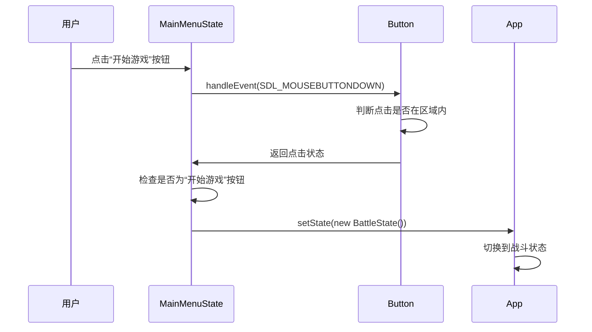

# 扩展UI元素

<cite>
**本文档引用的文件**  
- [Button.h](file://Tracer/src/ui/Button.h)
- [Button.cpp](file://Tracer/src/ui/Button.cpp)
- [MainMenuState.cpp](file://Tracer/src/states/MainMenuState.cpp)
- [MainMenuState.h](file://Tracer/src/states/MainMenuState.h)
- [App.h](file://Tracer/src/core/App.h)
- [State.h](file://Tracer/src/core/State.h)
</cite>

## 目录
1. [简介](#简介)
2. [按钮组件结构与参数](#按钮组件结构与参数)
3. [绑定点击事件](#绑定点击事件)
4. [按钮的添加与渲染](#按钮的添加与渲染)
5. [布局管理建议](#布局管理建议)
6. [功能扩展建议](#功能扩展建议)
7. [主菜单状态中的UI构建流程分析](#主菜单状态中的ui构建流程分析)
8. [注意事项与最佳实践](#注意事项与最佳实践)

## 简介
本文档深入讲解如何在当前项目架构下添加和定制用户界面（UI）元素，以 `Button` 组件为例。通过分析 `Button` 类的设计、其在 `MainMenuState` 中的实际应用，以及与状态管理和事件系统的集成方式，帮助开发者理解如何扩展和自定义UI元素，实现丰富的交互逻辑。

## 按钮组件结构与参数

`Button` 类是项目中用于实现可交互按钮的核心UI组件，位于 `Tracer/src/ui/Button.h` 和 `Tracer/src/ui/Button.cpp` 文件中。该类封装了按钮的视觉表现、事件响应和文本渲染功能。

### 构造函数与核心属性
`Button` 的默认构造函数 `Button()` 初始化一个空按钮对象，所有属性均设置为默认值。按钮的核心参数通过一系列 `set` 方法进行配置：

- **位置与尺寸**：通过 `setRect(const SDL_Rect& r)` 方法设置，`SDL_Rect` 结构体包含 `x`, `y`, `w`, `h` 四个成员，分别代表按钮在屏幕上的左上角坐标及其宽度和高度。
- **文本内容**：通过 `setText(const std::string& text)` 方法设置按钮上显示的文本内容。
- **字体**：通过 `setFont(_TTF_Font* font, SDL_Renderer* renderer)` 方法指定渲染文本所使用的字体资源。该方法内部会根据当前文本和字体生成一个 `SDL_Texture` 用于高效渲染。
- **颜色主题**：颜色主题并非通过直接参数设置，而是由 `render()` 方法内部的逻辑决定。按钮根据其悬停状态 (`hovered_`) 使用不同的背景色和边框色，实现了科技感的视觉反馈。

```mermaid
classDiagram
class Button {
+using Callback = std : : function<void()>
+Button()
+setRect(SDL_Rect r)
+setText(string text)
+setOnClick(Callback cb)
+handleEvent(SDL_Event e)
+render(SDL_Renderer* renderer)
+setFont(_TTF_Font* font, SDL_Renderer* renderer)
+isHovered() bool
+getRect() SDL_Rect
}
class SDL_Rect {
+int x
+int y
+int w
+int h
}
Button --> SDL_Rect : "包含"
```

**图示来源**
- [Button.h](file://Tracer/src/ui/Button.h#L8-L31)

**本节来源**
- [Button.h](file://Tracer/src/ui/Button.h#L8-L31)
- [Button.cpp](file://Tracer/src/ui/Button.cpp#L12-L156)

## 绑定点击事件

`Button` 组件通过回调机制实现点击事件的绑定，这是实现交互逻辑的关键。

### setOnClick 方法
`setOnClick(Callback cb)` 方法接受一个 `std::function<void()>` 类型的函数对象作为参数。这个函数对象将在按钮被点击时被调用。

```cpp
// 示例：设置退出按钮的点击回调
buttons_[3]->setOnClick([&app]() { 
    SDL_Event quit; 
    quit.type = SDL_QUIT; 
    SDL_PushEvent(&quit); 
});
```

### 事件处理流程
点击事件的处理流程在 `handleEvent(const SDL_Event& e)` 方法中完成：
1.  当接收到 `SDL_MOUSEBUTTONDOWN` 事件时，检查鼠标点击位置是否在按钮的矩形区域内。
2.  如果点击在区域内且 `onClick_` 回调函数已设置，则调用该回调函数。

值得注意的是，在 `MainMenuState` 中，“开始游戏”按钮的跳转逻辑并未通过 `setOnClick` 设置，而是在 `handleEvent` 中直接处理，这可能是为了避免 `BattleState` 构造函数的复杂性或生命周期问题。



**图示来源**
- [Button.cpp](file://Tracer/src/ui/Button.cpp#L58-L73)
- [MainMenuState.cpp](file://Tracer/src/states/MainMenuState.cpp#L118-L133)

**本节来源**
- [Button.cpp](file://Tracer/src/ui/Button.cpp#L58-L73)
- [MainMenuState.cpp](file://Tracer/src/states/MainMenuState.cpp#L118-L133)

## 按钮的添加与渲染

将按钮集成到游戏状态中需要两个步骤：在状态类中声明按钮成员，并在渲染循环中调用其渲染方法。

### 成员变量声明
在 `MainMenuState` 类中，使用一个 `std::array<Button*, 5>` 数组来管理多个按钮指针。这种设计允许灵活地管理一组按钮。

```cpp
// MainMenuState.h
private:
    std::array<Button*, 5> buttons_ {nullptr, nullptr, nullptr, nullptr, nullptr};
```

### 初始化与添加
在 `onEnter` 方法中，为每个按钮指针分配内存并进行配置（位置、文本、字体、回调）。

```cpp
// MainMenuState.cpp
for (int i = 0; i < 5; ++i) owned.push_back(new Button());
buttons_[0] = owned[0];
// ... 其他按钮赋值
```

### 渲染调用
在 `render` 方法中，遍历 `buttons_` 数组，对每个非空按钮调用其 `render(SDL_Renderer* renderer)` 方法。

```cpp
// MainMenuState.cpp
for (size_t i = 0; i < buttons_.size(); ++i) {
    if (buttons_[i]) {
        buttons_[i]->render(r);
        // ... 绘制装饰元素
    }
}
```

**本节来源**
- [MainMenuState.h](file://Tracer/src/states/MainMenuState.h#L15-L66)
- [MainMenuState.cpp](file://Tracer/src/states/MainMenuState.cpp#L48-L55)
- [MainMenuState.cpp](file://Tracer/src/states/MainMenuState.cpp#L348-L368)

## 布局管理建议

当前项目中的按钮布局是通过硬编码的坐标计算实现的，例如使用 `cx` 和 `cy` 计算中心对齐的垂直排列。

### 相对坐标
推荐使用屏幕分辨率的百分比或相对位置来计算坐标，以提高在不同分辨率下的适应性。

```cpp
// 示例：使用相对坐标
int cx = static_cast<int>(screenW_ * 0.5f - bw * 0.5f);
int cy = static_cast<int>(screenH_ * 0.4f);
```

### 布局容器（扩展建议）
为了管理更复杂的UI，建议扩展一个简单的布局容器类，例如 `VerticalLayout` 或 `GridLayout`。

```cpp
// 伪代码：垂直布局容器
class VerticalLayout {
public:
    void addWidget(Button* button, int spacing = 10);
    void setPosition(int x, int y);
    void render(SDL_Renderer* renderer);
private:
    std::vector<Button*> widgets_;
    int x_, y_, spacing_;
};
```

这种容器可以自动计算子元素的位置，极大地简化了UI的构建和维护。

## 功能扩展建议

`Button` 类的设计具有良好的扩展性，可以通过继承或修改现有类来添加新功能。

### 悬停动画
当前已实现基础的悬停光晕效果。可以进一步扩展，例如：
- 添加平滑的过渡动画（使用 `update` 方法中的 `dt` 参数）。
- 实现图标缩放或颜色渐变。

### 声音反馈
可以在 `handleEvent` 方法中，当检测到鼠标进入或点击时，调用音频系统播放音效。

```cpp
// 扩展思路
void Button::handleEvent(const SDL_Event& e) {
    if (e.type == SDL_MOUSEMOTION) {
        // ... 原有逻辑
        if (!hovered_ && newHoveredState) {
            // 播放鼠标进入音效
            AudioManager::playHoverSound();
        }
    }
    // ... 点击逻辑
}
```

### 图标支持
可以为 `Button` 类添加 `setIcon(SDL_Texture* icon)` 方法，并在 `render` 方法中绘制图标。

```cpp
// 扩展思路
class Button {
private:
    SDL_Texture* iconTexture_ = nullptr;
    SDL_Rect iconRect_; // 图标的位置和大小
};
```

## 主菜单状态中的UI构建流程分析

`MainMenuState` 是一个展示复杂UI构建流程的典型例子。

### onEnter 流程
1.  **初始化资源**：加载字体 (`font_`, `smallFont_`) 并创建标题纹理 (`titleTex_`)。
2.  **创建按钮**：动态分配 `Button` 对象，并将其指针存入 `buttons_` 数组。
3.  **配置按钮**：为每个按钮设置矩形区域、文本、字体，并为部分按钮绑定 `onClick` 回调。
4.  **初始化特效**：创建并配置数据流 (`streams_`)、装饰花纹 (`decorations_`) 和星光 (`stars_`) 等视觉元素。

### render 流程
1.  **绘制背景**：填充深色背景。
2.  **绘制特效**：依次绘制装饰花纹、星光和数据流。
3.  **绘制标题**：渲染标题纹理，并添加光晕和装饰线条。
4.  **绘制按钮**：遍历 `buttons_` 数组，调用每个按钮的 `render` 方法，并为其添加科技感装饰。

此流程清晰地展示了如何将静态UI元素与动态视觉效果结合，创造出丰富的界面。

**本节来源**
- [MainMenuState.cpp](file://Tracer/src/states/MainMenuState.cpp#L30-L380)

## 注意事项与最佳实践

在扩展和使用UI元素时，需注意以下几点：

### 字体资源有效性
在调用 `TTF_OpenFont` 后，必须检查返回的 `font_` 指针是否为 `nullptr`，并处理加载失败的情况，避免程序崩溃。

### 文本截断问题
当按钮的文本过长而按钮区域过窄时，文本可能会被截断。应确保 `textTexture_` 的宽度不超过按钮的宽度，或实现文本省略号（`...`）功能。

### 事件穿透处理
当前的 `handleEvent` 逻辑只处理了鼠标点击和移动。在更复杂的UI中，需要考虑事件的捕获和穿透。例如，当一个按钮被点击时，它应该“消耗”该事件，防止事件传递给其下方的其他UI元素或游戏场景。可以通过在 `handleEvent` 中返回一个布尔值（表示事件是否被处理）来实现。

### 内存管理
`MainMenuState` 使用了原始指针 (`Button*`) 和手动 `new` 操作。虽然在析构函数中会清理，但建议使用智能指针（如 `std::unique_ptr<Button>`）来自动管理内存，防止内存泄漏。