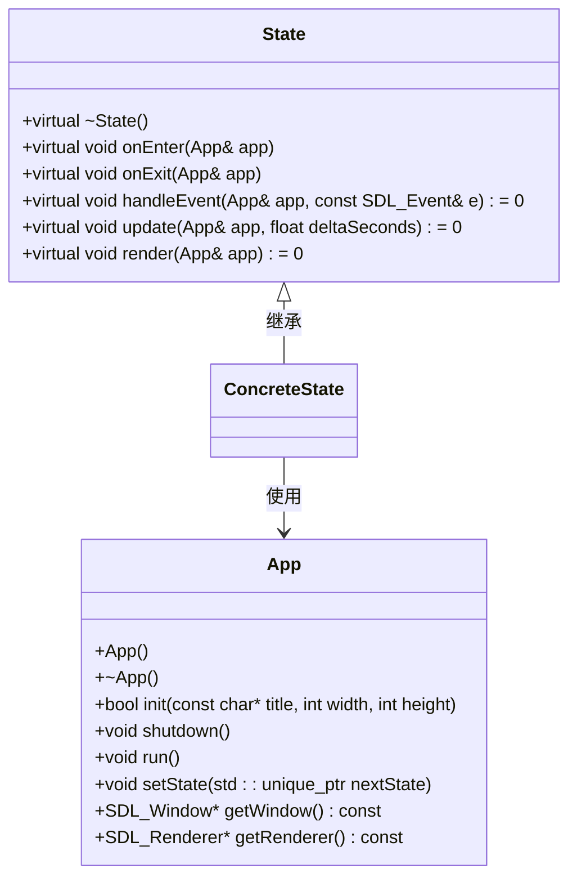
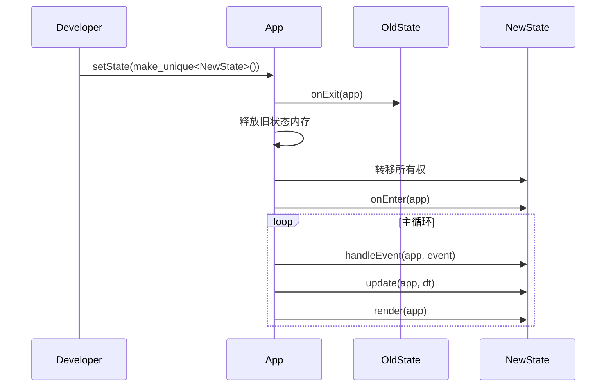

# 新增游戏状态

<cite>
**Referenced Files in This Document**   
- [State.h](file://Tracer/src/core/State.h)
- [App.h](file://Tracer/src/core/App.h)
- [TestState.h](file://Tracer/src/states/TestState.h)
- [TestState.cpp](file://Tracer/src/states/TestState.cpp)
</cite>

## 目录
1. [简介](#简介)
2. [核心组件](#核心组件)
3. [状态基类分析](#状态基类分析)
4. [状态管理机制](#状态管理机制)
5. [在测试界面中注册新状态](#在测试界面中注册新状态)
6. [完整实现流程](#完整实现流程)
7. [最佳实践与常见错误](#最佳实践与常见错误)

## 简介
本文档详细说明如何在项目中新增一个游戏状态。通过继承 `State` 基类并实现其核心接口，开发者可以创建自定义的游戏状态。文档涵盖从类定义、生命周期管理到在调试界面中注册入口的全过程，并强调使用智能指针、头文件保护等最佳实践。

## 核心组件

本节分析实现游戏状态所需的核心组件及其交互关系。

**Section sources**
- [State.h](file://Tracer/src/core/State.h#L6-L14)
- [App.h](file://Tracer/src/core/App.h#L7-L27)

## 状态基类分析

`State` 类是所有游戏状态的抽象基类，定义了状态机的核心行为契约。它采用依赖注入方式接收 `App` 实例引用，以访问窗口、渲染器等全局资源。



**Diagram sources**
- [State.h](file://Tracer/src/core/State.h#L6-L14)
- [App.h](file://Tracer/src/core/App.h#L7-L27)

### 接口函数说明
- **onEnter(App& app)**：状态进入时调用，用于初始化资源（如加载字体、创建UI组件）
- **onExit(App& app)**：状态退出前调用，必须在此释放所有分配的资源以防内存泄漏
- **handleEvent(App& app, const SDL_Event& e)**：处理SDL事件（如鼠标点击、键盘输入），为纯虚函数，必须实现
- **update(App& app, float deltaSeconds)**：每帧更新逻辑，处理游戏逻辑、动画等，为纯虚函数，必须实现
- **render(App& app)**：每帧渲染调用，负责绘制界面元素，为纯虚函数，必须实现

**Section sources**
- [State.h](file://Tracer/src/core/State.h#L6-L14)

## 状态管理机制

`App` 类通过 `std::unique_ptr<State>` 管理当前状态的生命周期，确保状态对象的安全转移和自动清理。`setState()` 方法接受一个 `std::unique_ptr<State>`，实现状态的无缝切换。



**Diagram sources**
- [App.h](file://Tracer/src/core/App.h#L19)
- [TestState.cpp](file://Tracer/src/states/TestState.cpp#L130-L135)

**Section sources**
- [App.h](file://Tracer/src/core/App.h#L19)
- [TestState.cpp](file://Tracer/src/states/TestState.cpp#L130-L135)

## 在测试界面中注册新状态

`TestState` 作为调试入口，允许开发者通过按钮直接跳转到目标状态。新增状态需在此界面中添加对应的跳转按钮。

### 按钮注册流程
1. 在 `TestState::onEnter()` 中创建新按钮并设置其位置和文本
2. 在 `handleEvent()` 中检测鼠标点击是否落在按钮区域内
3. 记录待切换的目标状态标识（使用 `pendingTarget_` 避免在事件处理中直接切换状态）
4. 在 `update()` 中根据 `pendingTarget_` 的值创建对应状态实例并调用 `setState()`

```mermaid
flowchart TD
A[onEnter] --> B[创建按钮]
B --> C[设置按钮文本和位置]
C --> D[存储按钮指针到testButtons_]
E[handleEvent] --> F[检测鼠标点击]
F --> G{点击在按钮上?}
G --> |是| H[设置pendingTarget_为目标ID]
G --> |否| I[忽略]
J[update] --> K{pendingTarget_ != -1?}
K --> |是| L[创建新状态实例]
L --> M[调用app.setState()]
M --> N[重置pendingTarget_]
K --> |否| O[跳过]
```

**Diagram sources**
- [TestState.cpp](file://Tracer/src/states/TestState.cpp#L100-L120)
- [TestState.cpp](file://Tracer/src/states/TestState.cpp#L130-L160)

**Section sources**
- [TestState.cpp](file://Tracer/src/states/TestState.cpp#L100-L160)

## 完整实现流程

以下是新增一个名为 `NewState` 的游戏状态的完整步骤：

1. **创建头文件 `NewState.h`**
   - 包含头文件保护
   - 继承自 `State` 类
   - 声明五个核心接口函数
   - 定义私有成员变量（如UI组件、资源句柄）

2. **创建源文件 `NewState.cpp`**
   - 实现 `onEnter()` 进行初始化（加载资源、创建按钮等）
   - 实现 `onExit()` 释放所有资源
   - 实现 `handleEvent()` 处理用户输入
   - 实现 `update()` 更新游戏逻辑
   - 实现 `render()` 绘制界面

3. **在 `TestState` 中注册入口**
   - 在 `buttonLabels` 向量中添加新状态的显示名称
   - 在 `handleEvent()` 和 `update()` 的 `switch` 语句中添加对应的目标ID分支
   - 确保目标ID唯一且不与其他状态冲突

4. **状态跳转**
   - 使用 `App::getInstance().setState(std::make_unique<NewState>())` 实现状态切换
   - 推荐在 `update()` 循环中调用以避免生命周期问题

**Section sources**
- [State.h](file://Tracer/src/core/State.h#L6-L14)
- [App.h](file://Tracer/src/core/App.h#L19)
- [TestState.cpp](file://Tracer/src/states/TestState.cpp#L100-L160)

## 最佳实践与常见错误

### 最佳实践
- **使用智能指针**：始终通过 `std::make_unique<T>()` 创建状态对象，由 `App` 管理生命周期
- **头文件保护**：所有头文件必须包含 `#pragma once` 或传统宏保护
- **资源管理**：在 `onExit()` 中释放所有在 `onEnter()` 或运行时分配的资源（如字体、纹理、动态内存）
- **避免直接访问SDL句柄**：通过 `App` 提供的接口（`getWindow()`, `getRenderer()`）间接访问

### 常见错误
- **未正确初始化渲染器**：在 `render()` 中使用 `getRenderer()` 前未确认其有效性
- **事件处理逻辑遗漏**：忘记在 `handleEvent()` 中调用子组件的事件处理函数（如按钮的 `handleEvent()`）
- **内存泄漏**：在 `onExit()` 或析构函数中未释放动态分配的资源
- **状态切换时机不当**：在 `handleEvent()` 中直接调用 `setState()` 可能导致当前对象在事件处理完成前被销毁
- **按钮ID冲突**：在 `TestState` 中为新状态分配了已使用的 `pendingTarget_` ID

**Section sources**
- [State.h](file://Tracer/src/core/State.h#L6-L14)
- [App.h](file://Tracer/src/core/App.h#L19)
- [TestState.cpp](file://Tracer/src/states/TestState.cpp#L100-L160)