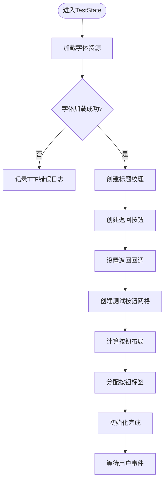

# 调试技巧与工具

<cite>
**本文档引用的文件**  
- [TestState.h](file://Tracer/src/states/TestState.h)
- [TestState.cpp](file://Tracer/src/states/TestState.cpp)
- [App.cpp](file://Tracer/src/core/App.cpp)
- [App.h](file://Tracer/src/core/App.h)
- [Button.cpp](file://Tracer/src/ui/Button.cpp)
- [Button.h](file://Tracer/src/ui/Button.h)
- [main.cpp](file://Tracer/src/main.cpp)
</cite>

## 目录
1. [使用TestState作为调试中枢](#使用teststate作为调试中枢)  
2. [配置IDE调试环境](#配置ide调试环境)  
3. [日志输出与事件追踪](#日志输出与事件追踪)  
4. [SDL错误捕获与问题定位](#sdl错误捕获与问题定位)  
5. [帧率控制与delta time调试](#帧率控制与delta-time调试)  
6. [条件编译控制调试功能](#条件编译控制调试功能)  
7. [常见运行时问题与解决方案](#常见运行时问题与解决方案)

## 使用TestState作为调试中枢

`TestState` 是项目中专为功能测试设计的核心调试状态，允许开发者快速跳转至任意游戏界面，无需手动操作即可验证各模块功能。该状态通过一个网格化的按钮界面，列出了包括主菜单、战斗、地图探索、文脉传承、牌库管理等在内的17个核心游戏状态，点击对应按钮即可立即切换。

`TestState` 的设计采用了延迟状态切换机制（`pendingTarget_`），避免在事件处理过程中直接销毁当前状态对象，从而防止潜在的内存访问错误。这种安全的切换方式确保了调试过程的稳定性。



**Diagram sources**  
- [TestState.h](file://Tracer/src/states/TestState.h#L9-L41)
- [TestState.cpp](file://Tracer/src/states/TestState.cpp#L30-L100)

**Section sources**  
- [TestState.cpp](file://Tracer/src/states/TestState.cpp#L30-L150)

## 配置IDE调试环境

为了高效调试本项目，建议使用 Visual Studio 或 VS Code 搭配 C++ 扩展进行开发。配置步骤如下：

1. **项目导入**：将 `Tracer` 项目导入 IDE，确保包含所有 `src` 子目录。
2. **编译器设置**：配置编译器以支持 C++17 或更高版本，并正确链接 SDL2 和 SDL2_ttf 库。
3. **断点设置**：在关键函数入口处设置断点，例如 `App::run()`、`State::handleEvent()` 和各状态的 `update()` 方法。
4. **变量监视**：在调试会话中监视 `App` 类的 `state_` 成员，观察状态机的切换过程；监视 `pendingTarget_` 变量，确认状态跳转逻辑正确。
5. **调用堆栈分析**：当程序崩溃或行为异常时，利用调用堆栈（Call Stack）回溯执行路径，定位问题源头。

例如，在 `TestState::handleEvent` 中设置断点，可以精确观察鼠标点击事件如何被分发到各个按钮，并检查 `pendingTarget_` 的赋值是否符合预期。

**Section sources**  
- [App.cpp](file://Tracer/src/core/App.cpp#L50-L76)
- [TestState.cpp](file://Tracer/src/states/TestState.cpp#L150-L180)

## 日志输出与事件追踪

项目中广泛使用 `SDL_Log` 进行日志记录，这是调试 SDL 应用程序的推荐方式。`SDL_Log` 会将消息输出到控制台或系统日志，便于追踪程序执行流程。

在 `TestState::onEnter` 中，代码通过一系列 `SDL_Log` 调用记录了从窗口尺寸获取、字体加载到按钮创建的完整初始化过程。例如：
- `SDL_Log("Screen size: %d x %d", screenW_, screenH_);` 记录屏幕分辨率。
- `SDL_Log("Fonts loaded successfully");` 确认字体资源加载成功。
- `SDL_Log("Button %zu created and added", i);` 在循环中记录每个按钮的创建状态。

这些日志信息对于诊断资源加载失败、布局错乱等问题至关重要。开发者可以据此判断问题发生在初始化的哪个阶段。

**Section sources**  
- [TestState.cpp](file://Tracer/src/states/TestState.cpp#L35-L45)
- [App.cpp](file://Tracer/src/core/App.cpp#L10-L15)

## SDL错误捕获与问题定位

当 SDL API 调用失败时，应立即调用 `SDL_GetError()` 获取详细的错误信息。项目中已正确实践了这一模式。

例如，在 `App::init` 中：
```cpp
if (SDL_Init(...) != 0) {
    SDL_Log("SDL_Init Error: %s", SDL_GetError());
    return false;
}
```
同样，在字体加载失败时：
```cpp
if (!font_ || !smallFont_) {
    SDL_Log("TTF_OpenFont failed: %s", TTF_GetError());
    return;
}
```

这些错误信息能帮助开发者快速定位问题，如：
- **纹理创建失败**：检查图片文件路径是否正确，格式是否为 SDL 支持的 BMP/PNG/JPG。
- **字体加载异常**：确认字体文件（如 `Sanji.ttf`）存在于 `assets/fonts/` 目录下，且文件未损坏。
- **窗口创建失败**：检查显卡驱动和 SDL 动态链接库（DLL）是否匹配。

**Section sources**  
- [App.cpp](file://Tracer/src/core/App.cpp#L10-L15)
- [TestState.cpp](file://Tracer/src/states/TestState.cpp#L60-L65)

## 帧率控制与delta time调试

游戏的 `update` 逻辑依赖于精确的 `delta time`（自上一帧以来的时间，单位为秒）。项目中通过 SDL 的高性能计数器实现：

```cpp
Uint64 prev = SDL_GetPerformanceCounter();
// ...
Uint64 now = SDL_GetPerformanceCounter();
double delta = (double)(now - prev) / (double)SDL_GetPerformanceFrequency();
```

此 `delta` 值被传递给 `state_->update(*this, static_cast<float>(delta))`，确保游戏逻辑与帧率解耦。

**调试建议**：
- 在 `update` 函数中添加日志，打印 `dt` 值，观察其是否稳定（理想情况下接近 1/60 ≈ 0.0167 秒）。
- 如果 `dt` 值过大，可能导致物理模拟或动画跳跃，应检查是否有耗时操作阻塞了主循环。
- 利用 IDE 的性能分析工具（Profiler）找出 `update` 或 `render` 中的性能瓶颈。

**Section sources**  
- [App.cpp](file://Tracer/src/core/App.cpp#L60-L63)

## 条件编译控制调试功能

虽然当前代码未显式使用 `#ifdef DEBUG`，但这是管理调试功能的最佳实践。建议将调试专用代码（如 `TestState`）包裹在条件编译块中：

```cpp
#ifdef DEBUG
    app.setState(std::make_unique<TestState>());
#else
    app.setState(std::make_unique<MainMenuState>());
#endif
```

这可以确保发布版本中不包含调试入口，避免用户误入测试界面。同时，可以将详细的日志输出也置于 `DEBUG` 宏下，以减少发布版本的运行时开销。

**Section sources**  
- [main.cpp](file://Tracer/src/main.cpp#L10-L12)

## 常见运行时问题与解决方案

### 问题1：窗口无响应
**可能原因**：主循环被阻塞，或事件队列未正确处理。  
**解决方案**：检查 `App::run()` 中的 `SDL_PollEvent` 循环是否完整执行，确保没有无限循环或耗时过长的 `update` 操作。

### 问题2：画面闪烁
**可能原因**：渲染逻辑错误，如未调用 `SDL_RenderClear` 或 `SDL_RenderPresent`。  
**解决方案**：确认 `App::run()` 中的渲染流程完整：`Clear -> Render -> Present`。检查是否有多个 `Present` 调用。

### 问题3：按钮无反应
**可能原因**：按钮的 `onClick_` 回调未设置，或事件未正确传递。  
**解决方案**：在 `Button::handleEvent` 中设置断点，确认 `SDL_MOUSEBUTTONDOWN` 事件被正确捕获。检查 `setOnClick` 是否被调用。

### 问题4：字体或纹理无法显示
**可能原因**：资源路径错误或资源加载失败。  
**解决方案**：检查 `SDL_Log` 输出，确认 `TTF_OpenFont` 和 `SDL_CreateTextureFromSurface` 是否成功。验证资源文件存在于正确的 `assets/` 子目录中。

**Section sources**  
- [Button.cpp](file://Tracer/src/ui/Button.cpp#L40-L50)
- [App.cpp](file://Tracer/src/core/App.cpp#L70-L75)
- [TestState.cpp](file://Tracer/src/states/TestState.cpp#L60-L65)