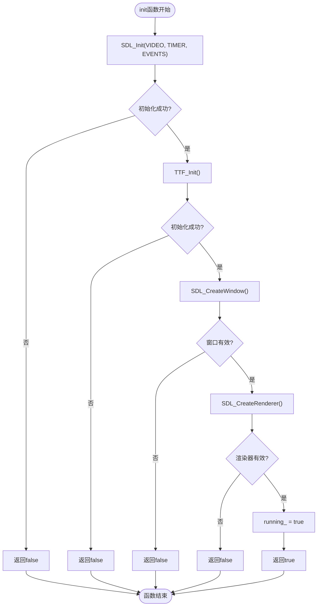
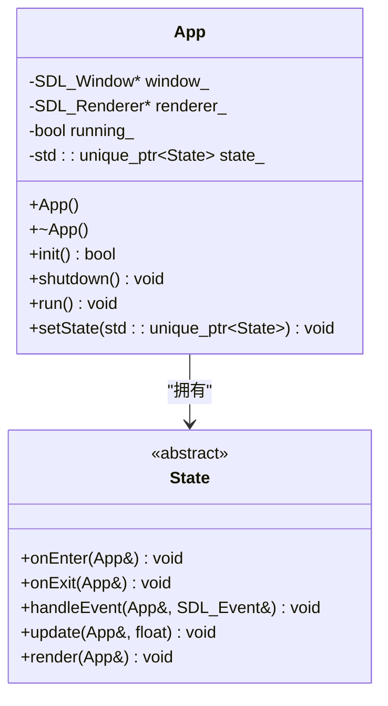

# 技术栈与依赖

<cite>
**本文档引用文件**  
- [App.cpp](file://Tracer/src/core/App.cpp)
- [App.h](file://Tracer/src/core/App.h)
- [Tracer.vcxproj](file://Tracer/Tracer.vcxproj)
</cite>

## 目录
1. [简介](#简介)
2. [C++语言标准要求](#c语言标准要求)
3. [SDL2与SDL2_ttf库的作用](#sdl2与sdl2_ttf库的作用)
4. [Windows平台开发环境配置](#windows平台开发环境配置)
5. [初始化流程分析](#初始化流程分析)
6. [字体资源管理与assets/fonts/目录设置](#字体资源管理与assetsfonts目录设置)
7. [最小依赖集与编译配置](#最小依赖集与编译配置)
8. [常见链接错误排查](#常见链接错误排查)
9. [RAII原则在资源管理中的应用](#raii原则在资源管理中的应用)
10. [结论](#结论)

## 简介
本指南详细说明了Tracer项目的技术栈构成与依赖配置，重点聚焦于C++17及以上语言标准的使用、SDL2和SDL2_ttf图形库的集成方式及其在窗口管理、事件处理、图形渲染和中文字体显示中的核心作用。同时提供Windows平台下完整的开发环境搭建步骤，并结合代码分析初始化流程、资源管理和常见问题解决方案。

## C++语言标准要求
本项目要求使用C++17或更高版本的语言标准。从`Tracer.vcxproj`文件中的`<ConformanceMode>true</ConformanceMode>`配置可知，项目启用了现代C++一致性模式，确保对标准特性的正确支持。此外，`<AdditionalOptions>/utf-8 %(AdditionalOptions)</AdditionalOptions>`表明源码采用UTF-8编码，兼容中文字符处理。

**Section sources**
- [Tracer.vcxproj](file://Tracer/Tracer.vcxproj#L65-L68)

## SDL2与SDL2_ttf库的作用
SDL2是本项目的核心多媒体框架，负责底层系统交互，包括：
- **窗口管理**：通过`SDL_CreateWindow`创建和管理主窗口
- **事件处理**：利用`SDL_PollEvent`捕获用户输入与系统事件
- **图形渲染**：使用`SDL_Renderer`进行硬件加速的2D图形绘制

SDL2_ttf扩展库则专注于文本渲染功能，特别是支持TrueType字体（TTF）的加载与显示，在中文界面显示中起关键作用。其通过`TTF_Init()`初始化并配合`TTF_OpenFont`实现字体资源加载。

**Section sources**
- [App.cpp](file://Tracer/src/core/App.cpp#L5-L10)
- [App.cpp](file://Tracer/src/core/App.cpp#L15-L18)

## Windows平台开发环境配置
在Windows平台上配置SDL2开发环境需完成以下步骤：

### 头文件包含路径设置
在Visual Studio项目中，需将SDL2和SDL2_ttf的头文件路径添加至包含目录：
- `D:\C++Project\SDL2-2.32.10\include`
- `D:\C++Project\SDL2_ttf-2.22.0\include`

这些路径已在`Tracer.vcxproj`的`<AdditionalIncludeDirectories>`中定义。

### 库文件链接设置
根据目标平台（x86/x64）选择对应的库目录，并链接必要的库文件：
- **库目录**：
  - x64: `D:\C++Project\SDL2-2.32.10\lib\x64`, `D:\C++Project\SDL2_ttf-2.22.0\lib\x64`
  - x86: `D:\C++Project\SDL2-2.32.10\lib\x86`, `D:\C++Project\SDL2_ttf-2.22.0\lib\x86`
- **链接库**：`SDL2.lib`, `SDL2main.lib`, `SDL2_ttf.lib`

上述配置已在`Tracer.vcxproj`的`<AdditionalDependencies>`和`<AdditionalLibraryDirectories>`中明确指定。

### 运行时DLL部署
为确保程序正常运行，必须将以下DLL文件复制到可执行文件同级目录：
- `SDL2.dll`
- `SDL2_ttf.dll`
- 若使用freetype后端，还需`zlib1.dll`和`freetype.dll`

**Section sources**
- [Tracer.vcxproj](file://Tracer/Tracer.vcxproj#L110-L114)
- [Tracer.vcxproj](file://Tracer/Tracer.vcxproj#L138-L142)

## 初始化流程分析
`App`类的`init`方法实现了SDL系统的初始化流程，其关键步骤如下：

1. **SDL子系统初始化**：调用`SDL_Init`并传入`SDL_INIT_VIDEO | SDL_INIT_TIMER | SDL_INIT_EVENTS`标志，启用视频、定时器和事件子系统。
2. **TTF字体系统初始化**：调用`TTF_Init()`初始化字体渲染引擎。
3. **窗口创建**：通过`SDL_CreateWindow`创建主窗口，若失败则记录日志并返回false。
4. **渲染器创建**：使用`SDL_CreateRenderer`创建硬件加速且垂直同步的渲染器。

该流程通过条件判断确保每一步初始化成功，否则立即返回错误状态，体现了健壮的错误处理机制。

**Diagram sources**
- [App.cpp](file://Tracer/src/core/App.cpp#L11-L30)

**Section sources**
- [App.cpp](file://Tracer/src/core/App.cpp#L11-L30)

## 字体资源管理与assets/fonts目录设置
为确保字体资源正确加载，项目应建立`assets/fonts/`目录用于存放.ttf或.otf字体文件。在代码中通过相对路径（如`"assets/fonts/simhei.ttf"`）调用`TTF_OpenFont`加载字体。建议将常用中文字体（如黑体、宋体）放入该目录，并在构建后事件中将其复制到输出目录，以保证运行时可访问。

## 最小依赖集与编译配置
项目编译所需的最小依赖集包括：
- **头文件**：`SDL.h`, `SDL_ttf.h`
- **静态库**：`SDL2.lib`, `SDL2main.lib`, `SDL2_ttf.lib`
- **运行时DLL**：`SDL2.dll`, `SDL2_ttf.dll`

Visual Studio项目已通过`Tracer.vcxproj`文件中的`<AdditionalDependencies>`正确配置这些依赖项，适用于Debug和Release配置的x64与x86平台。

**Section sources**
- [Tracer.vcxproj](file://Tracer/Tracer.vcxproj#L112-L113)

## 常见链接错误排查
**undefined reference to SDL functions** 类错误通常由以下原因引起：
1. **库未正确链接**：检查`AdditionalDependencies`是否包含`SDL2.lib`和`SDL2main.lib`
2. **库路径未设置**：确认`AdditionalLibraryDirectories`指向正确的`lib/x64`或`lib/x86`目录
3. **架构不匹配**：确保项目平台（x64/x86）与SDL库版本一致
4. **预处理器定义缺失**：需定义`SDL_MAIN_HANDLED`以避免main重定义冲突

可通过启用`<SDLCheck>true</SDLCheck>`增强编译时检查，辅助定位问题。

**Section sources**
- [Tracer.vcxproj](file://Tracer/Tracer.vcxproj#L109-L114)

## RAII原则在资源管理中的应用
本项目遵循RAII（资源获取即初始化）原则进行资源管理。`App`类在构造函数中初始化资源，在析构函数中调用`shutdown()`方法安全释放：
- 窗口与渲染器指针在销毁后置为`nullptr`
- 按逆序调用`TTF_Quit()`和`SDL_Quit()`清理子系统
- 使用`std::unique_ptr<State>`自动管理状态对象生命周期

此设计确保即使在异常情况下也能正确释放资源，防止内存泄漏。

**Diagram sources**
- [App.h](file://Tracer/src/core/App.h#L1-L30)
- [App.cpp](file://Tracer/src/core/App.cpp#L33-L48)

**Section sources**
- [App.cpp](file://Tracer/src/core/App.cpp#L33-L48)

## 结论
Tracer项目基于C++17标准，采用SDL2与SDL2_ttf构建跨平台图形界面，具备良好的模块化结构与资源管理机制。通过正确配置开发环境、遵循RAII原则并理解初始化流程，开发者可高效进行功能扩展与维护。建议严格遵循本文档的依赖配置与目录结构规范，以保障项目的稳定构建与运行。