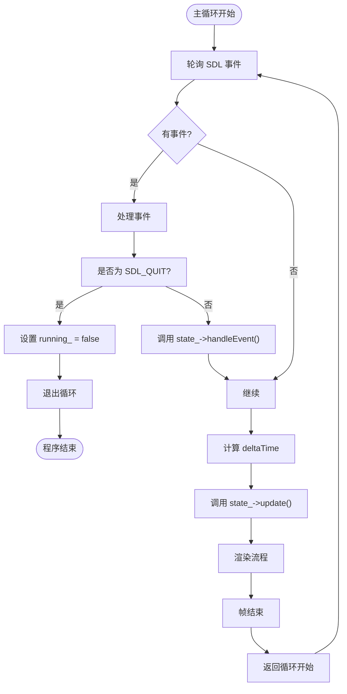

# 主循环机制

<cite>
**本文档引用的文件**  
- [App.cpp](file://Tracer/src/core/App.cpp)
- [App.h](file://Tracer/src/core/App.h)
- [State.h](file://Tracer/src/core/State.h)
- [MainMenuState.cpp](file://Tracer/src/states/MainMenuState.cpp)
- [TestState.cpp](file://Tracer/src/states/TestState.cpp)
</cite>

## 目录
1. [主循环结构概述](#主循环结构概述)
2. [事件处理流程](#事件处理流程)
3. [时间步长与帧率控制](#时间步长与帧率控制)
4. [deltaTime计算与时间驱动更新](#deltatime计算与时间驱动更新)
5. [update与render分离设计](#update与render分离设计)
6. [优化建议：固定时间步长](#优化建议：固定时间步长)

## 主循环结构概述

`App::run()` 方法实现了游戏主循环的核心结构，通过 `running_` 标志控制程序生命周期。主循环持续运行，直到接收到退出事件（如 `SDL_QUIT`），确保应用程序保持响应并持续更新与渲染画面。

主循环包含四个关键阶段：事件轮询、逻辑更新、画面清除与渲染、帧同步。这种结构保证了游戏状态的实时响应与流畅视觉表现。

**Section sources**  
- [App.cpp](file://Tracer/src/core/App.cpp#L48-L68)

## 事件处理流程

主循环通过 `SDL_PollEvent(&e)` 轮询系统事件队列，逐个处理输入事件。当检测到 `SDL_QUIT` 事件时，将 `running_` 标志设为 `false`，从而退出循环并终止程序。

当前状态（`state_`）通过 `handleEvent(*this, e)` 接收事件，实现状态相关的事件响应逻辑。这种设计实现了事件分发的解耦，使不同状态可独立处理用户输入。



**Diagram sources**  
- [App.cpp](file://Tracer/src/core/App.cpp#L50-L54)

**Section sources**  
- [App.cpp](file://Tracer/src/core/App.cpp#L50-L54)

## 时间步长与帧率控制

主循环通过高精度计时器 `SDL_GetPerformanceCounter()` 和频率 `SDL_GetPerformanceFrequency()` 计算每帧时间差（`delta`），单位为秒。该值作为 `deltaSeconds` 传递给 `update()` 方法，驱动时间相关逻辑。

尽管代码中未显式调用 `SDL_Delay(16)`，但渲染器创建时使用了 `SDL_RENDERER_PRESENTVSYNC` 标志，启用垂直同步（VSync），使帧率锁定在显示器刷新率（通常为60Hz），从而实现约60FPS的帧率限制。

**Section sources**  
- [App.cpp](file://Tracer/src/core/App.cpp#L60-L63)
- [App.cpp](file://Tracer/src/core/App.cpp#L27)

## deltaTime计算与时间驱动更新

`deltaTime` 的计算基于前后帧的性能计数器差值：

```cpp
Uint64 now = SDL_GetPerformanceCounter();
double delta = (double)(now - prev) / (double)SDL_GetPerformanceFrequency();
prev = now;
```

此 `delta` 值以秒为单位，传递给 `state_->update(*this, static_cast<float>(delta))`，用于驱动与时间相关的动画更新。例如，在 `MainMenuState` 中：

- **星光闪烁**：`star.brightness += star.twinkleSpeed * dt`
- **数据流滚动**：`s.y += s.speed * dt`

这种基于真实时间的更新确保动画速度在不同硬件上保持一致，避免因帧率波动导致的运动速度差异。

**Section sources**  
- [App.cpp](file://Tracer/src/core/App.cpp#L60-L63)
- [MainMenuState.cpp](file://Tracer/src/states/MainMenuState.cpp#L170-L178)

## update与render分离设计

主循环明确分离了 `update()` 与 `render()` 调用：

```cpp
state_->update(*this, delta);
// ...
state_->render(*this);
```

这种设计优势显著：

1. **逻辑与渲染解耦**：游戏逻辑更新独立于画面渲染，确保核心机制（如物理、AI）不受图形性能影响。
2. **稳定性增强**：即使渲染帧率波动，逻辑更新仍基于真实时间，保持游戏行为一致性。
3. **可维护性提升**：职责分离使代码更清晰，便于调试与优化。

例如，`MainMenuState::update()` 仅更新数据流位置与星光亮度，而 `render()` 负责绘制背景、按钮、特效等视觉元素。

**Section sources**  
- [App.cpp](file://Tracer/src/core/App.cpp#L65-L74)
- [MainMenuState.cpp](file://Tracer/src/states/MainMenuState.cpp#L169-L179)
- [MainMenuState.cpp](file://Tracer/src/states/MainMenuState.cpp#L200-L600)

## 优化建议：固定时间步长

在高负载或需要精确物理模拟的场景下，建议采用**固定时间步长**（fixed timestep）替代可变 `deltaTime`。

### 固定时间步长优势：
- **物理模拟一致性**：避免因帧率变化导致的物理行为差异（如跳跃高度、碰撞响应）。
- **确定性行为**：确保游戏逻辑在不同运行环境下表现一致。
- **减少累积误差**：避免小 `delta` 值在长时间运行中积累误差。

### 实现思路：
```cpp
const float FIXED_TIMESTEP = 1.0f / 60.0f; // 60Hz
float accumulator = 0.0f;

while (running_) {
    // 事件处理...
    
    accumulator += delta;
    while (accumulator >= FIXED_TIMESTEP) {
        if (state_) state_->update(*this, FIXED_TIMESTEP);
        accumulator -= FIXED_TIMESTEP;
    }
    
    // 插值渲染（可选）
    if (state_) state_->render(*this);
}
```

此方法确保 `update()` 以固定频率调用，而 `render()` 仍可按实际帧率执行，兼顾逻辑稳定性与画面流畅性。

**Section sources**  
- [App.cpp](file://Tracer/src/core/App.cpp#L60-L65)