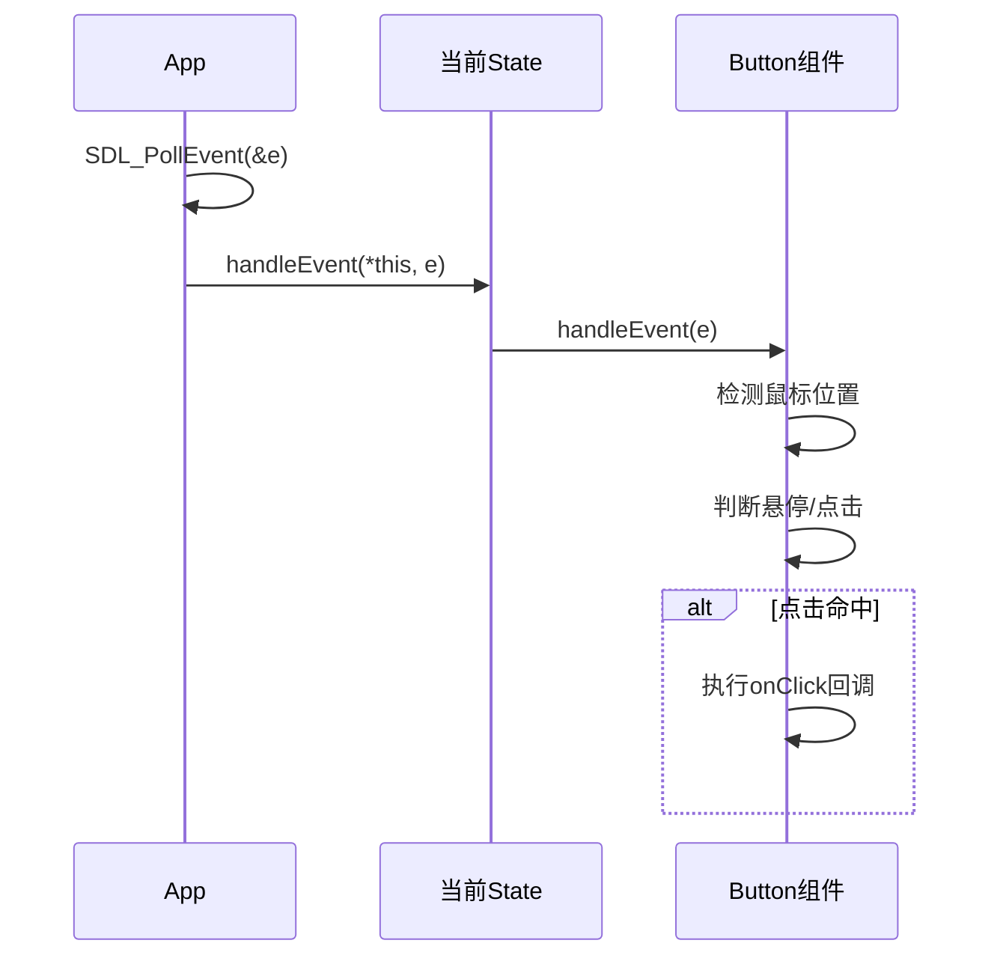
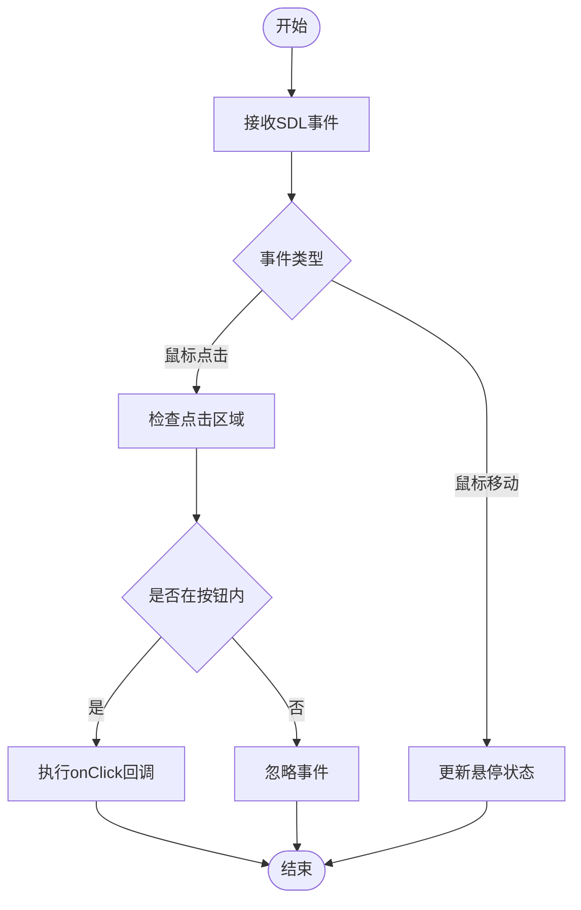
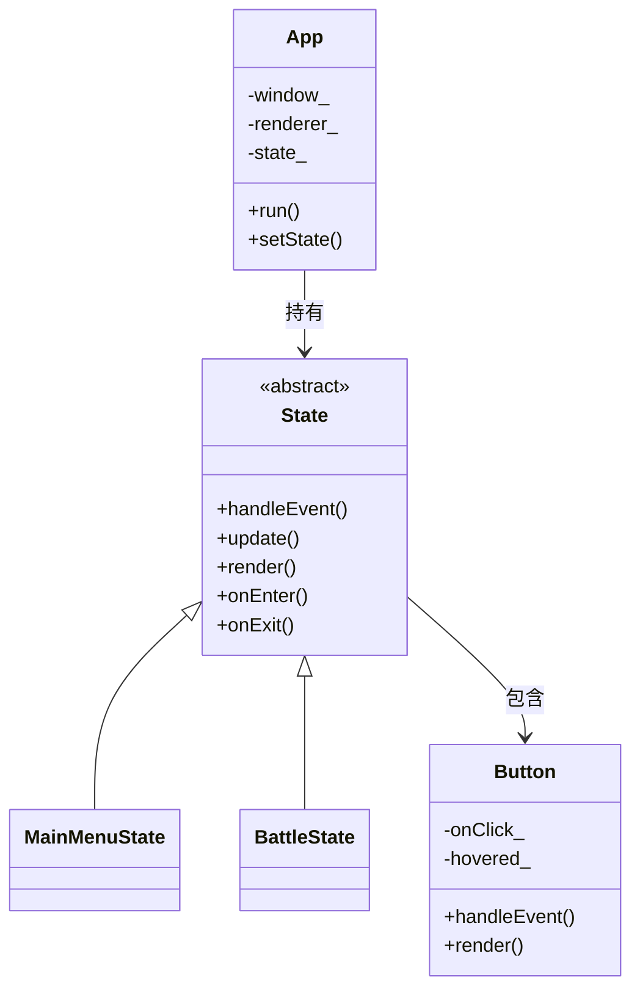

# 事件处理机制

<cite>
**本文档引用的文件**  
- [App.cpp](file://Tracer/src/core/App.cpp)
- [App.h](file://Tracer/src/core/App.h)
- [State.h](file://Tracer/src/core/State.h)
- [Button.cpp](file://Tracer/src/ui/Button.cpp)
- [Button.h](file://Tracer/src/ui/Button.h)
- [MainMenuState.cpp](file://Tracer/src/states/MainMenuState.cpp)
- [BattleState.cpp](file://Tracer/src/states/BattleState.cpp)
</cite>

## 目录
1. [简介](#简介)
2. [事件系统架构](#事件系统架构)
3. [核心事件处理流程](#核心事件处理流程)
4. [状态感知的事件分发](#状态感知的事件分发)
5. [UI组件的事件处理](#ui组件的事件处理)
6. [事件消费与中断机制](#事件消费与中断机制)
7. [常见问题与解决方案](#常见问题与解决方案)
8. [总结](#总结)

## 简介
本项目基于SDL2构建了一个上下文感知的事件处理系统，实现了从底层输入捕获到高层UI交互的完整链条。系统通过App类统一管理事件循环，将输入事件分发给当前活跃的游戏状态（State），并由状态进一步传递给具体的UI组件（如Button）。该设计实现了事件处理的上下文隔离与行为差异化，确保不同游戏状态下相同输入能触发不同逻辑。

## 事件系统架构

```mermaid
graph TD
A[SDL事件队列] --> B[App::run()]
B --> C[SDL_PollEvent]
C --> D{事件类型}
D --> |SDL_QUIT| E[终止运行]
D --> |其他事件| F[State::handleEvent]
F --> G[当前State]
G --> H[UI组件事件处理]
H --> I[Button::handleEvent]
I --> J[onClick回调]
```

**图示来源**  
- [App.cpp](file://Tracer/src/core/App.cpp#L45-L55)
- [State.h](file://Tracer/src/core/State.h#L10-L14)
- [Button.cpp](file://Tracer/src/ui/Button.cpp#L30-L45)

## 核心事件处理流程

事件处理的核心流程始于App类的`run()`方法，该方法维护主事件循环。通过`SDL_PollEvent`逐个获取事件，并在循环中进行分发。当接收到`SDL_QUIT`事件时，设置`running_`标志为false以终止程序。对于其他事件，若当前存在活跃状态（state_非空），则调用其`handleEvent()`方法进行处理。

此设计实现了事件分发的集中控制，确保所有输入事件都经过统一入口，便于日志记录、事件过滤和全局快捷键处理。

**本节来源**  
- [App.cpp](file://Tracer/src/core/App.cpp#L45-L55)

## 状态感知的事件分发



**图示来源**  
- [App.cpp](file://Tracer/src/core/App.cpp#L50)
- [MainMenuState.cpp](file://Tracer/src/states/MainMenuState.cpp#L150-L165)
- [Button.cpp](file://Tracer/src/ui/Button.cpp#L30-L45)

系统的事件分发具有上下文感知特性。以`MainMenuState`与`BattleState`为例，同一鼠标点击事件会触发不同行为：

- 在`MainMenuState`中，点击"开始游戏"按钮会通过`app.setState()`切换至`BattleState`
- 在`BattleState`中，点击"返回测试"按钮则会切换至`TestState`

这种行为差异源于每个状态类实现了独立的`handleEvent`方法，从而实现了事件处理的上下文隔离。

**本节来源**  
- [MainMenuState.cpp](file://Tracer/src/states/MainMenuState.cpp#L150-L165)
- [BattleState.cpp](file://Tracer/src/states/BattleState.cpp#L120-L135)

## UI组件的事件处理

Button组件作为核心UI交互元素，实现了完整的事件处理逻辑。其`handleEvent`方法接收SDL事件，通过检查`SDL_MOUSEMOTION`和`SDL_MOUSEBUTTONDOWN`事件来检测用户交互：

- 鼠标移动时更新`hovered_`状态，用于视觉反馈
- 鼠标左键点击时检查是否在按钮区域内，若命中则执行预注册的`onClick`回调

这种设计实现了关注点分离：Button负责交互检测，具体行为由回调函数定义，提高了组件的复用性。



**图示来源**  
- [Button.cpp](file://Tracer/src/ui/Button.cpp#L30-L45)
- [Button.h](file://Tracer/src/ui/Button.h#L15-L18)

## 事件消费与中断机制

本系统通过"单一消费"原则实现事件处理链的中断。当某个状态或组件处理并消费了事件后，无需显式标记，因为事件分发是单向的：

1. App将事件传递给当前State
2. State处理事件（可能进一步分发给子组件）
3. 事件处理结束，继续处理下一个事件

由于事件是逐个处理的，且每个事件只传递给当前活跃状态，自然实现了事件消费的独占性。例如，当用户点击MainMenuState中的按钮时，该点击事件被MainMenuState处理并导致状态切换，后续的BattleState不会收到该历史事件。

这种设计避免了事件穿透问题，确保了交互的确定性。

**本节来源**  
- [App.cpp](file://Tracer/src/core/App.cpp#L50)
- [MainMenuState.cpp](file://Tracer/src/states/MainMenuState.cpp#L150-L165)

## 常见问题与解决方案

### 事件队列溢出
**问题**：高频输入可能导致事件队列积压，影响性能。  
**解决方案**：本系统采用`SDL_PollEvent`在每帧中处理所有待处理事件，避免了队列无限增长。

### 鼠标点击穿透
**问题**：UI层叠时，底层组件可能接收到本应被上层拦截的点击。  
**解决方案**：采用单一活跃状态设计，确保每帧只有一个状态能接收事件，从根本上避免了穿透问题。

### 多状态间事件竞争
**问题**：状态切换瞬间可能导致事件处理不一致。  
**解决方案**：在`setState`方法中，先调用旧状态的`onExit`，再设置新状态并调用`onEnter`，确保状态切换的原子性。



**图示来源**  
- [App.h](file://Tracer/src/core/App.h#L10-L20)
- [State.h](file://Tracer/src/core/State.h#L10-L14)
- [Button.h](file://Tracer/src/ui/Button.h#L10-L20)

## 总结
本项目的事件处理系统通过SDL2的事件机制，构建了一个高效、可扩展的输入处理架构。系统采用状态模式实现上下文感知的事件分发，通过回调机制实现UI组件的行为解耦，并利用单一活跃状态设计自然解决了事件竞争与穿透问题。整体设计简洁而强大，为游戏的交互逻辑提供了坚实基础。

**本节来源**  
- [App.cpp](file://Tracer/src/core/App.cpp)
- [State.h](file://Tracer/src/core/State.h)
- [Button.cpp](file://Tracer/src/ui/Button.cpp)