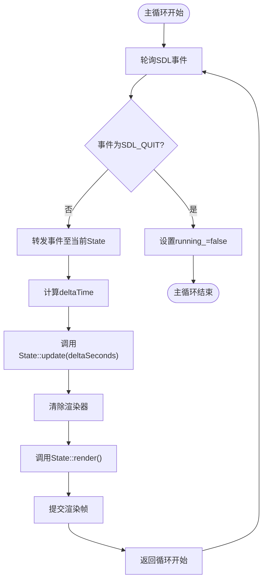
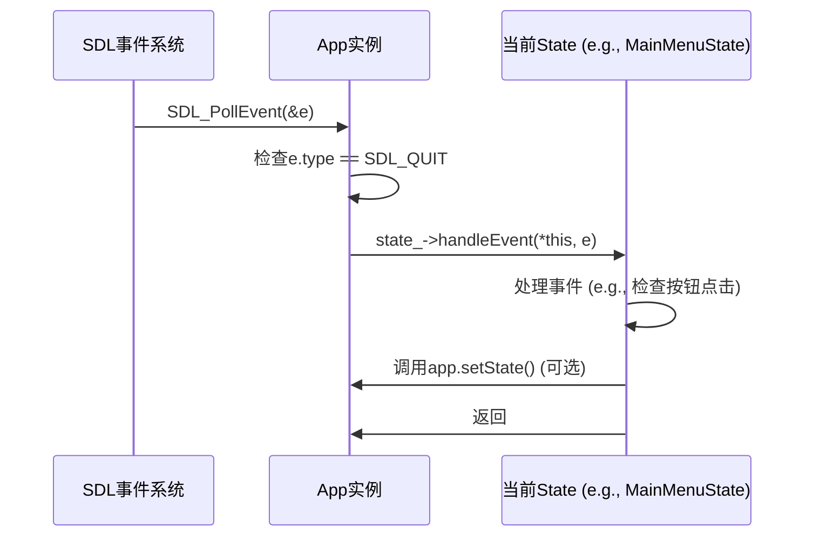

# 控制流机制

<cite>
**本文档中引用的文件**   
- [main.cpp](file://Tracer/src/main.cpp)
- [App.h](file://Tracer/src/core/App.h)
- [App.cpp](file://Tracer/src/core/App.cpp)
- [State.h](file://Tracer/src/core/State.h)
- [Button.h](file://Tracer/src/ui/Button.h)
- [Button.cpp](file://Tracer/src/ui/Button.cpp)
- [MainMenuState.h](file://Tracer/src/states/MainMenuState.h)
- [MainMenuState.cpp](file://Tracer/src/states/MainMenuState.cpp)
- [BattleState.h](file://Tracer/src/states/BattleState.h)
- [BattleState.cpp](file://Tracer/src/states/BattleState.cpp)
</cite>

## 目录
1. [程序入口与主循环概述](#程序入口与主循环概述)
2. [App::run() 主循环机制](#apprun-主循环机制)
3. [deltaTime 计算与帧率无关更新](#deltatime-计算与帧率无关更新)
4. [事件驱动设计与状态上下文处理](#事件驱动设计与状态上下文处理)
5. [状态切换机制与内存安全](#状态切换机制与内存安全)
6. [渲染与更新分离的设计优势](#渲染与更新分离的设计优势)
7. [性能优化建议](#性能优化建议)

## 程序入口与主循环概述

《溯洄遗梦》的游戏主循环从 `main()` 函数开始，通过 `App` 类的实例化和 `run()` 方法启动。程序首先初始化 SDL 系统和窗口渲染器，然后设置初始状态为 `MainMenuState`，最后进入主循环。主循环负责事件处理、游戏逻辑更新和画面渲染，是整个游戏运行的核心。

**Section sources**
- [main.cpp](file://Tracer/src/main.cpp#L5-L13)
- [App.h](file://Tracer/src/core/App.h#L1-L30)
- [App.cpp](file://Tracer/src/core/App.cpp#L1-L77)

## App::run() 主循环机制

`App::run()` 方法实现了游戏的主循环控制流。循环持续运行直到 `running_` 标志被设置为 `false`（通常由 `SDL_QUIT` 事件触发）。主循环包含三个核心阶段：事件轮询、逻辑更新和画面渲染。

在事件轮询阶段，`SDL_PollEvent` 被用来非阻塞地获取所有待处理的 SDL 事件。每个事件首先被检查是否为退出事件，然后被转发给当前活动的 `State` 对象进行处理。这种设计确保了事件能够被当前游戏状态以情境感知的方式处理。

逻辑更新阶段调用当前状态的 `update` 方法，并传入一个 `deltaSeconds` 参数，该参数表示自上一帧以来经过的时间。这使得游戏逻辑的更新与帧率解耦，保证了在不同硬件上的行为一致性。

最后，渲染阶段清除屏幕，调用当前状态的 `render` 方法进行绘制，然后调用 `SDL_RenderPresent` 将帧提交到屏幕。



**Diagram sources**
- [App.cpp](file://Tracer/src/core/App.cpp#L50-L75)

**Section sources**
- [App.cpp](file://Tracer/src/core/App.cpp#L50-L75)

## deltaTime 计算与帧率无关更新

`deltaTime` 的计算基于 `SDL_GetPerformanceCounter()` 和 `SDL_GetPerformanceFrequency()`，这是一种高精度计时方法。在每一帧开始时，代码获取当前的性能计数器值，然后与上一帧的计数器值相减，得到经过的计数。将这个差值除以性能频率，即可得到以秒为单位的精确时间间隔。

```cpp
Uint64 now = SDL_GetPerformanceCounter();
double delta = (double)(now - prev) / (double)SDL_GetPerformanceFrequency();
prev = now;
```

这个 `delta` 值被转换为 `float` 类型的 `deltaSeconds` 并传递给 `State::update()` 方法。这种设计是实现帧率无关动画的关键。例如，在 `MainMenuState` 中，数据流的移动速度 `s.speed` 是以“像素/秒”为单位定义的。在 `update` 方法中，位置的更新是 `s.y += s.speed * dt`，这意味着无论帧率是 30 FPS 还是 60 FPS，数据流在屏幕上移动的实际速度都是一致的。同样，星光的闪烁动画也通过 `star.brightness += star.twinkleSpeed * dt` 实现平滑、一致的视觉效果。

**Section sources**
- [App.cpp](file://Tracer/src/core/App.cpp#L58-L62)
- [MainMenuState.cpp](file://Tracer/src/states/MainMenuState.cpp#L250-L258)

## 事件驱动设计与状态上下文处理

游戏采用事件驱动的设计思想，`App` 类作为事件分发中心，将捕获的 SDL 事件转发给当前的 `State` 对象。`State` 是一个抽象基类，定义了 `handleEvent(App&, const SDL_Event&)` 纯虚方法。每个具体的状态类（如 `MainMenuState`、`BattleState`）都必须实现此方法，从而能够根据当前游戏上下文来解释和响应事件。

例如，在 `MainMenuState::handleEvent` 中，代码会检查鼠标点击事件是否发生在某个按钮的矩形区域内。如果检测到点击了“开始游戏”按钮，它会直接调用 `app.setState()` 来切换到 `BattleState`。这种设计将事件处理逻辑封装在状态内部，使得不同状态可以对相同的事件（如鼠标点击）做出完全不同的反应，实现了高度的模块化和可维护性。



**Diagram sources**
- [App.cpp](file://Tracer/src/core/App.cpp#L52-L56)
- [MainMenuState.cpp](file://Tracer/src/states/MainMenuState.cpp#L210-L244)

**Section sources**
- [App.cpp](file://Tracer/src/core/App.cpp#L52-L56)
- [State.h](file://Tracer/src/core/State.h#L1-L17)
- [MainMenuState.cpp](file://Tracer/src/states/MainMenuState.cpp#L210-L244)

## 状态切换机制与内存安全

`App::setState()` 方法是实现状态安全切换的核心。它接收一个 `std::unique_ptr<State>` 作为新状态。该方法首先调用旧状态的 `onExit()` 方法，允许其执行清理工作（如释放资源、保存数据）。然后，通过 `std::move` 将新的 `unique_ptr` 赋值给 `state_` 成员变量，这会自动销毁旧的 `unique_ptr` 所管理的对象。最后，调用新状态的 `onEnter()` 方法，使其可以进行初始化。

这种设计确保了无内存泄漏：`std::unique_ptr` 的所有权转移机制保证了任何时候都只有一个智能指针拥有状态对象，当 `setState` 被调用时，旧状态的指针被替换，其析构函数会自动调用 `delete`。同时，`onEnter` 和 `onExit` 的生命周期钩子为状态提供了优雅的初始化和清理机会。

**Section sources**
- [App.cpp](file://Tracer/src/core/App.cpp#L77-L83)
- [State.h](file://Tracer/src/core/State.h#L1-L17)

## 渲染与更新分离的设计优势

主循环中将 `update` 和 `render` 明确分离是一种最佳实践，具有多个优点：

1.  **逻辑与表现解耦**：游戏逻辑（`update`）和画面绘制（`render`）被清晰地分离开来。这使得代码更易于理解和维护。例如，`BattleState` 可以在 `update` 中改变阴阳平衡值，而在 `render` 中根据该值绘制水墨效果，两者逻辑独立。
2.  **帧率无关性**：如前所述，`update` 依赖于 `deltaSeconds`，而 `render` 不直接依赖于时间。这允许 `render` 函数专注于将当前游戏状态精确地绘制到屏幕上，无论 `update` 的频率如何。
3.  **性能优化**：分离允许对更新和渲染进行独立的性能分析和优化。开发者可以专注于优化计算密集型的 `update` 逻辑，而不影响渲染代码。
4.  **平滑视觉效果**：`deltaSeconds` 参数使得动画（如 `MainMenuState` 中的数据流移动和星光闪烁）能够以恒定的速度运行，避免了在不同性能的机器上出现忽快忽慢的卡顿感，提供了流畅一致的用户体验。

**Section sources**
- [App.cpp](file://Tracer/src/core/App.cpp#L50-L75)
- [MainMenuState.cpp](file://Tracer/src/states/MainMenuState.cpp#L250-L258)
- [MainMenuState.cpp](file://Tracer/src/states/MainMenuState.cpp#L260-L264)

## 性能优化建议

为了保持主循环的高效运行，应遵循以下性能优化建议：

1.  **避免在 `update` 中进行昂贵操作**：`update` 方法每帧都会被调用，因此应避免在此处进行文件 I/O、网络请求或复杂的资源加载。这些操作应放在状态的 `onEnter()` 方法中，只在状态切换时执行一次。
2.  **预计算和缓存**：如 `BattleState` 在 `onEnter()` 中预计算了所有水墨装饰的坐标点，避免了在 `render` 中进行耗时的随机数生成和几何计算，防止了画面闪烁。
3.  **合理使用纹理**：虽然当前代码在 `render` 中动态生成文本纹理（`TTF_RenderUTF8_Blended`），但这非常耗时。最佳实践是在 `onEnter()` 中将文本渲染到 `SDL_Texture` 并缓存，然后在 `render` 中直接使用 `SDL_RenderCopy` 绘制纹理。
4.  **优化事件处理**：对于复杂的 UI，应使用空间分区（如四叉树）来加速点击检测，而不是对每个按钮进行朴素的矩形碰撞检测。

**Section sources**
- [App.cpp](file://Tracer/src/core/App.cpp#L65-L67)
- [BattleState.cpp](file://Tracer/src/states/BattleState.cpp#L90-L177)
- [MainMenuState.cpp](file://Tracer/src/states/MainMenuState.cpp#L350-L355)