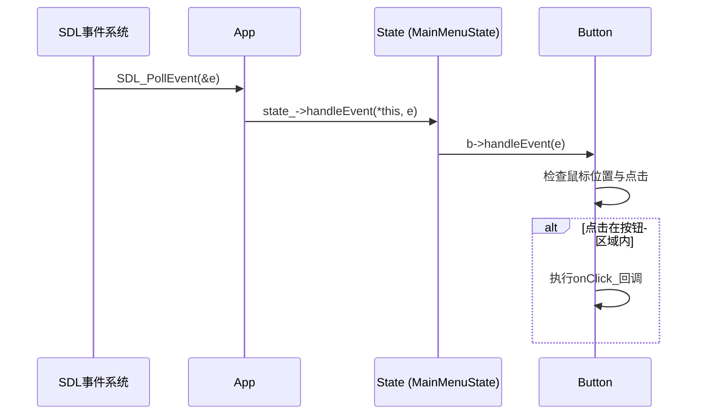
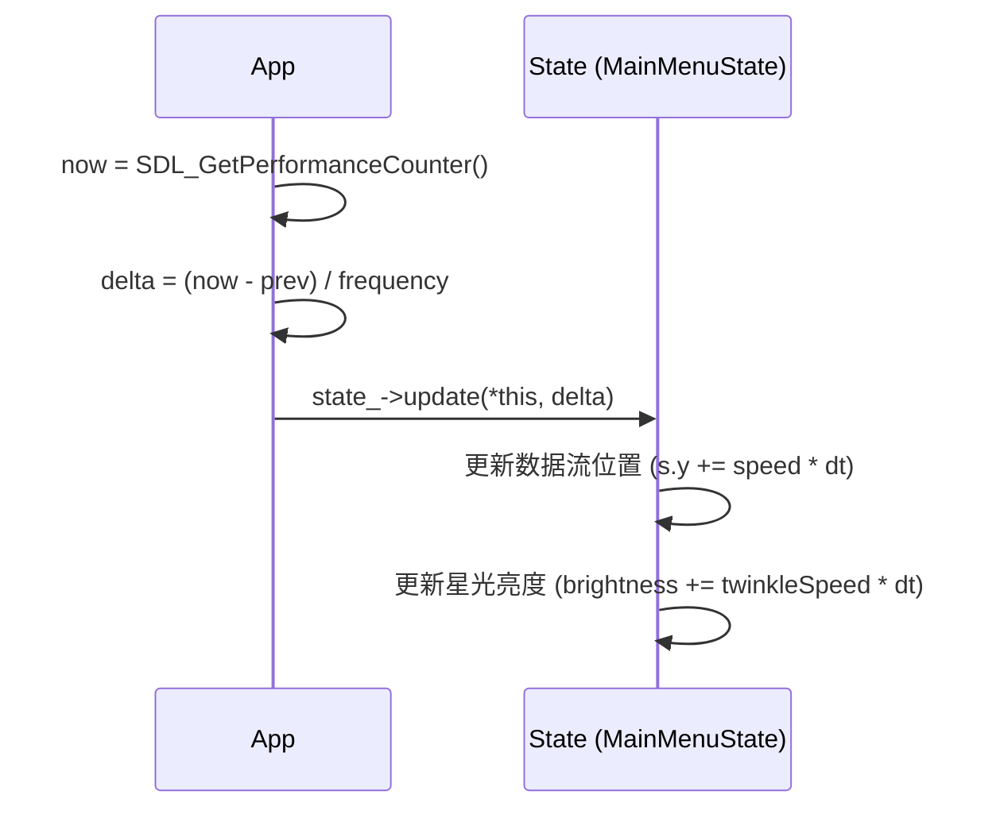
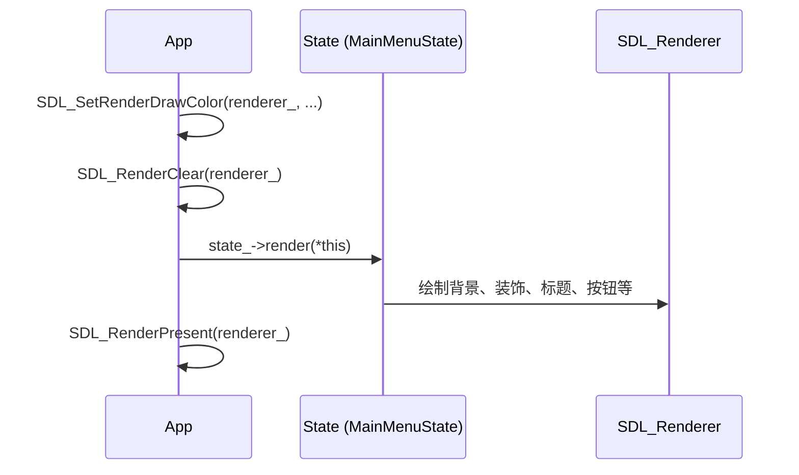
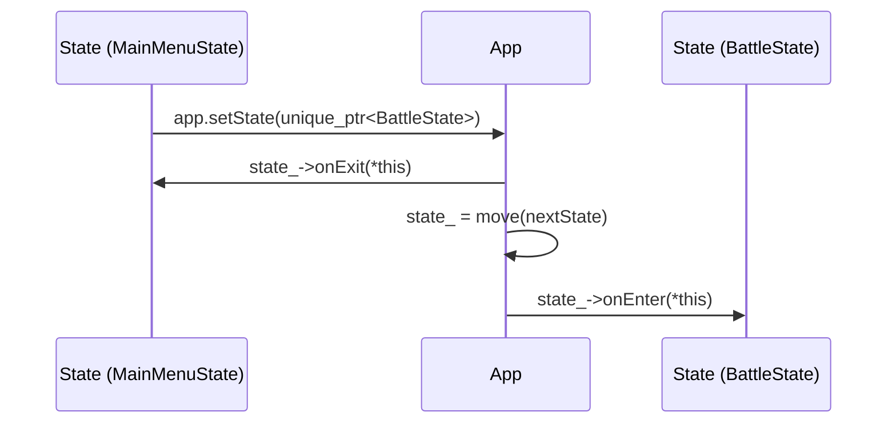

# 数据流路径

<cite>
**本文档引用文件**  
- [App.h](file://Tracer/src/core/App.h)
- [App.cpp](file://Tracer/src/core/App.cpp)
- [State.h](file://Tracer/src/core/State.h)
- [Button.h](file://Tracer/src/ui/Button.h)
- [Button.cpp](file://Tracer/src/ui/Button.cpp)
- [MainMenuState.cpp](file://Tracer/src/states/MainMenuState.cpp)
</cite>

## 目录
1. [用户输入事件流](#用户输入事件流)  
2. [时间数据流](#时间数据流)  
3. [渲染命令流](#渲染命令流)  
4. [状态切换请求流](#状态切换请求流)  
5. [App作为中介者的作用](#app作为中介者的作用)  
6. [当前数据流设计的局限性](#当前数据流设计的局限性)

## 用户输入事件流

用户输入事件流始于SDL事件系统的`SDL_PollEvent`调用，捕获原始输入事件（如鼠标移动、点击、键盘输入等）。这些事件首先由`App::run()`方法捕获，并通过`App`实例转发至当前激活的`State`对象的`handleEvent`方法。具体状态（如`MainMenuState`）进一步将事件分发给其管理的UI组件（如`Button`），由这些组件执行点击检测与回调逻辑。

在`MainMenuState`中，`handleEvent`方法遍历所有按钮并调用其`handleEvent`方法，实现事件的逐层传递。按钮通过检查鼠标坐标是否落在其矩形区域内来判断是否被点击，并在确认点击后执行预设的回调函数。

**图示来源**  
- [App.cpp](file://Tracer/src/core/App.cpp#L48-L68)
- [MainMenuState.cpp](file://Tracer/src/states/MainMenuState.cpp#L117-L140)
- [Button.cpp](file://Tracer/src/ui/Button.cpp#L25-L35)

**本节来源**  
- [App.cpp](file://Tracer/src/core/App.cpp#L48-L68)
- [MainMenuState.cpp](file://Tracer/src/states/MainMenuState.cpp#L117-L140)
- [Button.cpp](file://Tracer/src/ui/Button.cpp#L25-L35)

## 时间数据流

时间数据流用于驱动游戏逻辑中的动画、特效更新等时间相关行为。时间增量`deltaTime`通过`SDL_GetPerformanceCounter()`和`SDL_GetPerformanceFrequency()`计算得出，表示两次主循环迭代之间的时间差（以秒为单位）。该值由`App::run()`方法计算后，传递给当前状态的`update`方法。

在`MainMenuState`中，`update`方法利用`deltaTime`更新乱码数据流的垂直位置和星光的闪烁状态，确保动画效果平滑且与系统性能无关。

**图示来源**  
- [App.cpp](file://Tracer/src/core/App.cpp#L48-L68)
- [MainMenuState.cpp](file://Tracer/src/states/MainMenuState.cpp#L142-L160)

**本节来源**  
- [App.cpp](file://Tracer/src/core/App.cpp#L48-L68)
- [MainMenuState.cpp](file://Tracer/src/states/MainMenuState.cpp#L142-L160)

## 渲染命令流

渲染命令流负责将图形内容绘制到窗口。`App::run()`方法在每次循环中调用当前状态的`render`方法，该方法通过`App`持有的`renderer_`指针调用SDL渲染API进行绘制。绘制流程包括清除背景、渲染UI元素（如按钮、文本、装饰效果）和最终呈现到屏幕。

`MainMenuState`的`render`方法首先设置深色背景，然后依次绘制装饰性花纹、闪烁星光、乱码数据流、标题及其光晕效果，最后渲染所有按钮及其科技感装饰。

**图示来源**  
- [App.cpp](file://Tracer/src/core/App.cpp#L48-L68)
- [MainMenuState.cpp](file://Tracer/src/states/MainMenuState.cpp#L162-L401)

**本节来源**  
- [App.cpp](file://Tracer/src/core/App.cpp#L48-L68)
- [MainMenuState.cpp](file://Tracer/src/states/MainMenuState.cpp#L162-L401)

## 状态切换请求流

状态切换请求流允许游戏在不同状态间无缝跳转。当某个状态内部需要切换到新状态时（如从主菜单进入战斗状态），它通过调用`App::setState()`方法并传递一个`std::unique_ptr<State>`来实现。`App`在切换前调用当前状态的`onExit`方法进行清理，然后接管新状态的生命周期，并调用其`onEnter`方法进行初始化。

例如，在`MainMenuState`中，当“开始游戏”按钮被点击时，`handleEvent`方法直接构造一个`BattleState`的实例并通过`app.setState()`请求切换。

**图示来源**  
- [App.cpp](file://Tracer/src/core/App.cpp#L70-L74)
- [MainMenuState.cpp](file://Tracer/src/states/MainMenuState.cpp#L117-L140)

**本节来源**  
- [App.cpp](file://Tracer/src/core/App.cpp#L70-L74)
- [MainMenuState.cpp](file://Tracer/src/states/MainMenuState.cpp#L117-L140)

## App作为中介者的作用

`App`类在系统中扮演“中介者”（Mediator）角色，有效解耦了各个组件之间的直接依赖。所有状态、UI组件和系统资源（如窗口、渲染器）都通过`App`进行通信和访问，而非直接相互引用。这种设计使得：

- 状态之间无需知道彼此的存在，切换由`App`统一管理。
- UI组件只需关注自身逻辑，事件和渲染上下文由`App`提供。
- 资源管理集中化，避免了资源泄露和重复创建。

这种中介模式提升了代码的模块化程度和可维护性。

**本节来源**  
- [App.h](file://Tracer/src/core/App.h#L7-L27)
- [App.cpp](file://Tracer/src/core/App.cpp#L70-L74)

## 当前数据流设计的局限性

尽管当前数据流设计清晰且有效，但仍存在以下局限性：

1. **缺乏统一的消息总线机制**：组件间通信高度依赖`App`的直接方法调用，缺乏松耦合的事件发布/订阅机制。例如，状态切换必须通过`App::setState()`，无法通过广播事件实现。
2. **状态间间接通信成本高**：若需在状态间传递复杂数据，当前设计要求通过`App`作为中介，增加了不必要的依赖和复杂性。
3. **扩展性受限**：新增全局事件类型需修改`App`或`State`接口，违反开闭原则。

建议引入轻量级消息总线或事件系统，允许组件发布和订阅事件，从而实现更灵活、更松耦合的通信架构。

**本节来源**  
- [App.h](file://Tracer/src/core/App.h#L7-L27)
- [State.h](file://Tracer/src/core/State.h#L6-L14)
- [App.cpp](file://Tracer/src/core/App.cpp#L70-L74)
- [MainMenuState.cpp](file://Tracer/src/states/MainMenuState.cpp#L117-L140)