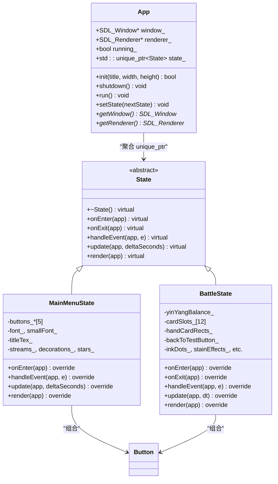
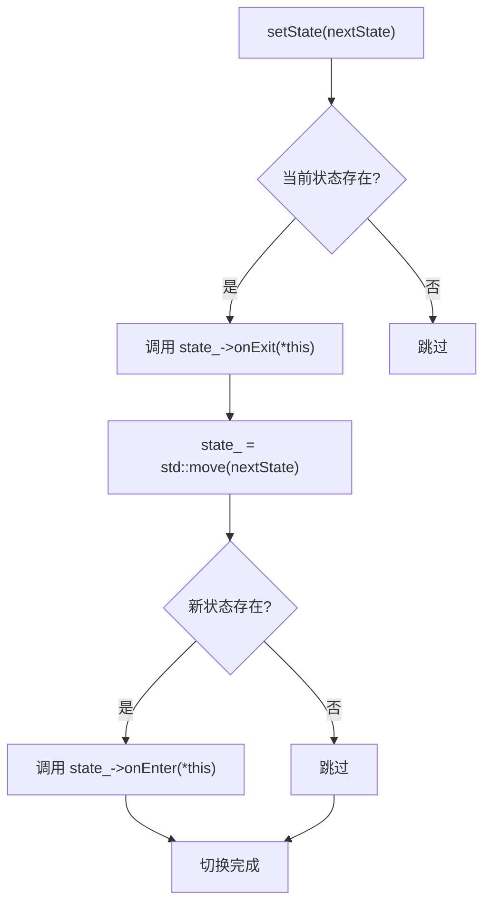

# 核心架构

<cite>
**本文档引用的文件**  
- [App.h](file://Tracer/src/core/App.h)
- [App.cpp](file://Tracer/src/core/App.cpp)
- [State.h](file://Tracer/src/core/State.h)
- [MainMenuState.h](file://Tracer/src/states/MainMenuState.h)
- [BattleState.h](file://Tracer/src/states/BattleState.h)
</cite>

## 目录
1. [引言](#引言)
2. [项目结构](#项目结构)
3. [核心组件](#核心组件)
4. [架构概览](#架构概览)
5. [详细组件分析](#详细组件分析)
6. [依赖关系分析](#依赖关系分析)
7. [性能考量](#性能考量)
8. [故障排查指南](#故障排查指南)
9. [结论](#结论)

## 引言
本文档旨在深入解析《溯洄遗梦》的核心架构设计，重点阐述以 `App` 类为中心的状态机系统。通过分析 `App` 与 `State` 基类之间的聚合关系、状态切换机制、多态行为分发以及具体状态类的实现方式，全面揭示该架构在界面控制流管理中的优势与局限性。同时探讨单例模式的应用影响及状态模式相较于其他架构的选择依据。

## 项目结构
项目采用模块化分层结构，主要分为 `core`（核心控制）、`states`（状态实现）和 `ui`（用户界面组件）三大目录。`main.cpp` 为程序入口，`core` 中的 `App` 和 `State` 构成状态管理骨架，`states` 目录下包含多个继承自 `State` 的具体状态类，如主菜单、战斗、交易等，每个状态独立封装其逻辑与渲染行为。

```mermaid
graph TB
subgraph "核心控制层"
App["App (控制中心)"]
State["State (抽象基类)"]
end
subgraph "状态实现层"
MainMenuState["MainMenuState"]
BattleState["BattleState"]
BarterState["BarterState"]
DeckState["DeckState"]
EngraveState["EngraveState"]
BurnState["BurnState"]
MapExploreState["MapExploreState"]
HeritageState["HeritageState"]
InkShopState["InkShopState"]
MemoryRepairState["MemoryRepairState"]
RelicPickupState["RelicPickupState"]
SeekerState["SeekerState"]
TemperState["TemperState"]
end
subgraph "UI组件"
Button["Button"]
end
App --> State : "持有 unique_ptr<State>"
State <|-- MainMenuState : "继承"
State <|-- BattleState : "继承"
State <|-- BarterState : "继承"
State <|-- DeckState : "继承"
State <|-- EngraveState : "继承"
State <|-- BurnState : "继承"
State <|-- MapExploreState : "继承"
State <|-- HeritageState : "继承"
State <|-- InkShopState : "继承"
State <|-- MemoryRepairState : "继承"
State <|-- RelicPickupState : "继承"
State <|-- SeekerState : "继承"
State <|-- TemperState : "继承"
Button -.-> BattleState : "使用"
```

**图示来源**  
- [App.h](file://Tracer/src/core/App.h#L1-L30)
- [State.h](file://Tracer/src/core/State.h#L1-L17)
- [MainMenuState.h](file://Tracer/src/states/MainMenuState.h#L1-L69)
- [BattleState.h](file://Tracer/src/states/BattleState.h#L1-L81)

**本节来源**  
- [App.h](file://Tracer/src/core/App.h#L1-L30)
- [State.h](file://Tracer/src/core/State.h#L1-L17)

## 核心组件
`App` 类作为整个应用程序的控制中心，负责初始化 SDL 资源（窗口与渲染器），维护主循环，并通过 `std::unique_ptr<State>` 管理当前状态对象，实现自动内存释放。`State` 基类定义了五大人机交互接口：`onEnter`（进入初始化）、`onExit`（退出清理）、`handleEvent`（事件处理）、`update`（逻辑更新）、`render`（渲染输出），所有具体状态类通过重写这些虚函数实现差异化行为。

**本节来源**  
- [App.h](file://Tracer/src/core/App.h#L1-L30)
- [State.h](file://Tracer/src/core/State.h#L1-L17)
- [App.cpp](file://Tracer/src/core/App.cpp#L1-L77)

## 架构概览
系统采用状态模式（State Pattern）构建主控逻辑，`App` 类聚合一个 `State` 接口的智能指针，通过 `setState()` 方法实现状态切换。该设计实现了状态间的解耦，使得新增状态无需修改 `App` 主逻辑，符合开闭原则。



**图示来源**  
- [App.h](file://Tracer/src/core/App.h#L1-L30)
- [State.h](file://Tracer/src/core/State.h#L1-L17)
- [MainMenuState.h](file://Tracer/src/states/MainMenuState.h#L1-L69)
- [BattleState.h](file://Tracer/src/states/BattleState.h#L1-L81)

## 详细组件分析

### App类分析
`App` 类承担了资源管理与状态调度的双重职责。其构造函数为空，析构函数调用 `shutdown()` 释放资源。`init()` 方法初始化SDL与TTF子系统并创建窗口和渲染器；`run()` 方法实现主循环，依次处理事件、更新状态、渲染画面；`setState()` 是状态切换的核心，自动调用旧状态的 `onExit()` 和新状态的 `onEnter()`，确保资源的正确释放与初始化。

#### 状态切换流程图


**图示来源**  
- [App.cpp](file://Tracer/src/core/App.cpp#L65-L77)

**本节来源**  
- [App.h](file://Tracer/src/core/App.h#L1-L30)
- [App.cpp](file://Tracer/src/core/App.cpp#L1-L77)

### State基类与多态机制
`State` 是一个纯虚接口类，定义了五大人机交互函数。其中 `handleEvent`、`update`、`render` 为纯虚函数，强制子类实现；`onEnter` 和 `onExit` 提供默认空实现，允许子类按需重写。这种设计利用C++多态机制，在运行时通过虚函数表动态分发调用，使 `App` 的主循环无需知晓具体状态类型即可完成统一调度。

**本节来源**  
- [State.h](file://Tracer/src/core/State.h#L1-L17)

### 具体状态类实现：MainMenuState与BattleState
`MainMenuState` 重写了 `onEnter` 以加载字体、创建按钮、生成动态背景特效（数据流、星光、装饰弧线），并在 `render` 中绘制科技感主菜单界面。`BattleState` 则在 `onEnter` 中初始化战斗UI布局（卡牌槽、阴阳池、铃铛等），并在 `update` 和 `render` 中维护水墨风格的战斗场景。

两者均通过组合方式使用 `Button` 类实现交互控件，展示了状态类如何封装自身所需的全部数据与行为，实现高内聚。

**本节来源**  
- [MainMenuState.h](file://Tracer/src/states/MainMenuState.h#L1-L69)
- [BattleState.h](file://Tracer/src/states/BattleState.h#L1-L81)

## 依赖关系分析
系统依赖关系清晰：`App` 依赖 `State` 接口，各具体状态类依赖 `State` 和 `Button`，`Button` 位于 `ui` 层，被多个状态使用。SDL 和 SDL_ttf 为外部库依赖，由 `App` 统一初始化和销毁，避免重复管理。

```mermaid
graph LR
App --> State
State <|-- MainMenuState
State <|-- BattleState
MainMenuState --> Button
BattleState --> Button
App --> SDL
App --> TTF
Button --> SDL
```

**图示来源**  
- [App.h](file://Tracer/src/core/App.h#L1-L30)
- [State.h](file://Tracer/src/core/State.h#L1-L17)
- [MainMenuState.h](file://Tracer/src/states/MainMenuState.h#L1-L69)
- [BattleState.h](file://Tracer/src/states/BattleState.h#L1-L81)

**本节来源**  
- [App.h](file://Tracer/src/core/App.h#L1-L30)
- [State.h](file://Tracer/src/core/State.h#L1-L17)
- [MainMenuState.h](file://Tracer/src/states/MainMenuState.h#L1-L69)
- [BattleState.h](file://Tracer/src/states/BattleState.h#L1-L81)

## 性能考量
- **内存管理**：使用 `std::unique_ptr` 自动管理状态对象生命周期，避免内存泄漏。
- **渲染优化**：启用硬件加速与垂直同步（`SDL_RENDERER_ACCELERATED | SDL_RENDERER_PRESENTVSYNC`），保证流畅渲染。
- **事件处理**：采用 `SDL_PollEvent` 非阻塞轮询，及时响应用户输入。
- **资源复用**：字体、纹理等资源在 `onEnter` 中创建，`onExit` 中释放，避免重复加载。

## 故障排查指南
- **窗口无法创建**：检查 `SDL_Init` 返回值，确认SDL库正确安装。
- **字体无法加载**：确保TTF库可用，字体文件路径正确。
- **状态切换无反应**：检查 `setState()` 是否被调用，新状态对象是否有效。
- **渲染黑屏**：确认 `render()` 函数中是否调用了 `SDL_RenderClear` 和 `SDL_RenderPresent`。
- **事件无响应**：检查 `handleEvent()` 是否正确处理了目标事件类型。

**本节来源**  
- [App.cpp](file://Tracer/src/core/App.cpp#L1-L77)
- [MainMenuState.h](file://Tracer/src/states/MainMenuState.h#L1-L69)
- [BattleState.h](file://Tracer/src/states/BattleState.h#L1-L81)

## 结论
《溯洄遗梦》采用以 `App` 为中心的状态模式架构，有效实现了界面状态的隔离与行为封装。`App` 类通过 `unique_ptr<State>` 实现安全的状态切换与自动内存管理，`State` 基类定义的五大人机交互接口为多态分发提供了基础。该设计具有高可扩展性，新增状态无需修改核心逻辑。然而，状态间通信（如数据传递）依赖 `App` 全局访问，存在耦合风险。未来可引入事件总线或状态上下文对象优化跨状态数据流动。尽管 `App` 类具备单例特征（全局访问点），但未强制实现为单例模式，保留了测试灵活性。总体而言，该架构在复杂UI状态管理中表现出色，是游戏主控逻辑的理想选择。