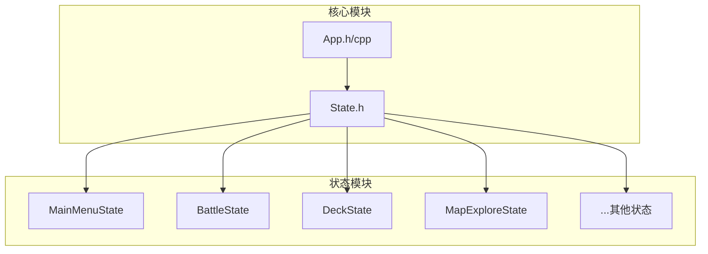
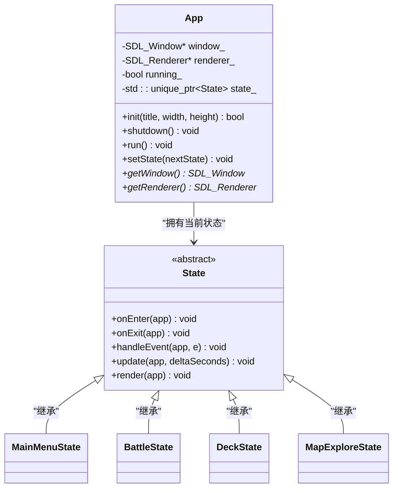
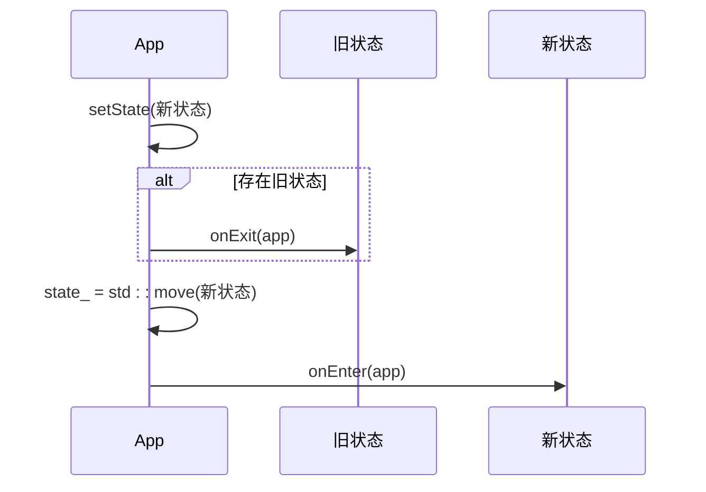
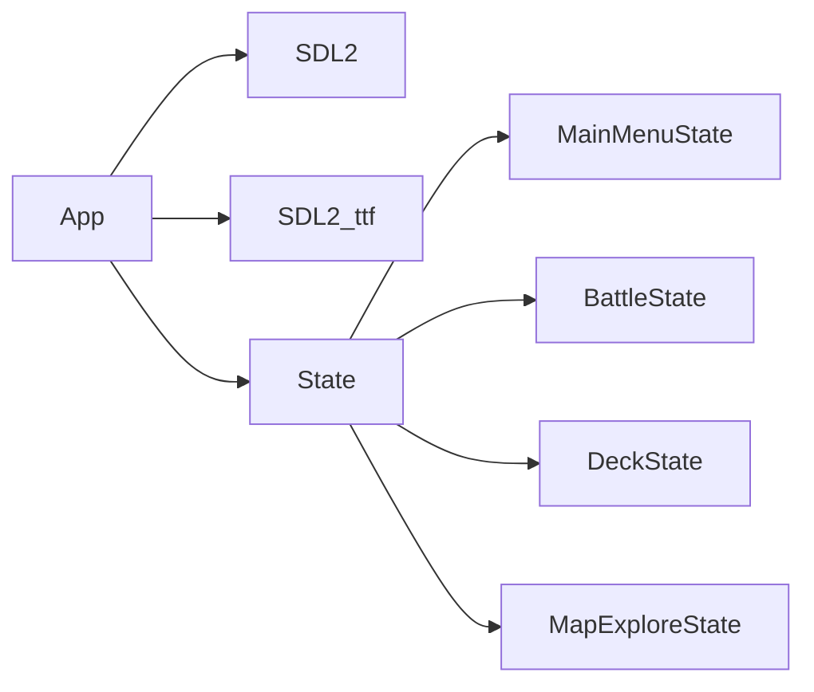

# App类详解

<cite>
**本文档引用的文件**
- [App.h](file://Tracer/src/core/App.h)
- [App.cpp](file://Tracer/src/core/App.cpp)
- [State.h](file://Tracer/src/core/State.h)
</cite>

## 目录
1. [简介](#简介)
2. [项目结构](#项目结构)
3. [核心组件](#核心组件)
4. [架构概述](#架构概述)
5. [详细组件分析](#详细组件分析)
6. [依赖分析](#依赖分析)
7. [性能考虑](#性能考虑)
8. [故障排除指南](#故障排除指南)
9. [结论](#结论)

## 简介
`App` 类是 Tracer 游戏引擎的核心控制器，负责管理整个应用程序的生命周期、状态切换、SDL 资源初始化与释放，以及主循环的执行流程。本文档将深入解析其设计与实现机制，重点阐述其作为游戏引擎中枢的关键作用。

## 项目结构
Tracer 项目采用模块化设计，主要分为 `core`（核心逻辑）、`states`（游戏状态）和 `ui`（用户界面）三个模块。`App` 类位于 `core` 模块中，是连接所有游戏状态和底层 SDL 库的中心枢纽。

**图示来源**
- [App.h](file://Tracer/src/core/App.h#L1-L31)
- [State.h](file://Tracer/src/core/State.h#L1-L18)

**本节来源**
- [App.h](file://Tracer/src/core/App.h#L1-L31)
- [State.h](file://Tracer/src/core/State.h#L1-L18)

## 核心组件
`App` 类是游戏的主控类，封装了 SDL 子系统的初始化、窗口与渲染器的创建、主循环的运行以及游戏状态的管理。其核心职责是提供一个稳定、高效的运行环境，并协调各个游戏状态之间的切换。

**本节来源**
- [App.h](file://Tracer/src/core/App.h#L1-L31)
- [App.cpp](file://Tracer/src/core/App.cpp#L1-L78)

## 架构概述
`App` 类采用经典的“状态机”（State Machine）架构模式。整个游戏逻辑被分解为多个独立的 `State`（如主菜单、战斗、地图探索等），`App` 类负责在这些状态之间进行切换和管理。这种设计极大地提高了代码的可维护性和可扩展性。

**图示来源**
- [App.h](file://Tracer/src/core/App.h#L1-L31)
- [State.h](file://Tracer/src/core/State.h#L1-L18)

## 详细组件分析

### App类分析
`App` 类的设计精巧，其各个成员函数共同协作，确保了游戏的稳定运行。

#### 构造函数与析构函数
构造函数 `App::App()` 为空，真正的初始化工作在 `init` 函数中完成。析构函数 `App::~App()` 会调用 `shutdown()` 方法，确保在对象销毁时能安全地释放所有资源，防止内存泄漏。

**本节来源**
- [App.cpp](file://Tracer/src/core/App.cpp#L5-L7)

#### 初始化流程 (init)
`init` 方法负责初始化 SDL 子系统并创建窗口和渲染器。
1.  **SDL子系统初始化**: 调用 `SDL_Init` 初始化视频、定时器和事件子系统。如果失败，会通过 `SDL_Log` 记录错误并返回 `false`。
2.  **TTF字体库初始化**: 调用 `TTF_Init` 初始化 SDL_ttf 库，为后续的文本渲染做准备。
3.  **窗口创建**: 使用 `SDL_CreateWindow` 创建一个居中显示的窗口，参数包括标题、宽高和 `SDL_WINDOW_SHOWN` 标志。
4.  **渲染器创建**: 使用 `SDL_CreateRenderer` 创建一个硬件加速且垂直同步的渲染器，这有助于防止画面撕裂并提高渲染效率。
5.  **状态设置**: 成功后，将 `running_` 标志设为 `true`。

**本节来源**
- [App.cpp](file://Tracer/src/core/App.cpp#L9-L33)

#### 资源释放 (shutdown)
`shutdown` 方法是资源管理的关键，它按照与初始化相反的顺序安全地释放所有资源：
1.  **状态重置**: 首先调用 `state_.reset()`，这会触发当前状态的析构函数，确保状态内部资源被清理。
2.  **销毁渲染器**: 调用 `SDL_DestroyRenderer` 销毁渲染器，并将指针置空。
3.  **销毁窗口**: 调用 `SDL_DestroyWindow` 销毁窗口，并将指针置空。
4.  **退出库**: 最后依次调用 `TTF_Quit()` 和 `SDL_Quit()` 来关闭 SDL_ttf 和 SDL 主库。

**本节来源**
- [App.cpp](file://Tracer/src/core/App.cpp#L35-L42)

#### 主循环 (run)
`run` 方法实现了游戏的主循环，其执行流程如下：
1.  **时间基准**: 使用 `SDL_GetPerformanceCounter` 获取初始时间戳。
2.  **事件轮询**: 进入 `while (running_)` 循环，通过 `SDL_PollEvent` 处理所有待处理的事件。如果收到 `SDL_QUIT` 事件，则将 `running_` 设为 `false`，准备退出循环。
3.  **Delta Time计算**: 在每次循环开始时，计算当前时间与上一帧时间的差值，并将其转换为以秒为单位的 `delta` 时间，用于物理和动画的精确计算。
4.  **更新逻辑**: 调用当前状态的 `update` 方法，传入 `App` 实例和 `delta` 时间，让状态更新其内部逻辑（如角色移动、AI决策）。
5.  **渲染流程**: 
    - 设置背景颜色（深灰色）。
    - 清除渲染器。
    - 调用当前状态的 `render` 方法进行绘制。
    - 调用 `SDL_RenderPresent` 将渲染结果呈现到屏幕上。

**本节来源**
- [App.cpp](file://Tracer/src/core/App.cpp#L44-L68)

#### 状态切换 (setState)
`setState` 方法是状态机的核心，它利用 `std::unique_ptr` 的所有权转移机制来实现安全的状态切换：
1.  **退出旧状态**: 如果当前存在一个状态（`state_` 不为空），则调用其 `onExit` 方法，允许旧状态执行清理工作（如保存数据、释放临时资源）。
2.  **所有权转移**: 使用 `std::move` 将新状态 `nextState` 的所有权转移给 `App` 的 `state_` 成员。这会自动析构旧状态（如果存在）。
3.  **进入新状态**: 如果新状态有效，则调用其 `onEnter` 方法，允许新状态进行初始化（如加载资源、设置初始变量）。

这种设计确保了状态切换的原子性和安全性，避免了资源泄漏和状态混乱。

**图示来源**
- [App.cpp](file://Tracer/src/core/App.cpp#L70-L76)
- [State.h](file://Tracer/src/core/State.h#L1-L18)

**本节来源**
- [App.cpp](file://Tracer/src/core/App.cpp#L70-L76)
- [State.h](file://Tracer/src/core/State.h#L1-L18)

#### 资源访问
`App` 类提供了两个公共的 getter 方法，允许游戏状态安全地访问底层的 SDL 资源：
- `App::getWindow()`：返回 `SDL_Window*` 指针。
- `App::getRenderer()`：返回 `SDL_Renderer*` 指针。

这些方法在状态的 `render` 或 `update` 方法中被频繁调用，例如 `SDL_RenderCopy(app.getRenderer(), ...)`。

**本节来源**
- [App.h](file://Tracer/src/core/App.h#L15-L16)

## 依赖分析
`App` 类与 `State` 抽象基类紧密耦合，它依赖于 `State` 接口来定义游戏状态的行为。同时，`App` 类直接依赖于 SDL2 和 SDL2_ttf 库，负责它们的生命周期管理。所有具体的游戏状态（如 `MainMenuState`, `BattleState`）都通过继承 `State` 类并被 `App` 管理，形成了清晰的依赖关系。

**图示来源**
- [App.h](file://Tracer/src/core/App.h#L1-L31)
- [App.cpp](file://Tracer/src/core/App.cpp#L1-L78)
- [State.h](file://Tracer/src/core/State.h#L1-L18)

**本节来源**
- [App.h](file://Tracer/src/core/App.h#L1-L31)
- [App.cpp](file://Tracer/src/core/App.cpp#L1-L78)
- [State.h](file://Tracer/src/core/State.h#L1-L18)

## 性能考虑
虽然 `App` 类本身不直接包含复杂的性能优化代码，但其设计对整体性能有重要影响：
- **垂直同步 (VSync)**：在创建渲染器时启用了 `SDL_RENDERER_PRESENTVSYNC`，这可以将帧率锁定在显示器的刷新率（通常是60FPS），避免画面撕裂，但可能会限制性能。在需要更高帧率的场景下，可以考虑移除此标志。
- **资源延迟加载**: `App` 类的 `init` 方法只加载了最基础的资源（窗口、渲染器）。更具体的资源（如纹理、音频）应在各个 `State` 的 `onEnter` 方法中按需加载，以减少启动时间和内存占用。
- **Delta Time**: 使用高精度的 `SDL_GetPerformanceCounter` 计算 `delta` 时间，确保了游戏逻辑的帧率独立性，即使在性能波动时也能保持流畅。

## 故障排除指南
以下是一些使用 `App` 类时可能遇到的常见问题及解决方案：

- **问题：窗口无法显示或立即关闭**
  - **检查点**: 确保 `init` 方法成功返回 `true`。检查 `SDL_Init` 和 `SDL_CreateWindow` 是否报错。确认 `run` 方法被正确调用，且 `running_` 变量未被意外修改。

- **问题：字体加载失败或文本无法渲染**
  - **检查点**: 确认 `TTF_Init()` 调用成功。检查 `TTF_OpenFont()` 是否在状态中被正确调用，并且字体文件路径正确。确保在渲染文本前，`TTF_Quit()` 尚未被调用。

- **问题：内存泄漏**
  - **检查点**: 确保 `App` 对象在程序结束时被销毁，以触发其析构函数中的 `shutdown` 流程。检查所有继承 `State` 的类，确保它们的析构函数能正确释放自身分配的资源。

- **问题：游戏卡顿或帧率过低**
  - **检查点**: 检查 `update` 和 `render` 方法中是否有耗时过长的操作。考虑使用性能分析工具定位瓶颈。确认是否因 VSync 而被限制在60FPS。

## 结论
`App` 类是 Tracer 游戏引擎的基石，它通过精心设计的初始化、资源管理和状态机模式，为游戏提供了一个健壮、灵活的运行框架。其对 SDL 资源的安全封装和对 `std::unique_ptr` 的合理运用，体现了良好的 C++ 编程实践。理解 `App` 类的工作原理，是开发和维护 Tracer 游戏应用的关键。