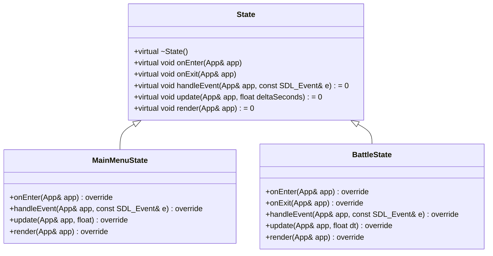
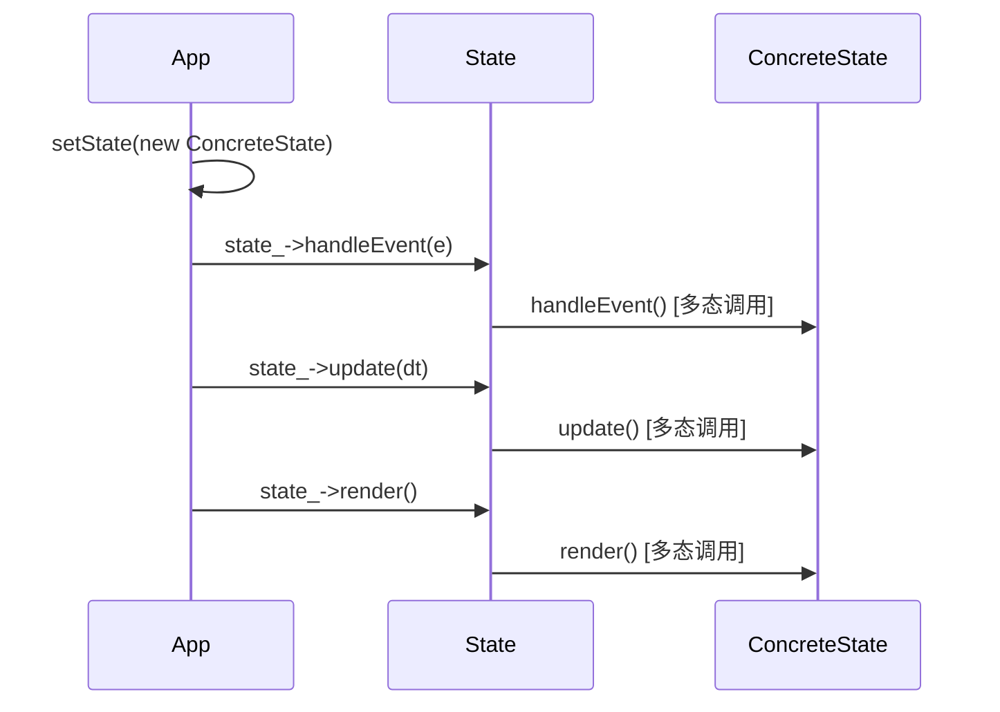

# State基类规范

<cite>
**本文档引用的文件**  
- [State.h](file://Tracer/src/core/State.h)
- [App.h](file://Tracer/src/core/App.h)
- [App.cpp](file://Tracer/src/core/App.cpp)
- [MainMenuState.h](file://Tracer/src/states/MainMenuState.h)
- [MainMenuState.cpp](file://Tracer/src/states/MainMenuState.cpp)
- [BattleState.h](file://Tracer/src/states/BattleState.h)
</cite>

## 目录
1. [引言](#引言)
2. [State基类设计概述](#state基类设计概述)
3. [核心接口解析](#核心接口解析)
4. [纯虚函数与默认虚函数的设计意图](#纯虚函数与默认虚函数的设计意图)
5. [状态类的派生与重写规范](#状态类的派生与重写规范)
6. [标准实现模板与常见错误](#标准实现模板与常见错误)
7. [多态在状态切换中的作用](#多态在状态切换中的作用)
8. [App与State的双向依赖关系](#app与state的双向依赖关系)
9. [结论](#结论)

## 引言
`State` 抽象基类是本游戏框架中状态模式的核心实现，负责定义所有游戏状态的统一行为接口。通过继承该基类并实现其虚函数，开发者可以构建如主菜单、战斗、交易等不同游戏状态。本文档全面阐述 `State` 类的设计理念、接口规范及其在状态管理中的关键作用。

## State基类设计概述

`State` 类是一个抽象基类，采用纯虚函数和默认实现虚函数相结合的方式，为所有具体状态类提供统一的生命周期管理和行为契约。其设计遵循开闭原则，允许扩展但禁止修改，确保状态切换的灵活性与安全性。



**图示来源**  
- [State.h](file://Tracer/src/core/State.h#L1-L17)
- [MainMenuState.h](file://Tracer/src/states/MainMenuState.h#L1-L69)
- [BattleState.h](file://Tracer/src/states/BattleState.h#L1-L81)

**本节来源**  
- [State.h](file://Tracer/src/core/State.h#L1-L17)

## 核心接口解析

### onEnter：状态激活时的初始化
`onEnter` 方法在状态被激活时调用，用于执行资源加载、UI初始化、音频播放等准备工作。该方法提供默认空实现，子类可根据需要选择性重写。

**调用时机**：当 `App::setState()` 被调用并传入新状态时，新状态的 `onEnter` 将在旧状态 `onExit` 后立即执行。

**本节来源**  
- [State.h](file://Tracer/src/core/State.h#L7)
- [App.cpp](file://Tracer/src/core/App.cpp#L70-L77)

### onExit：状态退出时的清理
`onExit` 方法在状态被销毁前调用，用于释放动态分配的资源、关闭文件句柄、停止音频等清理工作。与 `onEnter` 一样，它也提供默认空实现。

**调用时机**：当 `App::setState()` 被调用时，当前状态的 `onExit` 会首先被调用，确保资源安全释放。

**本节来源**  
- [State.h](file://Tracer/src/core/State.h#L8)
- [App.cpp](file://Tracer/src/core/App.cpp#L70-L77)

### handleEvent：事件处理与分发
`handleEvent` 是一个纯虚函数，必须由子类实现。它负责处理所有输入事件（如鼠标点击、键盘输入），并根据事件类型执行相应逻辑。

**调用时机**：在 `App::run()` 的主循环中，每当有 SDL 事件产生时，当前状态的 `handleEvent` 就会被调用。

**示例**：`MainMenuState` 在 `handleEvent` 中检测按钮点击，并据此切换到 `BattleState`。

**本节来源**  
- [State.h](file://Tracer/src/core/State.h#L9)
- [App.cpp](file://Tracer/src/core/App.cpp#L58-L60)
- [MainMenuState.cpp](file://Tracer/src/states/MainMenuState.cpp#L280-L300)

### update：游戏逻辑更新
`update` 是另一个纯虚函数，用于驱动游戏逻辑的更新。它接收一个 `deltaSeconds` 参数，表示自上一帧以来经过的时间（以秒为单位），用于实现帧率无关的动画和物理计算。

**调用时机**：在 `App::run()` 的主循环中，每帧调用一次。

**示例**：`MainMenuState` 使用 `update` 来更新数据流的滚动位置和星光的闪烁效果。

**本节来源**  
- [State.h](file://Tracer/src/core/State.h#L10)
- [App.cpp](file://Tracer/src/core/App.cpp#L64-L66)
- [MainMenuState.cpp](file://Tracer/src/states/MainMenuState.cpp#L302-L320)

### render：画面渲染
`render` 是纯虚函数，负责将当前状态的画面绘制到渲染器上。它应在 `update` 之后调用，确保显示的是最新逻辑状态。

**调用时机**：在 `App::run()` 的主循环中，`update` 之后、`SDL_RenderPresent` 之前调用。

**示例**：`MainMenuState::render` 绘制了标题、按钮、数据流和装饰元素。

**本节来源**  
- [State.h](file://Tracer/src/core/State.h#L11)
- [App.cpp](file://Tracer/src/core/App.cpp#L68-L72)
- [MainMenuState.cpp](file://Tracer/src/states/MainMenuState.cpp#L322-L400)

## 纯虚函数与默认虚函数的设计意图

`State` 基类巧妙地区分了必须实现和可选实现的接口：

- **纯虚函数**（`handleEvent`, `update`, `render`）：这些是状态的核心行为，每个具体状态都必须有独特的实现，因此强制子类重写。
- **默认虚函数**（`onEnter`, `onExit`）：这些是可选的生命周期钩子。提供空实现可以避免子类因无需初始化/清理而仍需编写空函数的冗余代码，提升了代码的简洁性和可维护性。

这种设计既保证了接口的完整性，又给予了子类最大的灵活性。

**本节来源**  
- [State.h](file://Tracer/src/core/State.h#L7-L11)

## 状态类的派生与重写规范

从 `State` 派生新状态类的标准步骤如下：

1. **继承**：`class NewState : public State`
2. **声明析构函数**：通常为 `~NewState() override;`
3. **重写虚函数**：根据需要重写 `onEnter`, `onExit`, `handleEvent`, `update`, `render`
4. **实现逻辑**：在 `.cpp` 文件中实现各函数的具体逻辑

**关键点**：
- 所有重写函数必须使用 `override` 关键字，确保正确覆盖基类方法。
- 若子类需要 `onEnter` 或 `onExit`，应明确重写，即使基类提供了默认实现。

**本节来源**  
- [MainMenuState.h](file://Tracer/src/states/MainMenuState.h#L1-L69)
- [BattleState.h](file://Tracer/src/states/BattleState.h#L1-L81)

## 标准实现模板与常见错误

### 标准实现模板
```cpp
class MyState : public State {
public:
    void onEnter(App& app) override;
    void onExit(App& app) override;
    void handleEvent(App& app, const SDL_Event& e) override;
    void update(App& app, float deltaSeconds) override;
    void render(App& app) override;
};

void MyState::onEnter(App& app) {
    // 初始化资源
}

void MyState::onExit(App& app) {
    // 释放资源
}

void MyState::handleEvent(App& app, const SDL_Event& e) {
    // 处理事件
}

void MyState::update(App& app, float deltaSeconds) {
    // 更新逻辑
}

void MyState::render(App& app) {
    // 渲染画面
}
```

### 常见错误
- **未调用基类方法**：如果基类 `onEnter`/`onExit` 有重要逻辑，子类重写时应显式调用 `State::onEnter(app)`。
- **资源未释放**：在 `onExit` 中忘记释放 `new` 出来的对象或关闭文件，导致内存泄漏。
- **事件处理遗漏**：在 `handleEvent` 中未处理 `SDL_QUIT` 事件，导致无法正常退出。
- **忽略 deltaSeconds**：在 `update` 中使用固定步长而非 `deltaSeconds`，导致游戏速度依赖于帧率。

**本节来源**  
- [State.h](file://Tracer/src/core/State.h#L7-L11)
- [App.cpp](file://Tracer/src/core/App.cpp#L70-L77)
- [MainMenuState.cpp](file://Tracer/src/states/MainMenuState.cpp#L100-L400)

## 多态在状态切换中的作用

多态是状态模式得以实现的关键。`App` 类通过 `std::unique_ptr<State>` 持有当前状态，使得 `setState` 方法可以接受任何 `State` 的派生类对象。在调用 `handleEvent`, `update`, `render` 时，实际执行的是具体状态类的重写方法，实现了运行时的动态行为绑定。

这种设计完全解耦了 `App` 与具体状态类，新增状态无需修改 `App` 的代码，符合开闭原则。



**图示来源**  
- [App.cpp](file://Tracer/src/core/App.cpp#L58-L72)
- [State.h](file://Tracer/src/core/State.h#L9-L11)

**本节来源**  
- [App.h](file://Tracer/src/core/App.h#L22)
- [App.cpp](file://Tracer/src/core/App.cpp#L70-L77)

## App与State的双向依赖关系

`App` 与 `State` 之间存在双向依赖：
- `App` 持有 `State` 的指针，并在其生命周期中调用其方法。
- `State` 的所有方法都接收 `App&` 引用，以便访问 `App` 提供的 `window_`, `renderer_` 等资源。

这种设计是安全的，因为：
1. **依赖稳定**：`App` 的接口相对稳定，`State` 依赖的是其公共方法。
2. **生命周期明确**：`State` 的生命周期完全由 `App` 管理，`App` 在销毁前会先释放 `State`，避免悬空引用。
3. **接口清晰**：`App` 通过引用传递自身，`State` 只能使用 `App` 公开的接口，不会破坏其内部状态。

**本节来源**  
- [App.h](file://Tracer/src/core/App.h#L22)
- [State.h](file://Tracer/src/core/State.h#L9-L11)
- [App.cpp](file://Tracer/src/core/App.cpp#L70-L77)

## 结论
`State` 抽象基类通过精心设计的接口规范，为游戏状态管理提供了强大而灵活的框架。理解其生命周期方法、多态机制和与 `App` 的交互模式，是开发和维护游戏状态逻辑的基础。遵循本文档的规范，可以确保代码的可维护性、可扩展性和稳定性。