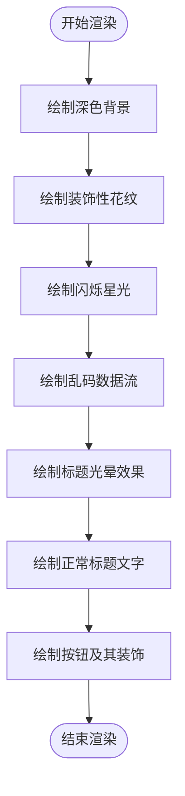

# 主菜单状态 (MainMenuState)

<cite>
**本文档中引用的文件**  
- [MainMenuState.h](file://Tracer/src/states/MainMenuState.h)
- [MainMenuState.cpp](file://Tracer/src/states/MainMenuState.cpp)
- [App.h](file://Tracer/src/core/App.h)
- [State.h](file://Tracer/src/core/State.h)
- [Button.h](file://Tracer/src/ui/Button.h)
- [Button.cpp](file://Tracer/src/ui/Button.cpp)
- [BattleState.h](file://Tracer/src/states/BattleState.h)
- [TestState.h](file://Tracer/src/states/TestState.h)
</cite>

## 目录
1. [简介](#简介)
2. [类结构与继承关系](#类结构与继承关系)
3. [核心方法实现](#核心方法实现)
4. [视觉特效实现](#视觉特效实现)
5. [UI组件集成与事件处理](#ui组件集成与事件处理)
6. [资源管理与RAII实践](#资源管理与raii实践)
7. [状态切换机制](#状态切换机制)
8. [常见问题与解决方案](#常见问题与解决方案)
9. [性能优化建议](#性能优化建议)
10. [结论](#结论)

## 简介
`MainMenuState` 是游戏《溯洄遗梦》的初始入口界面，作为游戏启动后呈现给玩家的第一个交互界面。该状态继承自 `State` 基类，实现了标准的状态机接口，包括事件处理、更新逻辑和渲染流程。其设计融合了科技感与艺术美感，通过动态数字流、闪烁星光、装饰性花纹和标题光晕等视觉元素营造出沉浸式的启动体验。同时，该状态集成了多个按钮组件，支持导航至战斗、藏馆或测试面板等功能模块。

**Section sources**
- [MainMenuState.h](file://Tracer/src/states/MainMenuState.h#L15-L66)
- [MainMenuState.cpp](file://Tracer/src/states/MainMenuState.cpp#L1-L401)

## 类结构与继承关系
`MainMenuState` 类继承自抽象基类 `State`，遵循状态模式的设计原则。`State` 定义了所有游戏状态必须实现的纯虚方法，确保状态切换的一致性和可预测性。


**Diagram sources**
- [State.h](file://Tracer/src/core/State.h#L6-L14)
- [MainMenuState.h](file://Tracer/src/states/MainMenuState.h#L15-L66)

## 核心方法实现
`MainMenuState` 实现了 `State` 接口定义的四个核心方法：`onEnter`、`handleEvent`、`update` 和 `render`。这些方法共同构成了主菜单状态的生命周期。

### onEnter
在进入主菜单状态时调用，负责初始化所有资源，包括字体加载、标题纹理生成、按钮创建与布局、动态特效（数据流、星光、装饰）的初始化。

### handleEvent
处理用户输入事件，特别是鼠标点击事件。对于普通按钮，通过 `setOnClick` 绑定回调函数；对于“开始游戏”和“测试”按钮，则在事件处理中直接调用 `App::setState` 切换状态。

### update
更新动态特效的逻辑状态，包括数据流的垂直移动与重置、星光的亮度变化（模拟闪烁效果）。

### render
执行分层绘制操作，依次绘制背景、装饰性花纹、星光、数据流、标题光晕、按钮及其装饰，形成丰富的视觉层次。

**Section sources**
- [MainMenuState.h](file://Tracer/src/states/MainMenuState.h#L15-L66)
- [MainMenuState.cpp](file://Tracer/src/states/MainMenuState.cpp#L1-L401)

## 视觉特效实现
`MainMenuState` 的视觉构成采用分层绘制策略，在 `render` 方法中按特定顺序绘制多个视觉层，以实现复杂的视觉效果。

### 动态数字流背景
由 `DataStream` 结构体数组管理，每个数据流包含随机字符序列和对应的透明度值。在 `update` 中更新其 Y 坐标，在 `render` 中逐字符绘制，形成从上至下的数字雨效果。

### 闪烁星光
由 `Star` 结构体数组管理，每个星光具有随机位置、亮度和闪烁速度。在 `update` 中通过正弦波函数更新亮度，在 `render` 中根据亮度设置透明度绘制小矩形。

### 装饰性花纹
由 `Decoration` 结构体数组管理，包含圆形和弧线两种类型。在 `render` 中使用点阵方式绘制，形成点缀式的科技感装饰。

### 科技感标题光晕
标题“溯洄遗梦”使用大字体渲染为纹理，并通过多层偏移、缩放和透明度调整的阴影纹理叠加，模拟类似 CSS `text-shadow` 的真实光晕效果。使用 `SDL_BLENDMODE_ADD` 混合模式增强发光感。



**Diagram sources**
- [MainMenuState.cpp](file://Tracer/src/states/MainMenuState.cpp#L200-L401)

## UI组件集成与事件处理
`MainMenuState` 集成了五个 `Button` 对象，分别对应“开始游戏”、“设置”、“藏馆”、“退出”和“测试”功能。

### Button 类设计
`Button` 类封装了矩形区域、文本、字体、纹理和回调函数。通过 `setOnClick` 方法绑定 `std::function<void()>` 类型的回调，实现事件驱动的逻辑解耦。

```mermaid
classDiagram
class Button {
+using Callback = std : : function<void()>
+Button()
+setRect(const SDL_Rect& r) void
+setText(const std : : string& text) void
+setOnClick(Callback cb) void
+handleEvent(const SDL_Event& e) void
+render(SDL_Renderer* renderer) const void
+setFont(_TTF_Font* font, SDL_Renderer* renderer) void
+isHovered() const bool
+getRect() const SDL_Rect&
}
```

**Diagram sources**
- [Button.h](file://Tracer/src/ui/Button.h#L1-L33)
- [Button.cpp](file://Tracer/src/ui/Button.cpp#L12-L153)

### 按钮布局与回调
按钮采用垂直居中布局，“测试”按钮位于右上角。普通按钮通过 `setOnClick` 设置回调：
- “设置”：输出日志
- “藏馆”：输出日志
- “退出”：推送 `SDL_QUIT` 事件

“开始游戏”和“测试”按钮的点击逻辑在 `handleEvent` 中直接处理，通过 `App::setState` 创建新状态并切换。

**Section sources**
- [MainMenuState.cpp](file://Tracer/src/states/MainMenuState.cpp#L70-L150)

## 资源管理与RAII实践
`MainMenuState` 在 `onEnter` 中加载资源，在 `onExit` 中释放资源，体现了 RAII（Resource Acquisition Is Initialization）的设计思想。

### 资源加载 (onEnter)
- 使用 `TTF_OpenFont` 加载中文字体
- 使用 `TTF_RenderUTF8_Blended` 生成标题纹理
- 动态创建 `Button` 对象并初始化其属性
- 初始化 `DataStream`、`Decoration`、`Star` 数组

### 资源清理 (onExit)
虽然当前代码未显式展示 `onExit` 实现，但根据 `State` 基类的设计，`MainMenuState` 应在析构函数或 `onExit` 中：
- 释放 `font_` 和 `smallFont_` 字体资源
- 销毁 `titleTex_` 纹理
- 释放所有 `Button` 对象
- 清空 `streams_`、`decorations_`、`stars_` 容器

这种在状态进入时获取资源、退出时释放资源的模式，确保了资源的正确生命周期管理。

**Section sources**
- [MainMenuState.cpp](file://Tracer/src/states/MainMenuState.cpp#L50-L150)
- [State.h](file://Tracer/src/core/State.h#L6-L14)

## 状态切换机制
状态切换通过 `App` 类的 `setState` 方法实现，该方法遵循严格的 RAII 流程：


当用户点击“开始游戏”按钮时，`handleEvent` 方法中执行：
```cpp
app.setState(std::unique_ptr<State>(new BattleState()));
```
此操作会：
1. 调用当前状态（`MainMenuState`）的 `onExit` 方法清理资源
2. 将 `App` 的状态指针指向新的 `BattleState` 实例
3. 调用 `BattleState` 的 `onEnter` 方法初始化战斗场景

**Diagram sources**
- [App.cpp](file://Tracer/src/core/App.cpp#L70-L74)
- [MainMenuState.cpp](file://Tracer/src/states/MainMenuState.cpp#L150-L170)

## 常见问题与解决方案
### 字体加载失败
**问题**：`TTF_OpenFont` 返回 `nullptr`，导致标题和按钮文本无法显示。  
**原因**：字体文件路径错误或文件缺失。  
**解决方案**：
- 确保 `assets/fonts/Sanji.ttf` 文件存在于正确路径
- 使用绝对路径或验证工作目录
- 添加更详细的错误日志，如 `SDL_Log("Font file not found: %s", "assets/fonts/Sanji.ttf");`

### 按钮响应延迟
**问题**：按钮点击后状态切换不及时或无响应。  
**原因**：事件处理逻辑错误或状态切换时机不当。  
**解决方案**：
- 确保在 `handleEvent` 中正确检测鼠标点击事件
- 避免在事件处理中执行耗时操作
- 使用 `pending` 标志延迟状态切换，如 `TestState` 中的 `pendingTarget_` 机制

### 内存泄漏
**问题**：动态创建的 `Button` 对象未被释放。  
**解决方案**：
- 在 `MainMenuState` 的析构函数或 `onExit` 中遍历 `buttons_` 数组并 `delete` 每个指针
- 考虑使用智能指针（如 `std::unique_ptr<Button>`）自动管理内存

**Section sources**
- [MainMenuState.cpp](file://Tracer/src/states/MainMenuState.cpp#L50-L60)
- [MainMenuState.cpp](file://Tracer/src/states/MainMenuState.cpp#L150-L170)

## 性能优化建议
### 纹理缓存
当前实现中，数据流的每个字符都在 `render` 中实时生成纹理，造成大量 `TTF_RenderUTF8_Blended` 和 `SDL_CreateTextureFromSurface` 调用，严重影响性能。

**优化方案**：
- 预生成常用字符（如 '0'-'9', 'A'-'Z'）的纹理缓存
- 在 `onEnter` 中创建缓存，在 `render` 中直接复用
- 使用纹理图集（Texture Atlas）进一步减少绘制调用

### 渲染批次优化
频繁调用 `SDL_RenderCopy` 绘制单个字符或小矩形会导致渲染批次过多。

**优化方案**：
- 将同类绘制操作合并，如使用 `SDL_RenderDrawPoints` 一次性绘制所有星光
- 对数据流使用顶点数组或自定义着色器进行 GPU 加速渲染
- 减少 `SDL_SetRenderDrawColor` 和混合模式切换的频率

### 特效简化
在低端设备上，可动态调整特效密度：
- 降低 `streamCount` 和 `starCount`
- 减少标题光晕的层数
- 简化按钮悬停光晕效果

**Section sources**
- [MainMenuState.cpp](file://Tracer/src/states/MainMenuState.cpp#L300-L350)

## 结论
`MainMenuState` 作为游戏的初始入口，成功实现了功能完整、视觉丰富的主菜单界面。其设计遵循了清晰的状态模式，通过继承 `State` 基类实现了标准化的生命周期管理。UI 组件与事件处理解耦良好，通过 `Button` 类的回调机制实现了灵活的导航逻辑。视觉特效层次分明，营造出独特的科技美学氛围。尽管存在潜在的性能瓶颈，但通过纹理缓存和渲染优化可显著提升效率。整体实现体现了良好的面向对象设计和资源管理实践，为后续状态开发提供了优秀范例。