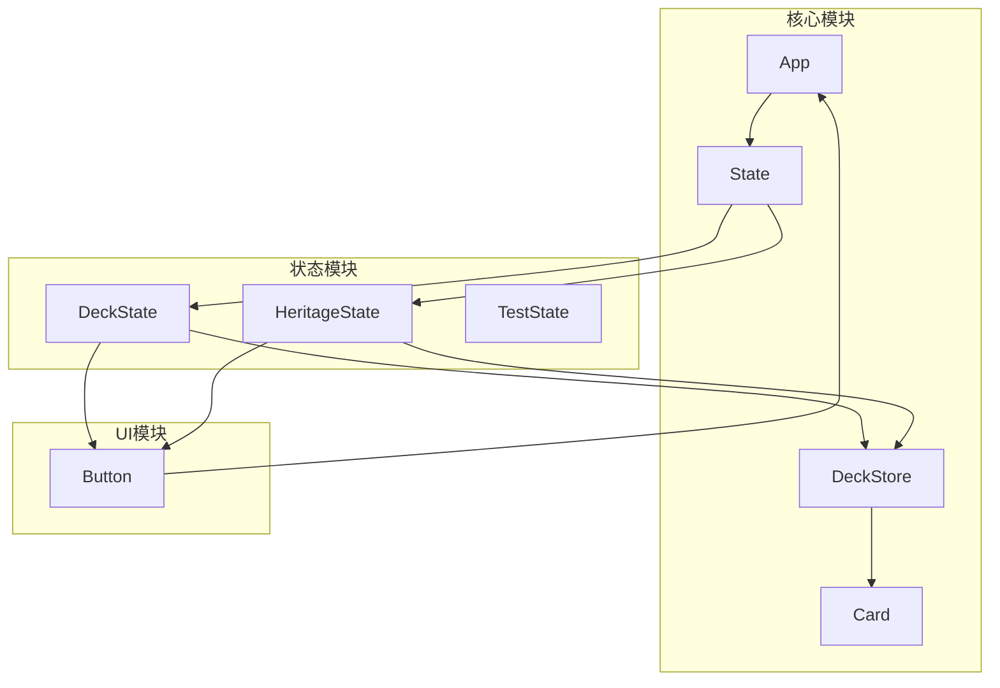
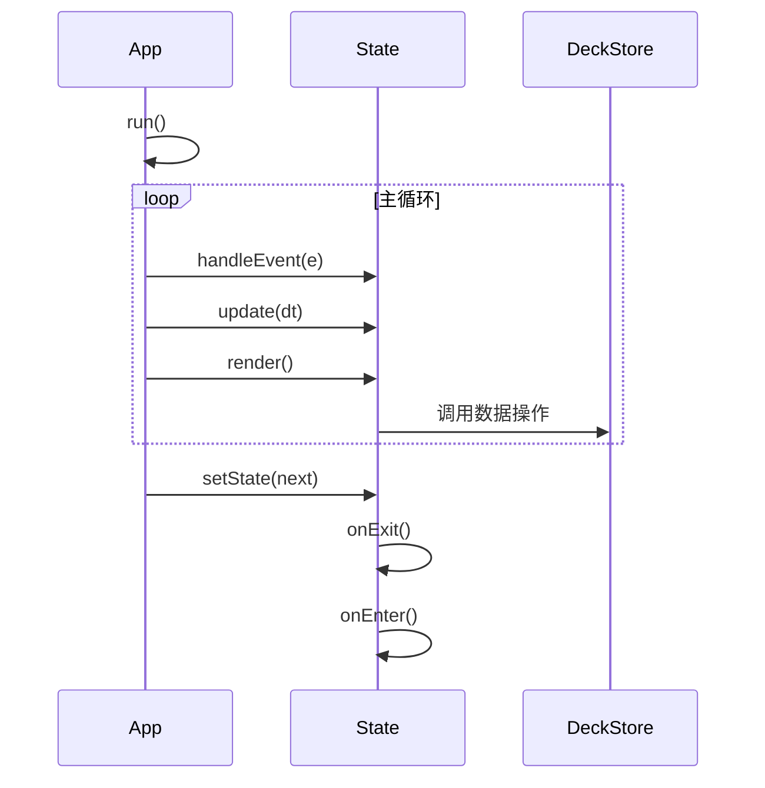
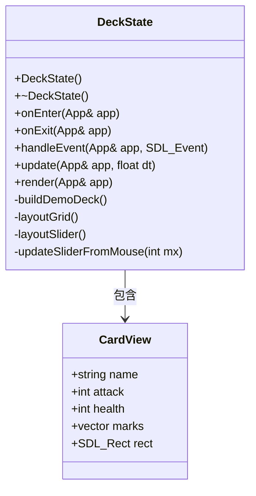
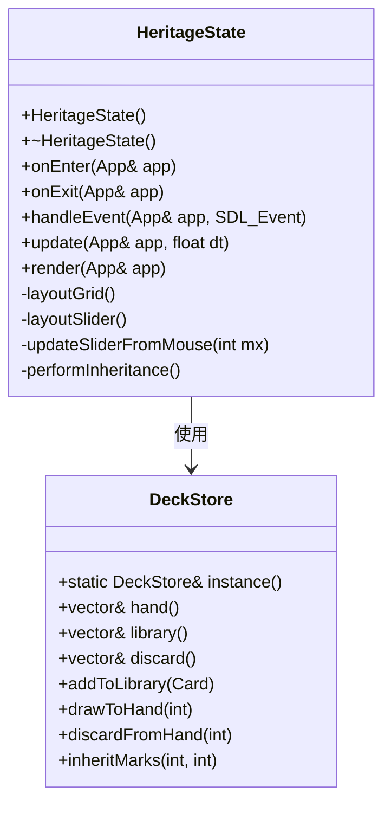
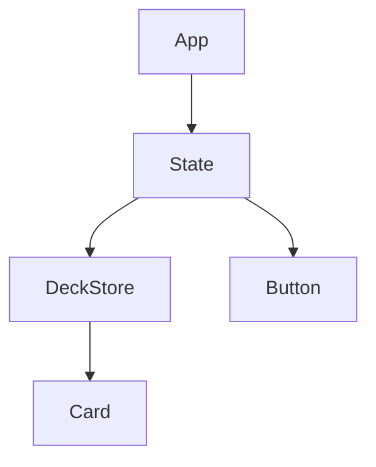

# 卡组与遗产管理状态 (DeckState & HeritageState)

<cite>
**本文档中引用的文件**  
- [DeckState.h](file://Tracer/src/states/DeckState.h)
- [DeckState.cpp](file://Tracer/src/states/DeckState.cpp)
- [HeritageState.h](file://Tracer/src/states/HeritageState.h)
- [HeritageState.cpp](file://Tracer/src/states/HeritageState.cpp)
- [Card.h](file://Tracer/src/core/Card.h)
- [Deck.h](file://Tracer/src/core/Deck.h)
- [Deck.cpp](file://Tracer/src/core/Deck.cpp)
- [App.h](file://Tracer/src/core/App.h)
- [App.cpp](file://Tracer/src/core/App.cpp)
- [State.h](file://Tracer/src/core/State.h)
- [Button.h](file://Tracer/src/ui/Button.h)
</cite>

## 目录
1. [简介](#简介)
2. [项目结构](#项目结构)
3. [核心组件](#核心组件)
4. [架构概览](#架构概览)
5. [详细组件分析](#详细组件分析)
6. [依赖关系分析](#依赖关系分析)
7. [性能考量](#性能考量)
8. [故障排除指南](#故障排除指南)
9. [结论](#结论)

## 简介
本项目为一个基于SDL的卡牌管理系统，核心功能围绕卡组（Deck）与遗产（Heritage）两大状态展开。`DeckState` 提供卡组的可视化编辑与配置界面，支持动态调整卡牌数量；`HeritageState` 实现“文脉传承”机制，允许玩家将一张卡牌的属性印记转移至另一张卡牌。系统通过单例 `DeckStore` 统一管理卡牌数据，实现状态间的数据共享与持久化。

## 项目结构
项目采用分层架构，核心模块分离清晰：
- `core/`：包含核心数据结构（Card）、状态管理（State）、应用主循环（App）及卡组存储（DeckStore）。
- `states/`：实现具体的游戏状态，如卡组编辑（DeckState）、遗产传承（HeritageState）、战斗（BattleState）等。
- `ui/`：提供基础UI组件（Button），支持事件处理与渲染。



**Diagram sources**
- [App.h](file://Tracer/src/core/App.h#L1-L30)
- [State.h](file://Tracer/src/core/State.h#L1-L17)
- [Deck.h](file://Tracer/src/core/Deck.h#L7-L28)
- [Card.h](file://Tracer/src/core/Card.h#L5-L11)

**Section sources**
- [App.h](file://Tracer/src/core/App.h#L1-L30)
- [State.h](file://Tracer/src/core/State.h#L1-L17)

## 核心组件

`DeckState` 与 `HeritageState` 均继承自 `State` 抽象基类，负责各自界面的事件处理、更新与渲染。`DeckStore` 作为全局数据容器，通过单例模式确保数据一致性。`Card` 结构体定义了卡牌的基本属性，而 `Button` 提供了用户交互的基础。

**Section sources**
- [DeckState.h](file://Tracer/src/states/DeckState.h#L9-L54)
- [HeritageState.h](file://Tracer/src/states/HeritageState.h#L10-L55)
- [Deck.h](file://Tracer/src/core/Deck.h#L7-L28)
- [Card.h](file://Tracer/src/core/Card.h#L5-L11)

## 架构概览

系统采用状态机模式驱动主循环，`App` 类维护当前 `State` 实例，并在状态切换时调用 `onExit` 与 `onEnter` 生命周期方法。卡牌数据由 `DeckStore` 单例统一管理，各状态通过其接口读写手牌、牌库与弃牌堆。



**Diagram sources**
- [App.cpp](file://Tracer/src/core/App.cpp#L48-L74)
- [State.h](file://Tracer/src/core/State.h#L1-L17)
- [Deck.cpp](file://Tracer/src/core/Deck.cpp#L3-L43)

## 详细组件分析

### DeckState 分析
`DeckState` 实现卡组的可视化编辑功能，核心包括卡牌网格布局与数量滑动条。

#### 卡牌数据结构与渲染
`DeckState` 内部使用 `CardView` 结构体缓存渲染所需数据（名称、攻击、生命、印记），通过 `buildDemoDeck()` 构造示例卡牌，并在 `render()` 中绘制水墨风格的卡牌网格。卡牌尺寸与布局通过 `layoutGrid()` 动态计算，确保在不同屏幕分辨率下自适应排列。



**Diagram sources**
- [DeckState.h](file://Tracer/src/states/DeckState.h#L9-L54)
- [DeckState.cpp](file://Tracer/src/states/DeckState.cpp#L1-L303)

**Section sources**
- [DeckState.h](file://Tracer/src/states/DeckState.h#L9-L54)
- [DeckState.cpp](file://Tracer/src/states/DeckState.cpp#L1-L303)

#### 滑动条交互逻辑
`DeckState` 提供滑动条控件，允许用户动态调整卡组中卡牌的数量（3-20张）。`layoutSlider()` 计算滑动条的UI位置，`updateSliderFromMouse()` 处理鼠标拖拽事件，并在数量变化时重新生成卡组与布局。

### HeritageState 分析
`HeritageState` 实现“文脉传承”功能，允许玩家选择一张“牺牲卡”将其印记转移至“目标卡”，随后牺牲卡被移除。

#### UI设计模式
该状态采用列表滚动与卡片预览结合的设计。所有手牌以网格形式展示，用户可通过点击选择源卡与目标卡。选中状态通过高亮边框（金色为源，青色为目标）与中心水印文字（“源”、“承”）进行视觉反馈。底部提示信息栏提供操作指引。



**Diagram sources**
- [HeritageState.h](file://Tracer/src/states/HeritageState.h#L10-L55)
- [HeritageState.cpp](file://Tracer/src/states/HeritageState.cpp#L1-L218)
- [Deck.h](file://Tracer/src/core/Deck.h#L7-L28)
- [Deck.cpp](file://Tracer/src/core/Deck.cpp#L3-L43)

**Section sources**
- [HeritageState.h](file://Tracer/src/states/HeritageState.h#L10-L55)
- [HeritageState.cpp](file://Tracer/src/states/HeritageState.cpp#L1-L218)

#### 状态间协作
`HeritageState::onEnter()` 在进入状态时，会检查 `DeckStore` 中的手牌与牌库是否为空。若为空，则构造示例卡牌并抽入手牌，确保界面有内容可展示。这体现了状态初始化时对全局数据的依赖与初始化逻辑。

### Card与Deck类分析
`Card` 结构体定义了卡牌的核心属性：唯一ID、名称、攻击力、生命值及印记列表。`DeckStore` 作为单例类，管理三个卡牌容器：手牌（hand）、牌库（library）、弃牌堆（discard），并提供添加、抽牌、弃牌及印记传承等操作。

```mermaid
erDiagram
Card {
string id PK
string name
int attack
int health
string marks
}
DeckStore {
vector<Card> hand
vector<Card> library
vector<Card> discard
}
DeckStore ||--o{ Card : "包含"
```

**Diagram sources**
- [Card.h](file://Tracer/src/core/Card.h#L5-L11)
- [Deck.h](file://Tracer/src/core/Deck.h#L7-L28)
- [Deck.cpp](file://Tracer/src/core/Deck.cpp#L3-L43)

**Section sources**
- [Card.h](file://Tracer/src/core/Card.h#L5-L11)
- [Deck.h](file://Tracer/src/core/Deck.h#L7-L28)
- [Deck.cpp](file://Tracer/src/core/Deck.cpp#L3-L43)

## 依赖关系分析

系统依赖关系清晰，`App` 作为顶层容器，持有当前 `State`。各 `State` 通过 `DeckStore::instance()` 访问全局卡牌数据。`Button` 作为UI组件，被各状态实例化用于用户交互。



**Diagram sources**
- [App.h](file://Tracer/src/core/App.h#L1-L30)
- [State.h](file://Tracer/src/core/State.h#L1-L17)
- [Deck.h](file://Tracer/src/core/Deck.h#L7-L28)
- [Button.h](file://Tracer/src/ui/Button.h#L1-L10)

**Section sources**
- [App.h](file://Tracer/src/core/App.h#L1-L30)
- [State.h](file://Tracer/src/core/State.h#L1-L17)
- [Deck.h](file://Tracer/src/core/Deck.h#L7-L28)

## 性能考量

- **内存管理**：`DeckState` 和 `HeritageState` 在析构函数中正确释放了字体、纹理和按钮资源，避免内存泄漏。
- **资源复用**：`DeckStore` 作为单例，避免了数据的重复加载与复制。
- **渲染优化**：卡牌的布局信息（`SDL_Rect`）在 `layoutGrid()` 中预先计算，`render()` 时直接使用，减少实时计算开销。

## 故障排除指南

- **卡牌未显示**：检查 `DeckStore` 中 `hand()` 或 `library()` 是否为空，`HeritageState` 在 `onEnter()` 中会填充示例数据。
- **滑动条无响应**：确认 `handleEvent()` 中鼠标事件的坐标判断逻辑是否正确，`sliderDragging_` 标志位是否被正确设置。
- **传承功能失败**：检查 `performInheritance()` 中的索引边界判断，确保 `selectedSource_` 与 `selectedTarget_` 有效且不相等。

**Section sources**
- [HeritageState.cpp](file://Tracer/src/states/HeritageState.cpp#L1-L218)
- [Deck.cpp](file://Tracer/src/core/Deck.cpp#L31-L43)

## 结论

`DeckState` 与 `HeritageState` 共同构建了一个功能完整的卡牌管理与进化系统。前者侧重于卡组的配置与可视化，后者实现了独特的“文脉传承”玩法。通过 `DeckStore` 单例，实现了状态间的数据共享与持久化。代码结构清晰，职责分离明确，具备良好的可维护性与扩展性。