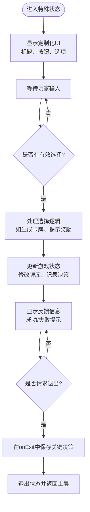
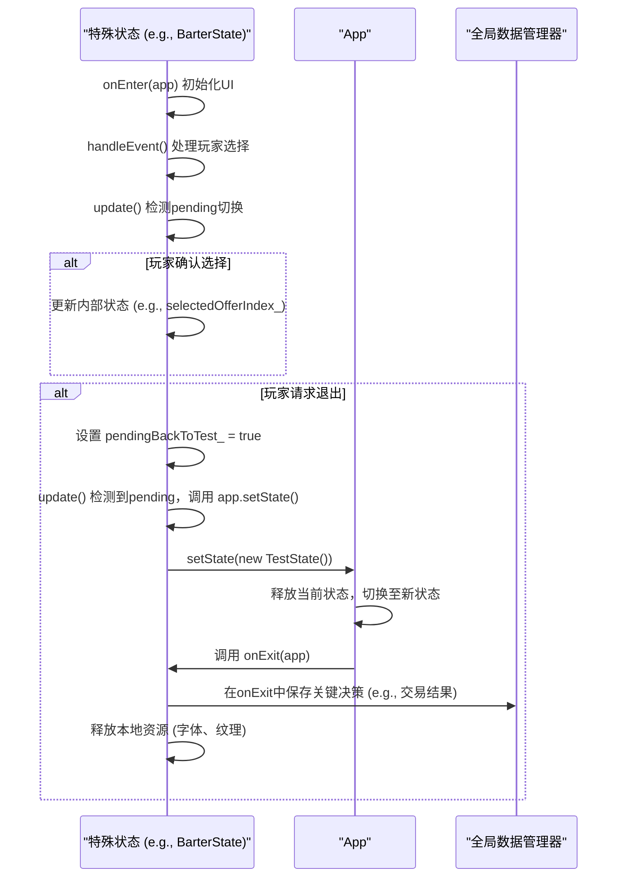

# 叙事与特殊状态 (MemoryRepairState, SeekerState, BurnState, BarterState)

<cite>
**本文档引用文件**  
- [MemoryRepairState.h](file://Tracer/src/states/MemoryRepairState.h)
- [MemoryRepairState.cpp](file://Tracer/src/states/MemoryRepairState.cpp)
- [SeekerState.h](file://Tracer/src/states/SeekerState.h)
- [SeekerState.cpp](file://Tracer/src/states/SeekerState.cpp)
- [BurnState.h](file://Tracer/src/states/BurnState.h)
- [BurnState.cpp](file://Tracer/src/states/BurnState.cpp)
- [BarterState.h](file://Tracer/src/states/BarterState.h)
- [BarterState.cpp](file://Tracer/src/states/BarterState.cpp)
- [State.h](file://Tracer/src/core/State.h)
- [App.h](file://Tracer/src/core/App.h)
- [TestState.h](file://Tracer/src/states/TestState.h)
- [TestState.cpp](file://Tracer/src/states/TestState.cpp)
</cite>

## 目录
1. [引言](#引言)
2. [核心状态功能分析](#核心状态功能分析)
3. [共性技术需求与实现机制](#共性技术需求与实现机制)
4. [状态管理与剧情变量传递](#状态管理与剧情变量传递)
5. [开发指导与最佳实践](#开发指导与最佳实践)
6. [结论](#结论)

## 引言
在叙事驱动型游戏中，特殊状态（如记忆修复、追寻者、焚毁、交易等）承担着推动剧情发展、增强玩家沉浸感的关键作用。这些状态通常表现为高度定制化的交互界面，结合动画、音频与视觉反馈，引导玩家做出关键决策。本文将深入分析 `MemoryRepairState`、`SeekerState`、`BurnState` 与 `BarterState` 在游戏叙事中的定位，探讨其共性技术实现，并提供开发层面的优化建议。

## 核心状态功能分析

### MemoryRepairState（记忆修复）
该状态实现“三选一”机制，玩家从随机生成的候选卡牌中选择一张加入牌库。其设计预留了模式标签（随机/种族/指定消耗），具备良好的扩展性。通过 `buildCandidates()` 与 `layoutCandidates()` 方法完成内容生成与布局，强调叙事中的“选择与成长”主题。

**状态来源**
- [MemoryRepairState.h](file://Tracer/src/states/MemoryRepairState.h#L1-L45)
- [MemoryRepairState.cpp](file://Tracer/src/states/MemoryRepairState.cpp)

### SeekerState（追寻者）
模拟“寻物”叙事场景，玩家从三件未知文物中选择一件进行“破壁”，揭示其奖励内容。文物具有稀有度分级（普通/稀有/传奇），并通过 `generateArtifacts()` 方法按权重生成，体现风险与回报的权衡，增强探索的悬念感。

**状态来源**
- [SeekerState.h](file://Tracer/src/states/SeekerState.h#L1-L51)
- [SeekerState.cpp](file://Tracer/src/states/SeekerState.cpp)

### BurnState（焚毁）
允许玩家从牌库中选择一张卡牌进行销毁（焚毁），以换取某种叙事上的代价或收益。该状态通过 `layoutGridFromLibrary()` 将牌库可视化为可交互网格，强调“牺牲”这一核心叙事主题，常用于资源管理或剧情分支触发。

**状态来源**
- [BurnState.h](file://Tracer/src/states/BurnState.h#L1-L37)
- [BurnState.cpp](file://Tracer/src/states/BurnState.cpp)

### BarterState（交易）
实现双向选择机制：左侧从牌库选择用于交易的卡牌，右侧提供三选一的报价卡牌。通过 `generateOffers()` 随机生成报价，`ensureDemoLibraryIfEmpty()` 确保空牌库时的测试可用性。此状态体现“交换”与“谈判”的叙事张力。

**状态来源**
- [BarterState.h](file://Tracer/src/states/BarterState.h#L1-L47)
- [BarterState.cpp](file://Tracer/src/states/BarterState.cpp)

**图示来源**
- [State.h](file://Tracer/src/core/State.h#L1-L17)
- [App.h](file://Tracer/src/core/App.h#L1-L30)

## 共性技术需求与实现机制

### 对话框渲染与UI定制
所有特殊状态均继承自 `State` 基类，重写 `render(App& app)` 方法实现自定义UI渲染。普遍使用 SDL_ttf 渲染多级字体（`titleFont_`、`smallFont_` 等），并通过 `SDL_Texture` 缓存标题文本，提升渲染效率。

### 选项分支处理
通过鼠标事件（`SDL_MOUSEBUTTONDOWN`）检测玩家点击位置，并与预设的 `SDL_Rect` 区域（如 `candidates_`、`artifacts_`、`cardRects_`）进行碰撞检测，确定选择项。选择后通过 `confirmButton_` 或类似控件确认，触发相应逻辑。

### 状态暂存与恢复
所有状态均通过 `onEnter()` 初始化资源（如字体、纹理、按钮），并在 `onExit()` 中释放资源。部分状态（如 `BarterState`）通过 `pendingBackToTest_` 标志位实现延迟状态切换，避免在事件处理中直接销毁当前对象。

**状态来源**
- [State.h](file://Tracer/src/core/State.h#L1-L17)
- [EngraveState.cpp](file://Tracer/src/states/EngraveState.cpp#L36-L76)

## 状态管理与剧情变量传递

### App上下文与状态切换
`App` 类通过 `setState(std::unique_ptr<State>)` 管理当前状态，实现状态间的无缝切换。特殊状态通过 `App& app` 参数访问全局上下文，读取牌库（`DeckStore::instance().library()`）、渲染器等资源。

### 剧情变量传递与保存
关键决策（如选择的卡牌、焚毁的卡牌、交易结果）通常存储在状态的成员变量（如 `result_`、`message_`）中。在 `onExit()` 时，可通过 `App` 上下文将这些变量写入全局数据管理器或剧情系统，确保决策持久化。

**图示来源**
- [App.h](file://Tracer/src/core/App.h#L1-L30)
- [TestState.cpp](file://Tracer/src/states/TestState.cpp#L187-L236)
- [EngraveState.cpp](file://Tracer/src/states/EngraveState.cpp#L36-L76)

## 开发指导与最佳实践

### 使用有限状态机管理叙事流程
建议将 `App` 的状态管理视为有限状态机（FSM），每个特殊状态为一个状态节点。通过清晰的 `onEnter`/`onExit` 协议确保状态切换的原子性与资源安全。利用 `TestState` 作为调试入口，快速验证多路径跳转逻辑。

### 增强表现力：音频与视觉特效
- **音频**：在关键事件（如选择确认、焚毁成功）时播放音效，强化反馈。
- **视觉特效**：使用粒子系统或着色器实现“破壁”、“焚毁”等动画效果，提升沉浸感。
- **UI动效**：为按钮、选项添加悬停、点击反馈动画，提升交互质感。

### 利用TestState进行快速验证
`TestState` 提供了通往所有特殊状态的快捷入口（通过 `pendingTarget_` 切换），是验证多路径叙事逻辑的理想工具。开发者可快速跳转至 `MemoryRepairState` 或 `SeekerState`，测试不同选择分支的UI与逻辑正确性。

**状态来源**
- [TestState.h](file://Tracer/src/states/TestState.h#L1-L42)
- [TestState.cpp](file://Tracer/src/states/TestState.cpp#L187-L236)

## 结论
`MemoryRepairState`、`SeekerState`、`BurnState` 与 `BarterState` 作为叙事驱动玩法的核心载体，通过高度定制化的UI与交互机制，实现了剧情分支、角色互动、资源牺牲与特殊决策等关键体验。其共性技术需求（对话框渲染、选项处理、状态管理）可通过统一的基类与设计模式高效实现。结合 `App` 上下文进行剧情变量传递，并在 `onExit` 时保存决策，确保了叙事的连贯性。推荐采用有限状态机管理复杂流程，并充分利用 `TestState` 进行多路径验证，以提升开发效率与游戏质量。