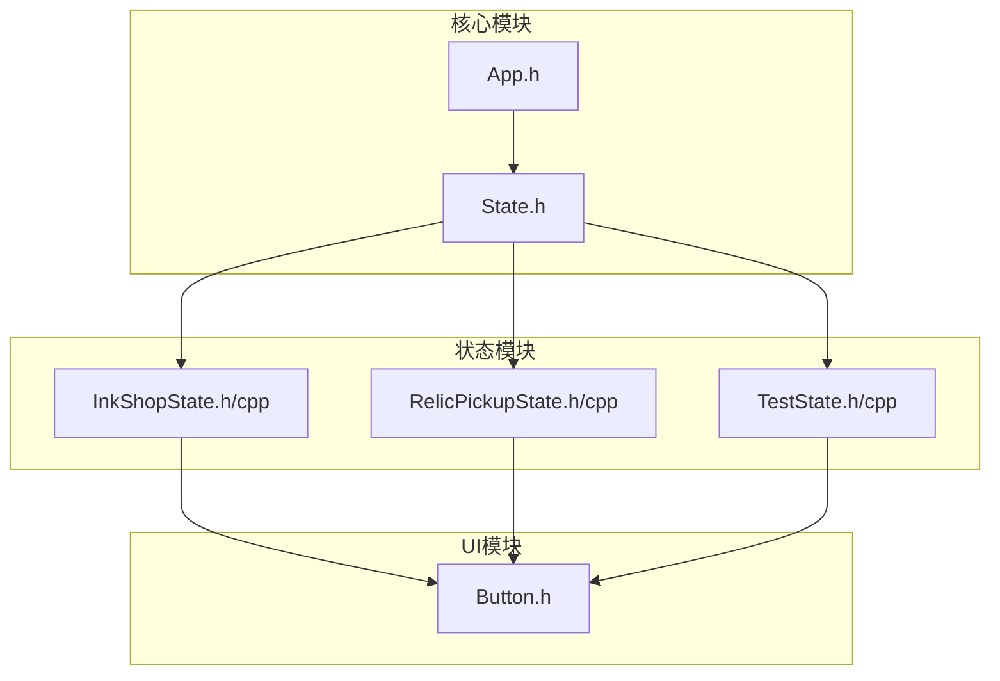
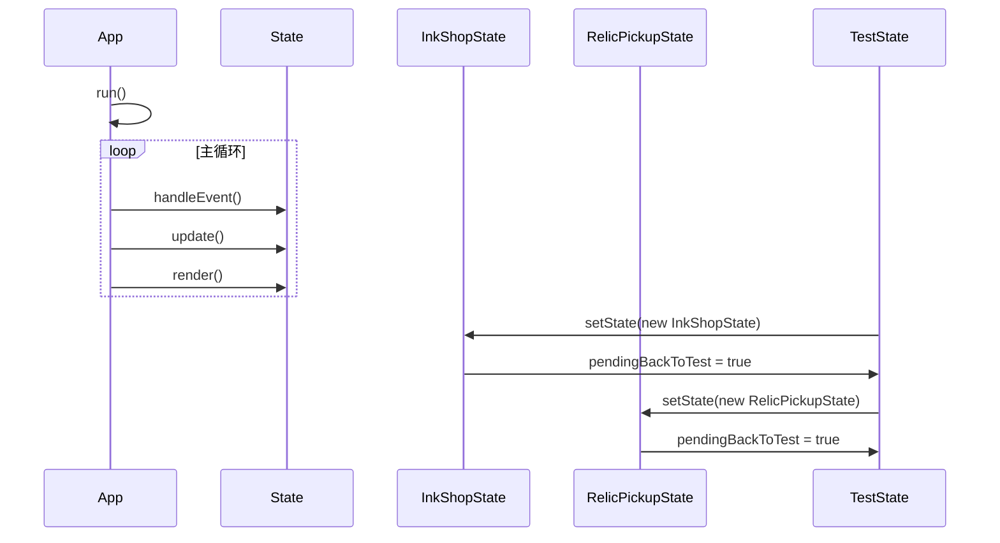
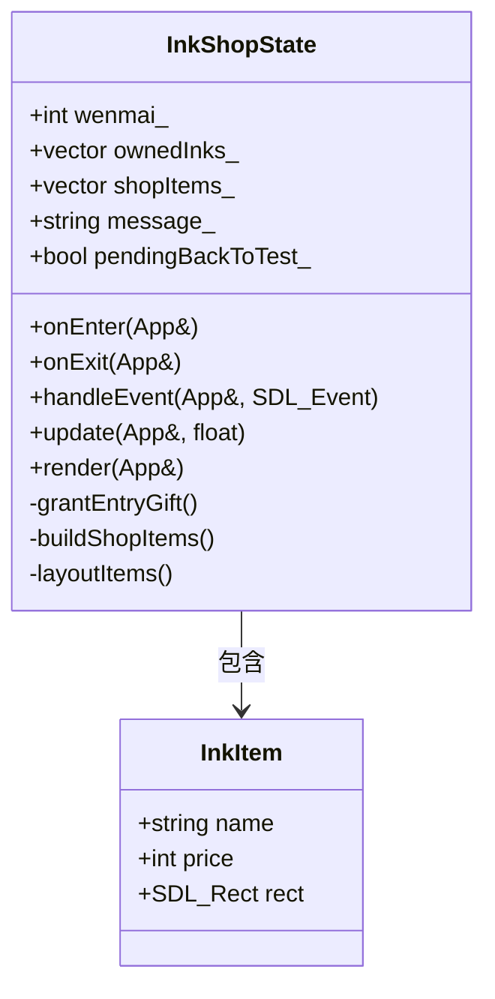
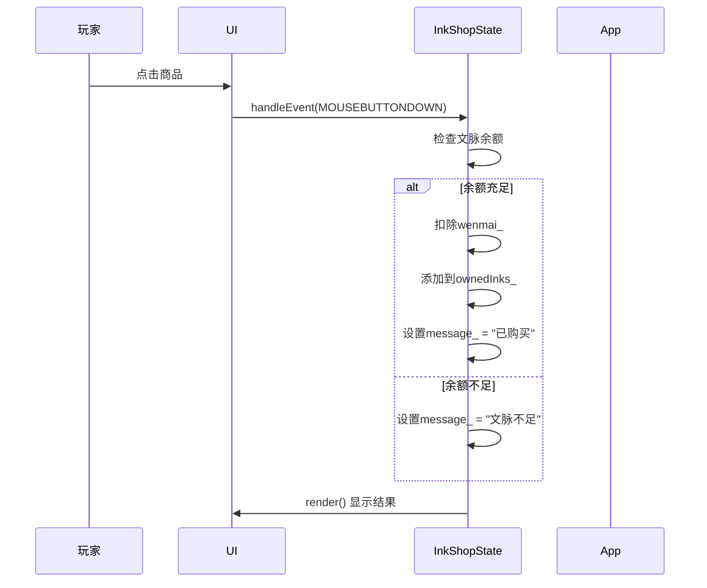
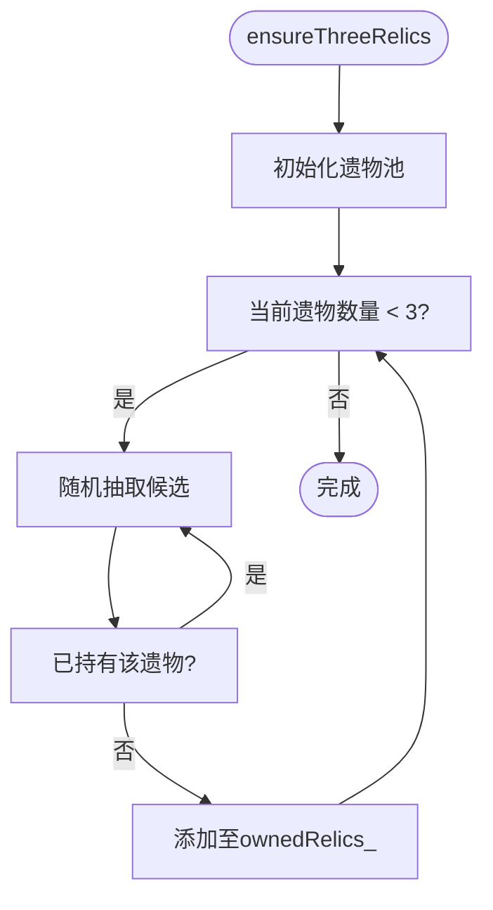
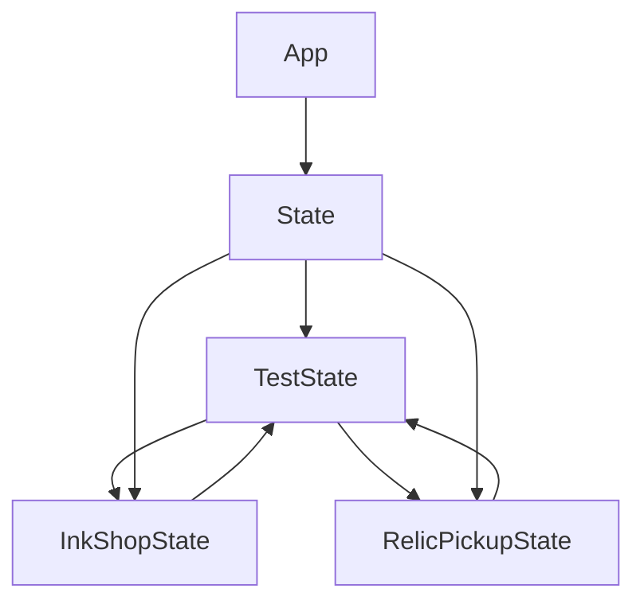

# 商店与遗物系统状态 (InkShopState & RelicPickupState)

<cite>
**本文档引用文件**  
- [InkShopState.h](file://Tracer/src/states/InkShopState.h)
- [InkShopState.cpp](file://Tracer/src/states/InkShopState.cpp)
- [RelicPickupState.h](file://Tracer/src/states/RelicPickupState.h)
- [RelicPickupState.cpp](file://Tracer/src/states/RelicPickupState.cpp)
- [TestState.h](file://Tracer/src/states/TestState.h)
- [TestState.cpp](file://Tracer/src/states/TestState.cpp)
- [State.h](file://Tracer/src/core/State.h)
- [App.h](file://Tracer/src/core/App.h)
- [Button.h](file://Tracer/src/ui/Button.h)
</cite>

## 目录
1. [简介](#简介)
2. [项目结构](#项目结构)
3. [核心组件](#核心组件)
4. [架构概览](#架构概览)
5. [详细组件分析](#详细组件分析)
6. [依赖分析](#依赖分析)
7. [性能考量](#性能考量)
8. [调试指南](#调试指南)
9. [结论](#结论)

## 简介
本文档深入解析游戏系统中的两个关键状态：`InkShopState`（墨坊状态）与`RelicPickupState`（遗物拾取状态）。前者实现虚拟商店功能，支持货币交易与商品购买；后者处理随机遗物选择机制，影响后续游戏进程。文档将分析其UI共性、与经济系统的集成方式、随机性算法设计及调试策略。

## 项目结构
本项目采用模块化分层结构，核心逻辑与状态管理分离。状态类集中于`states/`目录，UI组件独立封装，整体结构清晰，便于扩展与维护。

**图示来源**  
- [InkShopState.h](file://Tracer/src/states/InkShopState.h#L10-L40)
- [RelicPickupState.h](file://Tracer/src/states/RelicPickupState.h#L10-L33)
- [TestState.h](file://Tracer/src/states/TestState.h#L9-L41)
- [State.h](file://Tracer/src/core/State.h#L6-L14)

**本节来源**  
- [InkShopState.h](file://Tracer/src/states/InkShopState.h#L10-L40)
- [RelicPickupState.h](file://Tracer/src/states/RelicPickupState.h#L10-L33)

## 核心组件
`InkShopState`与`RelicPickupState`均继承自`State`基类，实现状态生命周期管理。两者通过`App`对象访问全局资源，使用`Button`组件构建交互界面，具备高度一致的UI设计语言。

**本节来源**  
- [InkShopState.h](file://Tracer/src/states/InkShopState.h#L10-L40)
- [RelicPickupState.h](file://Tracer/src/states/RelicPickupState.h#L10-L33)
- [State.h](file://Tracer/src/core/State.h#L6-L14)

## 架构概览
系统采用状态模式管理游戏流程，`App`类负责状态切换与主循环调度。各状态独立封装逻辑与渲染，通过事件驱动交互。

**图示来源**  
- [App.h](file://Tracer/src/core/App.h#L7-L27)
- [InkShopState.cpp](file://Tracer/src/states/InkShopState.cpp#L20-L35)
- [RelicPickupState.cpp](file://Tracer/src/states/RelicPickupState.cpp#L20-L30)
- [TestState.cpp](file://Tracer/src/states/TestState.cpp#L180-L200)

## 详细组件分析

### InkShopState 分析
`InkShopState`实现完整的商店系统，包含商品展示、购买逻辑与货币管理。

#### 类结构与数据模型

**图示来源**  
- [InkShopState.h](file://Tracer/src/states/InkShopState.h#L10-L40)
- [InkShopState.cpp](file://Tracer/src/states/InkShopState.cpp#L60-L80)

#### 购买流程序列图

**图示来源**  
- [InkShopState.cpp](file://Tracer/src/states/InkShopState.cpp#L40-L55)

**本节来源**  
- [InkShopState.h](file://Tracer/src/states/InkShopState.h#L10-L40)
- [InkShopState.cpp](file://Tracer/src/states/InkShopState.cpp#L1-L110)

### RelicPickupState 分析
`RelicPickupState`实现随机遗物拾取机制，确保玩家获得多样化的游戏增益。

#### 随机算法实现

**图示来源**  
- [RelicPickupState.cpp](file://Tracer/src/states/RelicPickupState.cpp#L50-L65)

#### 遗物池与平衡性
系统通过静态数组定义遗物池，使用`std::uniform_int_distribution`实现均匀随机分布，避免重复获取，保证拾取多样性与游戏平衡性。

**本节来源**  
- [RelicPickupState.h](file://Tracer/src/states/RelicPickupState.h#L10-L33)
- [RelicPickupState.cpp](file://Tracer/src/states/RelicPickupState.cpp#L1-L67)

## 依赖分析
各状态通过`App`进行切换，`TestState`作为调试入口统一管理所有状态跳转。

**图示来源**  
- [TestState.cpp](file://Tracer/src/states/TestState.cpp#L180-L200)
- [InkShopState.cpp](file://Tracer/src/states/InkShopState.cpp#L30-L35)
- [RelicPickupState.cpp](file://Tracer/src/states/RelicPickupState.cpp#L30-L35)

**本节来源**  
- [TestState.cpp](file://Tracer/src/states/TestState.cpp#L1-L260)
- [InkShopState.cpp](file://Tracer/src/states/InkShopState.cpp#L1-L110)
- [RelicPickupState.cpp](file://Tracer/src/states/RelicPickupState.cpp#L1-L67)

## 性能考量
- **渲染优化**：文本渲染在`render()`中动态生成，可考虑缓存纹理以提升性能。
- **随机数生成**：每次调用`ensureThreeRelics()`创建新的随机设备，建议复用随机生成器实例。
- **内存管理**：手动`new/delete`管理`Button`，建议使用智能指针避免内存泄漏。

## 调试指南
通过`TestState`可快速进入目标状态进行测试：

1. **货币测试**：修改`InkShopState`中`wenmai_`初始值，验证不同余额下的购买行为。
2. **遗物池测试**：调整`pool`数组内容或大小，测试不同遗物组合的随机分布。
3. **UI布局测试**：修改`screenW_`/`screenH_`，验证响应式布局正确性。
4. **边界测试**：模拟空遗物池或全持有状态，验证`ensureThreeRelics()`逻辑健壮性。

**本节来源**  
- [TestState.h](file://Tracer/src/states/TestState.h#L9-L41)
- [TestState.cpp](file://Tracer/src/states/TestState.cpp#L1-L260)
- [InkShopState.h](file://Tracer/src/states/InkShopState.h#L10-L40)
- [RelicPickupState.h](file://Tracer/src/states/RelicPickupState.h#L10-L33)

## 结论
`InkShopState`与`RelicPickupState`共同构建了游戏的核心资源获取系统。前者通过清晰的交易逻辑实现经济闭环，后者利用随机算法增强游戏可玩性。两者共享一致的UI范式与状态管理机制，结构清晰，易于扩展。建议后续引入配置文件管理商品与遗物数据，提升内容可维护性。