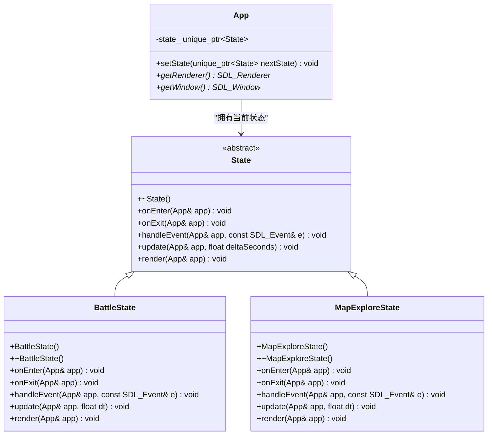
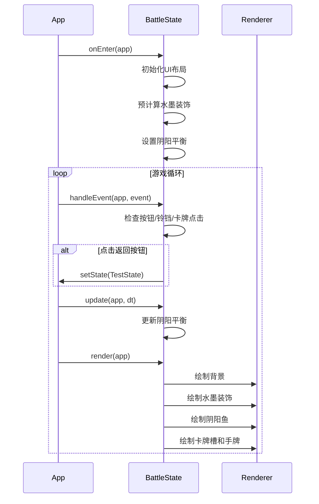
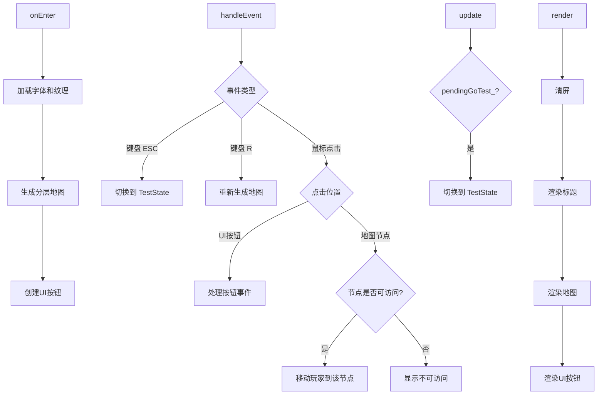

# 战斗与探索状态 (BattleState & MapExploreState)

<cite>
**本文档引用的文件**
- [State.h](file://Tracer/src/core/State.h)
- [App.h](file://Tracer/src/core/App.h)
- [BattleState.h](file://Tracer/src/states/BattleState.h)
- [BattleState.cpp](file://Tracer/src/states/BattleState.cpp)
- [MapExploreState.h](file://Tracer/src/states/MapExploreState.h)
- [MapExploreState.cpp](file://Tracer/src/states/MapExploreState.cpp)
</cite>

## 目录
1. [引言](#引言)
2. [核心状态设计模式](#核心状态设计模式)
3. [BattleState 深度解析](#battlestate-深度解析)
4. [MapExploreState 深度解析](#mapexplorestate-深度解析)
5. [状态间依赖与数据流](#状态间依赖与数据流)
6. [开发与扩展指南](#开发与扩展指南)
7. [结论](#结论)

## 引言
本文档旨在联合解析 `BattleState` 与 `MapExploreState` 两个核心游戏状态的设计意图与潜在实现路径。基于其命名、架构模式及现有代码分析，`BattleState` 被设计为封装回合制或实时战斗逻辑的容器，涵盖角色状态管理、卡牌交互与水墨风格的动画反馈；而 `MapExploreState` 则负责非线性地图的导航、区域交互与事件触发。二者均严格遵循 `State` 接口规范，通过 `render` 绘制场景、`update` 处理逻辑、`handleEvent` 响应输入。本文将探讨其与核心 `App` 的依赖关系，推测其内部数据结构，并提供在现有框架下进行扩展的实用开发指引。

## 核心状态设计模式

本游戏采用经典的“状态机”（State Machine）设计模式来管理不同的游戏场景。所有具体状态（如战斗、探索、菜单）均继承自一个抽象的 `State` 基类，从而实现了高内聚、低耦合的架构。



**Diagram sources**
- [State.h](file://Tracer/src/core/State.h#L6-L14)
- [App.h](file://Tracer/src/core/App.h#L7-L27)

**Section sources**
- [State.h](file://Tracer/src/core/State.h#L6-L14)
- [App.h](file://Tracer/src/core/App.h#L7-L27)

## BattleState 深度解析

`BattleState` 类是游戏战斗逻辑的核心实现。它不仅处理游戏玩法，还通过精心设计的UI元素和水墨风格的视觉效果营造出独特的氛围。

### 核心功能与数据结构
`BattleState` 封装了以下关键元素：
- **阴阳池 (YinYang Pool)**：一个核心的游戏机制，通过 `yinYangBalance_` 变量（0-100）来表示平衡状态，并在渲染时以动态的八卦阴阳鱼形象化展示。
- **卡牌系统**：包含一个3x4的卡牌槽网格 (`cardSlots_`)，用于放置卡牌；一个动态的手牌区 (`handCardRects_`)，其大小随手牌数量变化；以及抽牌堆和弃牌堆。
- **UI元素**：包含一个可点击的铃铛 (`bellRect_`)，可能用于触发特殊技能或暂停，以及一个返回测试状态的按钮。

### 生命周期与事件处理
`BattleState` 的生命周期由 `App` 精确控制：
- **onEnter**: 在进入战斗状态时调用。此方法负责初始化所有UI元素的位置和尺寸，基于当前窗口大小进行动态布局，并预计算水墨装饰效果（如墨点、晕染、云纹），以避免运行时的性能开销。
- **handleEvent**: 处理所有输入事件。它不仅管理返回按钮的点击，还检测对铃铛、卡牌槽、手牌、抽牌堆和弃牌堆的点击，并记录日志。例如，点击抽牌堆会增加手牌数量并重新布局手牌区。
- **update**: 更新游戏逻辑。当前实现中，`yinYangBalance_` 会随时间缓慢随机变化，模拟游戏平衡机制。此方法是添加卡牌冷却、AI行动等复杂逻辑的理想位置。
- **render**: 负责绘制整个战斗场景。它首先绘制一个深色背景，然后依次绘制预计算的水墨装饰、八卦阴阳鱼、卡牌槽网格、铃铛、手牌区和牌堆。所有元素均使用符合水墨画风格的淡雅色彩和装饰性细节。



**Diagram sources**
- [BattleState.h](file://Tracer/src/states/BattleState.h#L1-L81)
- [BattleState.cpp](file://Tracer/src/states/BattleState.cpp#L0-L799)

**Section sources**
- [BattleState.h](file://Tracer/src/states/BattleState.h#L1-L81)
- [BattleState.cpp](file://Tracer/src/states/BattleState.cpp#L0-L799)

## MapExploreState 深度解析

`MapExploreState` 负责管理一个分层的、可探索的地图系统，玩家可以在节点间移动，体验非线性的游戏进程。

### 核心功能与数据结构
`MapExploreState` 的核心是一个动态生成的分层地图：
- **分层地图结构**：地图由 `numLayers_` 层组成，每层包含一个 `MapNode` 向量 (`layerNodes_`)。每个 `MapNode` 代表一个可交互的节点，具有类型（起点、普通、BOSS、精英、商店、事件）、坐标、连接关系和访问状态。
- **节点连接**：节点通过 `connections` 向量存储指向其他节点的全局索引，形成一个有向图。`connectPaths` 等方法负责构建这个图，确保从起点到BOSS存在有效路径。
- **玩家状态**：`playerCurrentNode_` 记录玩家当前位置，`accessibleNodes_` 存储当前可移动到的节点列表。
- **生成与配置**：`maxNodesPerLayer_` 控制地图复杂度，`generateLayeredMap` 方法负责生成整个地图，包括节点、连接和验证路径。

### 生命周期与事件处理
- **onEnter**: 初始化状态，加载字体，创建标题纹理，并调用 `generateLayeredMap` 生成地图。同时创建“重新生成”、“复杂度”选择和“返回测试”三个按钮。
- **handleEvent**: 处理键盘（ESC返回、R重新生成）和鼠标事件。它会分发事件给UI按钮，并检测对地图节点的点击。如果点击的节点是可访问的，则调用 `movePlayerToNode` 移动玩家。
- **update**: 当 `pendingGoTest_` 标志被设置时，切换回 `TestState`。
- **render**: 清屏后，依次渲染标题、地图（包括节点和连接线）和所有UI按钮。



**Diagram sources**
- [MapExploreState.h](file://Tracer/src/states/MapExploreState.h#L1-L103)
- [MapExploreState.cpp](file://Tracer/src/states/MapExploreState.cpp#L0-L799)

**Section sources**
- [MapExploreState.h](file://Tracer/src/states/MapExploreState.h#L1-L103)
- [MapExploreState.cpp](file://Tracer/src/states/MapExploreState.cpp#L0-L799)

## 状态间依赖与数据流

`BattleState` 和 `MapExploreState` 并非孤立存在，它们与核心 `App` 类有着紧密的依赖关系，形成了清晰的数据流。

### 依赖核心App
两个状态都依赖于 `App` 类来获取运行时环境：
- **渲染器 (Renderer)**：通过 `app.getRenderer()` 获取 `SDL_Renderer*`，用于所有图形绘制操作。
- **窗口 (Window)**：通过 `app.getWindow()` 获取 `SDL_Window*`，主要用于获取窗口尺寸（`SDL_GetWindowSize`），以实现UI的自适应布局。
- **状态管理**：通过 `app.setState(...)` 可以无缝切换到其他状态（如 `TestState`），这是状态机模式的核心。

### 状态间数据传递
虽然当前代码中状态切换时直接创建新状态实例，但可以通过 `App` 的全局上下文来实现状态间的数据传递。例如，可以在 `App` 类中添加一个 `GameStateContext` 成员，用于存储玩家属性、库存、已解锁内容等。在 `onExit` 时，当前状态可以将数据写入上下文；在 `onEnter` 时，新状态可以从上下文中读取所需数据。

```mermaid
erDiagram
App ||--o{ State : "拥有"
App ||--o{ GameStateContext : "拥有"
BattleState ||--o{ GameStateContext : "读写"
MapExploreState ||--o{ GameStateContext : "读写"
class App {
-state_ State*
-context_ GameStateContext
}
class GameStateContext {
+playerHealth int
+playerMana int
+inventory vector~Item~
+unlockedAreas set~string~
}
class BattleState {
+onExit(App& app) : 保存战斗结果
}
class MapExploreState {
+onEnter(App& app) : 加载玩家位置
}
```

**Diagram sources**
- [App.h](file://Tracer/src/core/App.h#L7-L27)
- [BattleState.h](file://Tracer/src/states/BattleState.h#L1-L81)
- [MapExploreState.h](file://Tracer/src/states/MapExploreState.h#L1-L103)

## 开发与扩展指南

在现有框架下扩展 `BattleState` 和 `MapExploreState` 是直接且高效的。

### 扩展BattleState
1.  **添加战斗逻辑**：在 `update` 方法中，可以添加卡牌冷却计时器、敌人AI的回合处理、战斗状态机（如“玩家回合”、“敌人回合”）等。
2.  **增强卡牌系统**：为 `Card` 结构体添加属性（攻击力、防御力、技能效果），并在 `handleEvent` 中实现卡牌的使用逻辑。
3.  **丰富视觉效果**：在 `render` 中，可以为卡牌槽添加高亮效果，为阴阳鱼的动态变化添加更平滑的动画。

### 扩展MapExploreState
1.  **丰富节点类型**：为 `MapNode::NodeType` 添加更多类型（如“宝箱”、“谜题”），并在 `renderNode` 中根据类型绘制不同的图标。
2.  **实现事件系统**：当玩家移动到特定节点时，可以弹出一个事件窗口（另一个 `State`），描述遭遇并提供选择。
3.  **优化地图生成**：可以引入更复杂的算法（如Dijkstra或A*）来确保路径的最优性，或添加更多装饰性元素。

### 调试技巧
- **日志输出**：充分利用 `SDL_Log` 函数，在关键逻辑点（如状态切换、事件处理、地图生成）输出调试信息。
- **可视化调试**：在 `render` 方法中，可以临时绘制调试信息，如节点的连接线、玩家的可访问范围等。
- **利用按钮**：`MapExploreState` 中的“重新生成”和“复杂度”按钮是绝佳的调试工具，可以快速测试地图生成算法的鲁棒性。

**Section sources**
- [BattleState.h](file://Tracer/src/states/BattleState.h#L1-L81)
- [BattleState.cpp](file://Tracer/src/states/BattleState.cpp#L0-L799)
- [MapExploreState.h](file://Tracer/src/states/MapExploreState.h#L1-L103)
- [MapExploreState.cpp](file://Tracer/src/states/MapExploreState.cpp#L0-L799)

## 结论
`BattleState` 和 `MapExploreState` 是基于 `State` 接口构建的、功能完备的游戏状态模块。`BattleState` 通过丰富的UI和水墨视觉效果，为战斗玩法提供了坚实的基础；`MapExploreState` 则通过一个动态生成的分层地图，实现了非线性的探索体验。二者都与 `App` 核心紧密协作，遵循清晰的生命周期。通过利用 `App` 的全局上下文，可以轻松实现状态间的数据传递。开发者可以在此坚实的基础上，通过扩展 `update`、`handleEvent` 和 `render` 方法，以及丰富内部数据结构，来实现复杂的游戏逻辑和引人入胜的玩家体验。