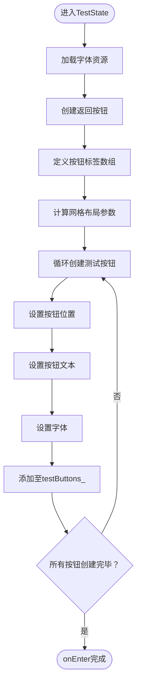
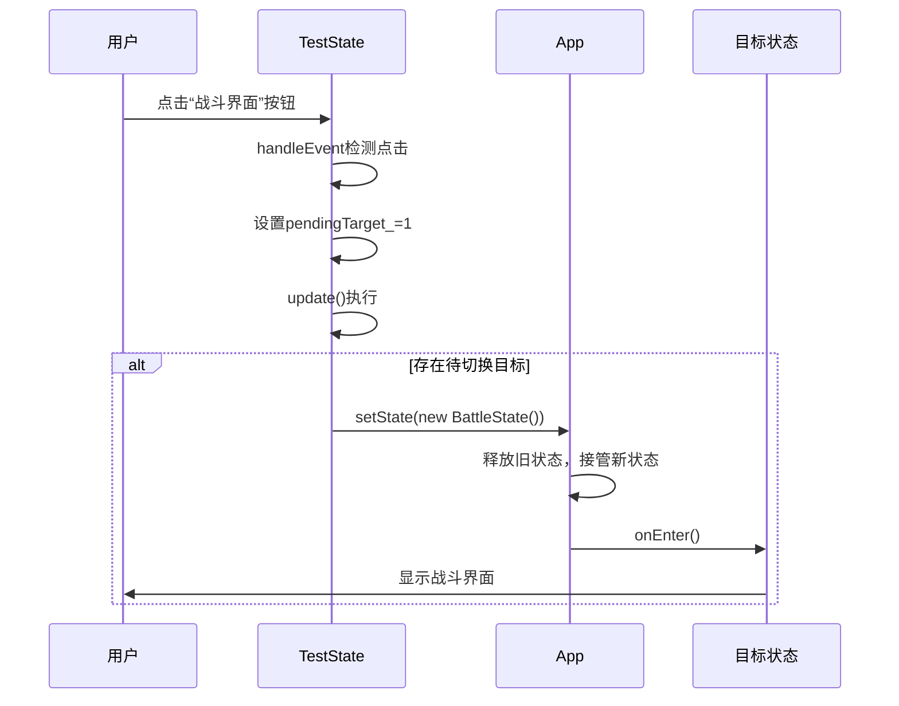

# 测试与调试状态 (TestState)

<cite>
**本文档引用文件**  
- [TestState.h](file://Tracer/src/states/TestState.h)
- [TestState.cpp](file://Tracer/src/states/TestState.cpp)
- [App.h](file://Tracer/src/core/App.h)
- [State.h](file://Tracer/src/core/State.h)
- [Button.h](file://Tracer/src/ui/Button.h)
- [MainMenuState.h](file://Tracer/src/states/MainMenuState.h)
- [BattleState.h](file://Tracer/src/states/BattleState.h)
- [MapExploreState.h](file://Tracer/src/states/MapExploreState.h)
- [DeckState.h](file://Tracer/src/states/DeckState.h)
- [HeritageState.h](file://Tracer/src/states/HeritageState.h)
- [EngraveState.h](file://Tracer/src/states/EngraveState.h)
- [InkShopState.h](file://Tracer/src/states/InkShopState.h)
- [MemoryRepairState.h](file://Tracer/src/states/MemoryRepairState.h)
- [RelicPickupState.h](file://Tracer/src/states/RelicPickupState.h)
- [TemperState.h](file://Tracer/src/states/TemperState.h)
- [SeekerState.h](file://Tracer/src/states/SeekerState.h)
- [BurnState.h](file://Tracer/src/states/BurnState.h)
- [BarterState.h](file://Tracer/src/states/BarterState.h)
</cite>

## 目录
1. [简介](#简介)
2. [核心实现机制](#核心实现机制)
3. [UI布局策略](#ui布局策略)
4. [事件绑定与状态切换](#事件绑定与状态切换)
5. [开发调试中的核心价值](#开发调试中的核心价值)
6. [使用指南与最佳实践](#使用指南与最佳实践)
7. [高级测试场景建议](#高级测试场景建议)
8. [结论](#结论)

## 简介
`TestState` 是游戏开发过程中不可或缺的调试中枢，专为快速验证功能、复现Bug和演示系统完整性而设计。作为 `State` 类的子类，它通过创建一系列按钮，实现一键跳转至任意游戏状态（如战斗、地图探索、牌库、文脉传承等），极大提升了开发与测试效率。本文档将深入剖析其架构设计、实现方式与使用方法。

## 核心实现机制

`TestState` 继承自抽象基类 `State`，遵循统一的状态管理接口。其核心职责是作为开发调试入口，提供对所有游戏状态的快速访问通道。

在实现上，`TestState` 通过动态创建多个 `Button` 对象，每个按钮对应一个目标游戏状态。这些按钮在 `onEnter` 方法中初始化，并通过事件处理机制响应用户点击，最终调用 `App::setState` 切换至目标状态。

```mermaid
classDiagram
class State {
<<abstract>>
+onEnter(App& app) void
+onExit(App& app) void
+handleEvent(App& app, SDL_Event) void
+update(App& app, float) void
+render(App& app) void
}
class TestState {
-backButton_ : Button*
-testButtons_ : vector<Button*>
-font_ : TTF_Font*
-smallFont_ : TTF_Font*
-screenW_ : int
-screenH_ : int
-titleTex_ : SDL_Texture*
-pendingTarget_ : int
+onEnter(App& app) void
+handleEvent(App& app, SDL_Event) void
+update(App& app, float) void
+render(App& app) void
}
class App {
-state_ : unique_ptr<State>
+setState(unique_ptr<State>) void
+getRenderer() SDL_Renderer*
+getWindow() SDL_Window*
}
class Button {
-rect_ : SDL_Rect
-text_ : string
-onClick_ : function<void()>
-hovered_ : bool
+setRect(SDL_Rect) void
+setText(string) void
+setOnClick(function<void()>) void
+handleEvent(SDL_Event) void
+render(SDL_Renderer*) void
}
State <|-- TestState : "继承"
App --> TestState : "状态管理"
App --> Button : "渲染与事件"
TestState --> Button : "包含多个"
```

**图示来源**  
- [TestState.h](file://Tracer/src/states/TestState.h#L9-L41)
- [State.h](file://Tracer/src/core/State.h#L6-L14)
- [App.h](file://Tracer/src/core/App.h#L5-L5)
- [Button.h](file://Tracer/src/ui/Button.h#L1-L33)

**本节来源**  
- [TestState.h](file://Tracer/src/states/TestState.h#L9-L41)
- [TestState.cpp](file://Tracer/src/states/TestState.cpp#L0-L40)

## UI布局策略

`TestState` 采用简洁高效的UI布局策略，确保调试界面清晰易用。

- **垂直网格布局**：所有测试按钮以2列网格形式垂直排列，居中显示于屏幕中央偏上区域。
- **清晰命名**：按钮文本使用中文命名，如“战斗界面”、“地图探索”、“文脉传承”等，直观反映目标状态。
- **紧凑间距**：按钮间设置20像素间距，保证视觉舒适度的同时最大化利用屏幕空间。
- **标题与返回按钮**：顶部居中显示“功能测试界面”标题，右上角设有“X”按钮用于返回主菜单。

布局计算基于当前窗口尺寸动态调整，确保在不同分辨率下均能良好显示。



**图示来源**  
- [TestState.cpp](file://Tracer/src/states/TestState.cpp#L40-L152)

**本节来源**  
- [TestState.cpp](file://Tracer/src/states/TestState.cpp#L80-L152)

## 事件绑定与状态切换

`TestState` 的事件处理机制设计精巧，避免了在事件处理中直接切换状态可能引发的对象生命周期问题。

### 事件处理流程
1. **事件分发**：`handleEvent` 方法首先将事件传递给返回按钮和所有测试按钮进行悬停/点击检测。
2. **点击检测**：当检测到鼠标左键点击时，遍历所有测试按钮的矩形区域，判断点击位置。
3. **目标记录**：若点击命中某按钮，则根据其索引设置 `pendingTarget_`，记录待切换状态的目标ID。
4. **延迟切换**：实际状态切换在 `update` 方法中执行，确保当前状态对象在切换前完整存在。

### 状态切换机制
`update` 方法检查 `pendingTarget_` 是否为有效值（非-1），若是，则根据其值创建对应状态的实例，并通过 `App::setState` 完成切换。此过程采用 `std::unique_ptr` 管理状态生命周期，确保内存安全。



**图示来源**  
- [TestState.cpp](file://Tracer/src/states/TestState.cpp#L154-L236)

**本节来源**  
- [TestState.cpp](file://Tracer/src/states/TestState.cpp#L154-L236)
- [App.h](file://Tracer/src/core/App.h#L20-L20)

## 开发调试中的核心价值

`TestState` 在开发流程中扮演着不可替代的角色，其核心价值体现在：

- **快速功能验证**：无需经历完整游戏流程，即可直接进入任意状态测试新功能。
- **高效Bug复现**：对于特定状态下的Bug，可通过 `TestState` 快速定位并复现，缩短调试周期。
- **系统完整性演示**：在评审或展示时，可一键切换所有模块，全面展示系统功能。
- **减少重复操作**：避免了从主菜单逐级进入深层状态的繁琐操作，提升开发效率。
- **状态隔离测试**：允许独立测试各状态逻辑，降低耦合影响。

例如，当开发“淬炼”功能时，开发者可直接从 `TestState` 进入 `TemperState`，无需完成一场战斗或探索地图。

## 使用指南与最佳实践

### 添加新测试入口
1. 在 `TestState.cpp` 的 `buttonLabels` 向量中添加新的中文标签。
2. 在 `handleEvent` 的 `switch` 语句中为新索引添加 `case` 分支。
3. 在 `update` 的 `switch` 语句中添加对应状态的实例化代码。
4. 确保包含新状态的头文件（如 `#include "NewState.h"`）。

### 按钮分组组织
为提升可读性，可将按钮按功能分组（如“战斗相关”、“养成系统”、“商店交易”），并在每组前添加分组标题（可通过禁用按钮模拟文本标签）。

### 生产环境禁用
建议通过编译宏控制 `TestState` 的启用：
```cpp
#ifdef DEBUG
    // 创建TestState入口
#endif
```
或在 `App` 启动时根据构建配置决定是否暴露该入口。

**本节来源**  
- [TestState.cpp](file://Tracer/src/states/TestState.cpp#L126-L152)
- [TestState.cpp](file://Tracer/src/states/TestState.cpp#L154-L236)

## 高级测试场景建议

为实现更高级的自动化测试，可结合以下策略：

- **日志输出**：在 `onEnter` 和 `onExit` 中添加日志，追踪状态切换路径。
- **参数传递**：扩展 `setState` 接口，支持传递初始化参数（如预设卡组、特定遗物），实现定向测试。
- **自动化脚本**：结合外部工具模拟鼠标点击，按预设序列自动执行状态切换，用于回归测试。
- **性能监控**：在状态切换前后记录时间戳，分析各状态加载性能。

例如，可设计一个测试流程：主菜单 → 意境刻画 → 墨坊 → 战斗，用于验证资源加载与状态间数据传递。

## 结论

`TestState` 作为开发调试的核心枢纽，通过简洁的UI设计与稳健的状态管理机制，极大提升了开发效率与测试覆盖率。其基于 `State` 模式的实现保证了架构一致性，而延迟切换策略则确保了运行时安全。合理使用并持续优化 `TestState`，将为项目开发提供强有力的支撑。