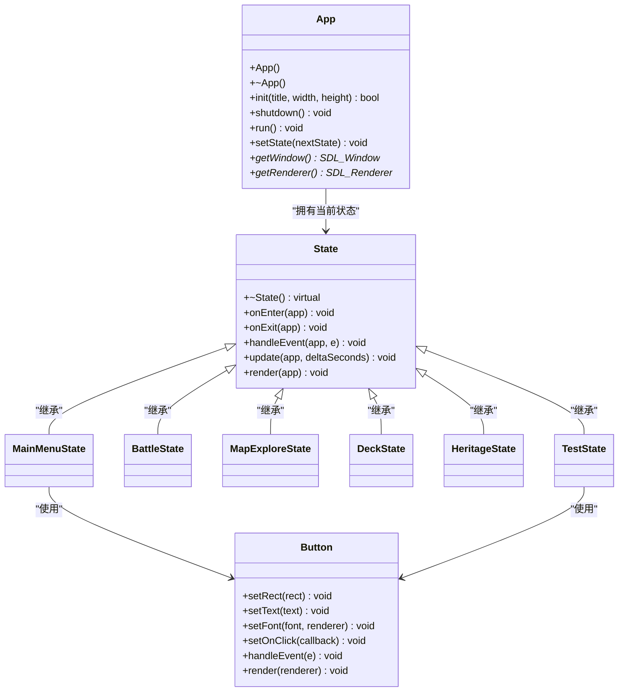
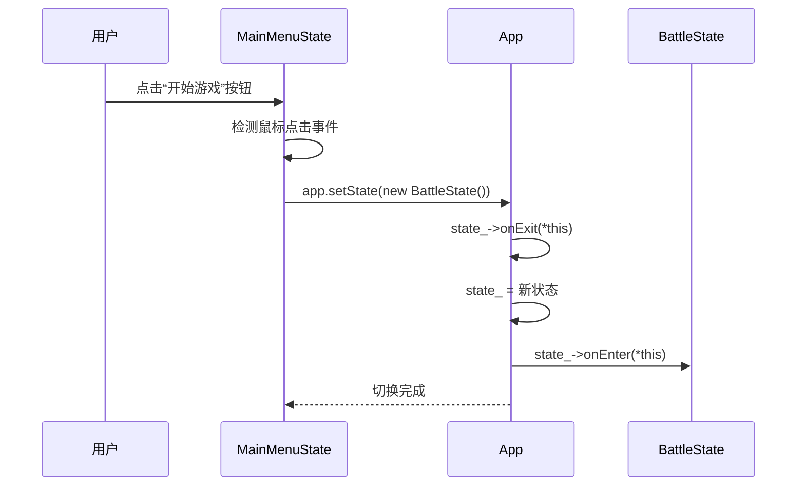

# 游戏状态系统

<cite>
**本文档引用文件**  
- [App.h](file://Tracer/src/core/App.h)
- [App.cpp](file://Tracer/src/core/App.cpp)
- [State.h](file://Tracer/src/core/State.h)
- [MainMenuState.h](file://Tracer/src/states/MainMenuState.h)
- [MainMenuState.cpp](file://Tracer/src/states/MainMenuState.cpp)
- [BattleState.h](file://Tracer/src/states/BattleState.h)
- [MapExploreState.h](file://Tracer/src/states/MapExploreState.h)
- [DeckState.h](file://Tracer/src/states/DeckState.h)
- [HeritageState.h](file://Tracer/src/states/HeritageState.h)
- [TestState.h](file://Tracer/src/states/TestState.h)
- [TestState.cpp](file://Tracer/src/states/TestState.cpp)
- [Button.h](file://Tracer/src/ui/Button.h)
</cite>

## 目录
1. [引言](#引言)
2. [状态系统设计原则](#状态系统设计原则)
3. [核心状态类功能分析](#核心状态类功能分析)
4. [状态间跳转机制](#状态间跳转机制)
5. [TestState的调试价值](#teststate的调试价值)
6. [新增状态指南](#新增状态指南)
7. [总结](#总结)

## 引言
本系统为游戏提供模块化的状态管理架构，通过统一接口封装不同游戏场景（如主菜单、战斗、探索等），实现高内聚、低耦合的状态切换机制。每个状态独立处理事件、更新逻辑与渲染流程，并通过App核心类进行统一调度。

## 状态系统设计原则
游戏状态系统采用经典的**状态模式（State Pattern）**，所有具体状态类继承自抽象基类`State`，并通过`App`类进行统一管理。该设计确保了状态之间的隔离性与可扩展性。



**图示来源**  
- [App.h](file://Tracer/src/core/App.h#L7-L27)
- [State.h](file://Tracer/src/core/State.h#L6-L14)
- [Button.h](file://Tracer/src/ui/Button.h)

**本节来源**  
- [App.h](file://Tracer/src/core/App.h#L7-L27)
- [State.h](file://Tracer/src/core/State.h#L6-L14)

## 核心状态类功能分析
各状态类分别封装独立的游戏场景逻辑，职责清晰，便于维护与扩展。

### MainMenuState：主菜单界面
作为游戏入口，集成动态视觉效果与导航功能：
- 显示标题“溯洄遗梦”及科技感光晕特效
- 渲染动态乱码数据流、装饰性花纹与闪烁星光
- 提供“开始游戏”、“设置”、“藏馆”、“退出”及“T”测试按钮
- 通过按钮事件触发状态跳转

**本节来源**  
- [MainMenuState.h](file://Tracer/src/states/MainMenuState.h#L15-L66)
- [MainMenuState.cpp](file://Tracer/src/states/MainMenuState.cpp#L1-L401)

### BattleState：战斗界面
负责核心战斗逻辑的呈现与交互：
- 管理阴阳池平衡值（0-100）
- 布局3x4卡牌槽网格
- 显示手牌区、抽牌堆与弃牌堆
- 渲染水墨风格UI元素（铃铛、背景色等）
- 提供返回测试按钮以支持调试

**本节来源**  
- [BattleState.h](file://Tracer/src/states/BattleState.h#L10-L80)

### MapExploreState：地图探索
支持分层地图生成与玩家移动：
- 生成10层结构的随机地图节点
- 支持多种节点类型（起点、普通、BOSS、精英、商店、事件）
- 实现路径连接、可达性验证与路径修剪
- 提供难度选择与地图重生成功能
- 支持玩家在节点间移动并更新可访问区域

**本节来源**  
- [MapExploreState.h](file://Tracer/src/states/MapExploreState.h#L8-L103)

### DeckState：牌库管理
用于展示与管理卡组内容：
- 构建演示卡组并布局为网格
- 支持滑动条动态调节卡牌数量（3-20张）
- 渲染卡牌名称、攻击力、生命值及标记
- 提供返回按钮以退出当前界面

**本节来源**  
- [DeckState.h](file://Tracer/src/states/DeckState.h#L9-L54)

### HeritageState：文脉传承
实现收藏内容展示与继承逻辑：
- 展示收藏卡牌网格
- 支持滑动条调节手牌数量（2-10张）
- 允许选择源与目标进行数据继承
- 提供确认与返回按钮完成操作

**本节来源**  
- [HeritageState.h](file://Tracer/src/states/HeritageState.h#L10-L55)

### TestState：测试中枢
作为开发调试专用入口，集中管理所有状态跳转：
- 提供“主菜单”、“战斗界面”、“地图探索”等功能测试按钮
- 支持快速跳转至意境刻画、墨坊、记忆修复、墨宝拾遗、淬炼、寻物人、以物易物、焚书等子系统
- 包含“牌库”状态的直接访问入口
- 通过延迟切换机制避免事件处理中状态销毁问题

**本节来源**  
- [TestState.h](file://Tracer/src/states/TestState.h#L9-L41)
- [TestState.cpp](file://Tracer/src/states/TestState.cpp#L1-L260)

## 状态间跳转机制
状态切换由`App`类统一管理，通过`setState`方法实现安全的状态过渡。



**图示来源**  
- [MainMenuState.cpp](file://Tracer/src/states/MainMenuState.cpp#L398-L401)
- [App.cpp](file://Tracer/src/core/App.cpp#L70-L74)

**本节来源**  
- [App.cpp](file://Tracer/src/core/App.cpp#L70-L74)
- [MainMenuState.cpp](file://Tracer/src/states/MainMenuState.cpp#L398-L401)

当用户在`MainMenuState`中点击“开始游戏”按钮时，系统执行以下流程：
1. 按钮点击事件被捕获
2. 调用`app.setState(std::unique_ptr<State>(new BattleState()))`
3. `App::setState`方法先调用当前状态的`onExit`
4. 将`state_`替换为新的`BattleState`实例
5. 调用新状态的`onEnter`方法完成初始化

此机制确保状态切换过程中的资源释放与初始化操作有序执行，避免内存泄漏或未初始化访问。

## TestState的调试价值
`TestState`是开发阶段的关键工具，极大提升了调试效率：
- **快速入口**：无需经过主菜单即可直达任意功能模块
- **全覆盖测试**：支持访问17个不同状态，包括战斗、地图、牌库、传承等
- **开发友好**：通过编号映射实现状态跳转（如0=主菜单，1=战斗，16=牌库）
- **安全切换**：采用`pendingTarget_`延迟机制，避免在事件处理中直接销毁当前对象

其设计体现了“开发即服务”的理念，将测试能力内建于系统架构之中，显著缩短迭代周期。

**本节来源**  
- [TestState.h](file://Tracer/src/states/TestState.h#L9-L41)
- [TestState.cpp](file://Tracer/src/states/TestState.cpp#L1-L260)

## 新增状态指南
为系统添加新状态需遵循以下步骤：

### 1. 创建新状态类
继承`State`基类并实现必要方法：
```cpp
class NewState : public State {
public:
    NewState();
    ~NewState();

    void onEnter(App& app) override;
    void handleEvent(App& app, const SDL_Event& e) override;
    void update(App& app, float dt) override;
    void render(App& app) override;

private:
    // 状态专属数据成员
};
```

### 2. 实现状态逻辑
在`onEnter`中初始化资源，在`handleEvent`中处理输入，在`update`中更新逻辑，在`render`中绘制界面。

### 3. 注册到App
通过`app.setState(std::make_unique<NewState>())`触发状态切换。

### 4. 添加测试入口
在`TestState`的按钮列表中添加新条目，并在`handleEvent`和`update`中添加对应跳转逻辑。

### 5. 验证可访问性
启动游戏后进入`TestState`，点击新增按钮验证状态是否正确加载与渲染。

**本节来源**  
- [State.h](file://Tracer/src/core/State.h#L6-L14)
- [TestState.cpp](file://Tracer/src/states/TestState.cpp#L1-L260)

## 总结
本游戏状态系统通过清晰的职责划分与统一的接口规范，构建了一个可扩展、易维护的状态管理架构。`App`类作为中枢协调者，`State`基类定义行为契约，各具体状态类实现独立场景逻辑。`TestState`作为调试中枢，极大提升了开发效率。该设计模式不仅适用于当前项目，也可作为通用框架应用于其他SDL2游戏开发中。