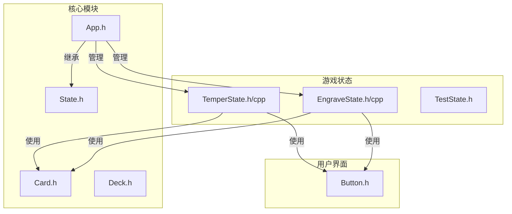
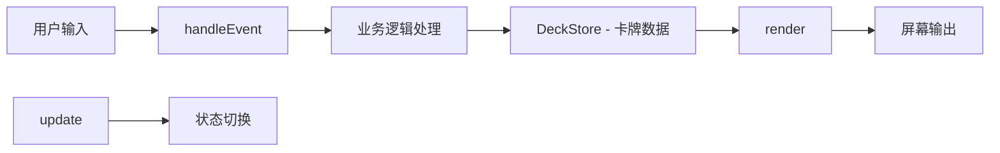
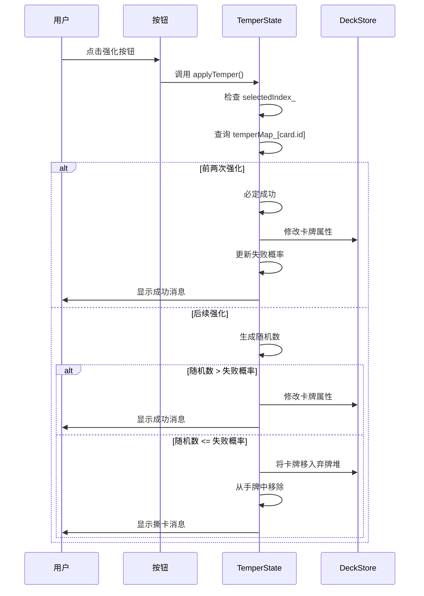
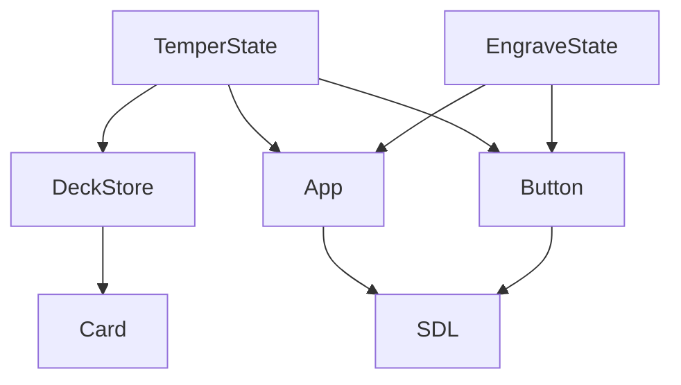

# 锻造与刻印系统状态 (TemperState & EngraveState)

<cite>
**本文档引用文件**  
- [TemperState.h](file://Tracer/src/states/TemperState.h)
- [TemperState.cpp](file://Tracer/src/states/TemperState.cpp)
- [EngraveState.h](file://Tracer/src/states/EngraveState.h)
- [EngraveState.cpp](file://Tracer/src/states/EngraveState.cpp)
- [App.h](file://Tracer/src/core/App.h)
- [Card.h](file://Tracer/src/core/Card.h)
- [Button.h](file://Tracer/src/ui/Button.h)
</cite>

## 目录
1. [简介](#简介)
2. [项目结构](#项目结构)
3. [核心组件](#核心组件)
4. [架构概览](#架构概览)
5. [详细组件分析](#详细组件分析)
6. [依赖分析](#依赖分析)
7. [性能考量](#性能考量)
8. [故障排除指南](#故障排除指南)
9. [结论](#结论)

## 简介
本文件系统化介绍 `TemperState`（锻造）与 `EngraveState`（刻印）作为角色成长系统的核心模块。这两个状态类实现了通过资源消耗提升卡牌或装备能力的机制，分别对应“强化属性”与“随机选择增益”的成长路径。文档将深入分析其UI布局、事件处理逻辑、与全局数据的交互方式，并提供渲染与更新逻辑的实现参考，同时指出潜在的扩展方向。

## 项目结构
项目采用分层结构，核心逻辑位于 `core` 目录，UI组件独立于 `ui` 目录，而具体的游戏状态（如锻造、刻印）则封装在 `states` 目录中。这种设计实现了关注点分离，便于状态间的切换与维护。



**Diagram sources**
- [TemperState.h](file://Tracer/src/states/TemperState.h#L12-L41)
- [EngraveState.h](file://Tracer/src/states/EngraveState.h#L10-L38)
- [App.h](file://Tracer/src/core/App.h)

**Section sources**
- [TemperState.h](file://Tracer/src/states/TemperState.h#L1-L44)
- [EngraveState.h](file://Tracer/src/states/EngraveState.h#L1-L41)

## 核心组件
`TemperState` 与 `EngraveState` 均继承自 `State` 基类，实现了标准的状态生命周期方法（`onEnter`, `handleEvent`, `update`, `render`）。它们的核心职责是提供一个独立的交互界面，允许玩家在特定情境下对卡牌进行成长操作。

**Section sources**
- [TemperState.h](file://Tracer/src/states/TemperState.h#L12-L41)
- [EngraveState.h](file://Tracer/src/states/EngraveState.h#L10-L38)

## 架构概览
两个状态模块均遵循 MVC（模型-视图-控制器）的简化模式：
- **模型**：由 `DeckStore::instance()` 提供的全局卡牌数据。
- **视图**：通过 `render` 方法使用 SDL2 直接绘制 UI 元素（按钮、卡牌、文本）。
- **控制器**：`handleEvent` 方法捕获鼠标输入，触发相应的业务逻辑。



**Diagram sources**
- [TemperState.cpp](file://Tracer/src/states/TemperState.cpp#L50-L170)
- [EngraveState.cpp](file://Tracer/src/states/EngraveState.cpp#L50-L121)

## 详细组件分析

### 锻造系统 (TemperState) 分析
`TemperState` 允许玩家选择一张手牌，通过点击按钮执行 +1 攻击 或 +2 生命 的强化操作。其设计包含风险机制：前两次强化必定成功，之后存在“撕卡”（移除卡牌）的概率。

#### 事件处理逻辑
点击“+1 攻击”或“+2 生命”按钮会触发 `applyTemper(bool addAttack)` 方法。该方法首先验证选中卡牌的有效性，然后根据 `temperMap_` 中记录的历史成功次数决定是否必定成功。若非保底阶段，则生成随机数与失败概率比较，决定结果。



**Diagram sources**
- [TemperState.cpp](file://Tracer/src/states/TemperState.cpp#L140-L170)
- [TemperState.h](file://Tracer/src/states/TemperState.h#L40-L41)

#### UI布局与交互
UI包含标题、返回按钮、两个强化选项按钮以及可点击的手牌网格。`layoutHandGrid()` 方法根据当前窗口大小和手牌数量，动态计算卡牌的排列位置与尺寸，确保良好的视觉效果。选中卡牌时，会绘制多层边框以提供视觉反馈。

**Section sources**
- [TemperState.cpp](file://Tracer/src/states/TemperState.cpp#L80-L140)
- [TemperState.h](file://Tracer/src/states/TemperState.h#L39)

### 刻印系统 (EngraveState) 分析
`EngraveState` 提供三选一的随机增益机制，每次进入状态时随机生成三个选项，每个选项为“意/印记”或“境/类型”之一。

#### 随机选项生成
`buildRandomChoices()` 方法使用随机数生成器从预定义的数组中选择“意”或“境”的名称，并构建 `Choice` 结构体。`layoutChoices()` 方法则负责将三个选项并排居中布局。

```mermaid
flowchart TD
Start([进入 EngraveState]) --> Build[buildRandomChoices()]
Build --> Layout[layoutChoices()]
Layout --> Render[render()]
Render --> Wait[等待用户选择]
Wait --> Click{用户点击？}
Click --> |是| Handle[handleEvent]
Handle --> Select[设置 selected_]
Click --> |确认| Confirm[confirmButton 点击]
Confirm --> Result[生成 result_ 消息]
Result --> Display[render 显示结果]
```

**Diagram sources**
- [EngraveState.cpp](file://Tracer/src/states/EngraveState.cpp#L90-L121)
- [EngraveState.h](file://Tracer/src/states/EngraveState.h#L37-L38)

#### 与全局数据的交互
与 `TemperState` 不同，`EngraveState` 当前版本并未直接修改卡牌或玩家数据，而是将选择结果存储在 `result_` 字符串中并通过UI显示。这表明其功能可能尚未完全集成，或结果需由上层状态（如 `TestState`）读取并处理。

**Section sources**
- [EngraveState.cpp](file://Tracer/src/states/EngraveState.cpp#L50-L121)
- [EngraveState.h](file://Tracer/src/states/EngraveState.h#L10-L38)

## 依赖分析
`TemperState` 和 `EngraveState` 的核心依赖如下：
- **DeckStore**：读取手牌数据，修改卡牌属性或移除卡牌。
- **App**：获取渲染器、窗口尺寸，以及进行状态切换。
- **Button**：实现可交互的UI按钮。
- **SDL2 & SDL_ttf**：底层图形渲染与字体渲染。



**Diagram sources**
- [TemperState.h](file://Tracer/src/states/TemperState.h#L1-L10)
- [EngraveState.h](file://Tracer/src/states/EngraveState.h#L1-L8)
- [App.h](file://Tracer/src/core/App.h)

**Section sources**
- [TemperState.h](file://Tracer/src/states/TemperState.h#L1-L44)
- [EngraveState.h](file://Tracer/src/states/EngraveState.h#L1-L41)

## 性能考量
- **渲染性能**：`render` 方法中频繁创建和销毁 SDL_Surface 与 SDL_Texture，这在每帧调用时可能造成内存分配开销。建议缓存文本纹理，仅在内容变化时更新。
- **随机数生成**：`applyTemper` 中每次调用都创建 `std::random_device` 和 `std::mt19937`，开销较大。应将随机数生成器作为类的成员变量复用。
- **布局计算**：`layoutHandGrid` 在 `onEnter` 和强化失败后调用，计算合理，对性能影响较小。

## 故障排除指南
- **问题**：强化后卡牌未更新。
  - **检查**：确认 `DeckStore::instance().hand()` 返回的是引用，确保修改的是原始数据。
- **问题**：UI元素错位或不显示。
  - **检查**：`onEnter` 中字体加载是否成功，`render` 中纹理创建是否返回非空指针。
- **问题**：按钮无响应。
  - **检查**：`handleEvent` 中是否正确传递了 SDL_Event，按钮的 `setOnClick` 回调是否正确绑定。
- **问题**：随机选项未变化。
  - **检查**：`buildRandomChoices` 是否在 `onEnter` 时被调用，随机数生成器是否正常工作。

**Section sources**
- [TemperState.cpp](file://Tracer/src/states/TemperState.cpp#L140-L170)
- [EngraveState.cpp](file://Tracer/src/states/EngraveState.cpp#L90-L121)

## 结论
`TemperState` 与 `EngraveState` 成功实现了角色成长系统的核心交互逻辑。`TemperState` 通过引入风险机制增加了策略深度，而 `EngraveState` 的三选一设计提供了多样化的成长路径。未来可扩展的方向包括：
- **随机属性生成**：在 `EngraveState` 中实现真正的属性修改，而非仅显示结果。
- **失败惩罚机制**：为 `TemperState` 增加除撕卡外的其他惩罚，如消耗额外资源。
- **多阶段强化流程**：将强化拆分为多个步骤，增加动画与反馈。
- **配置化**：将强化成功率、属性加成等数值从代码中分离，放入配置文件。