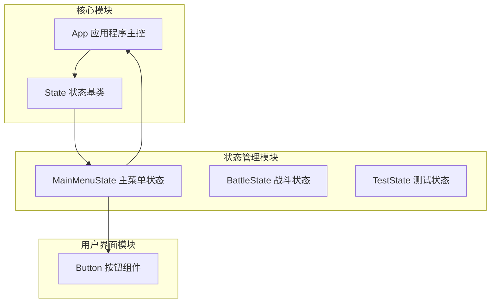
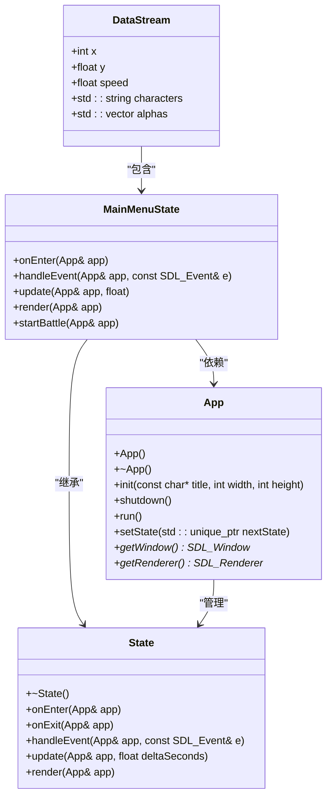
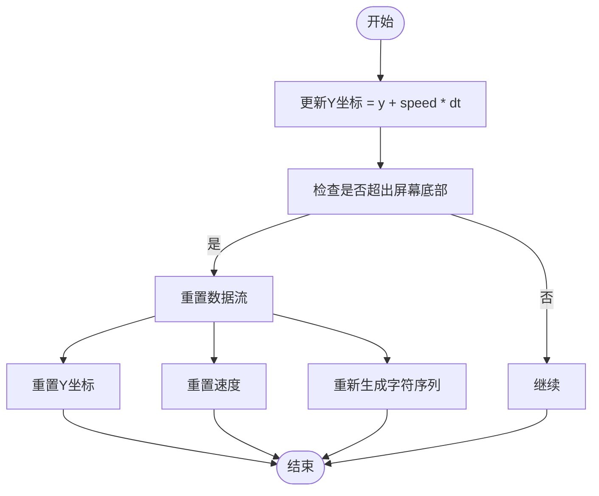
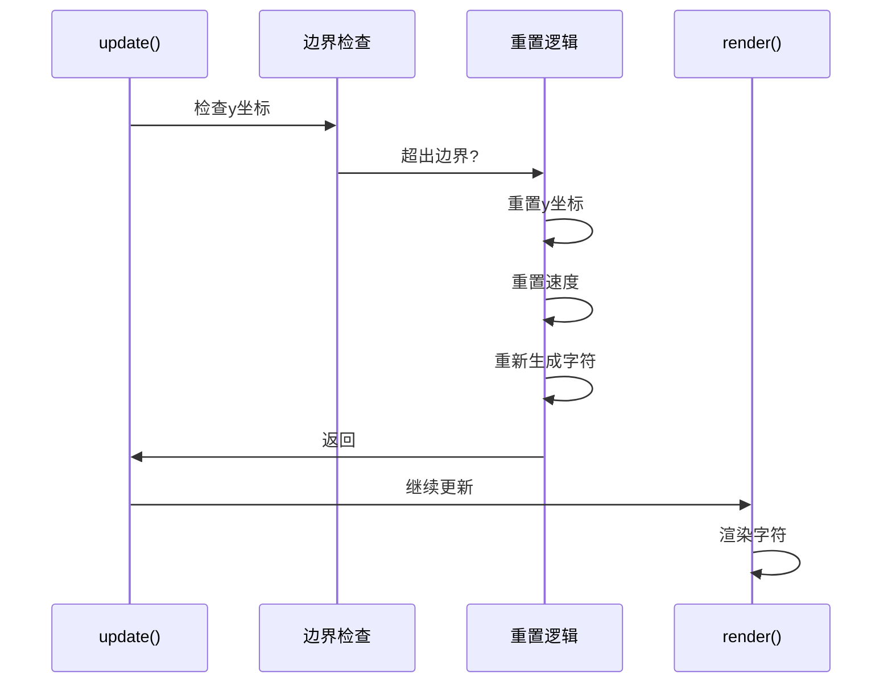
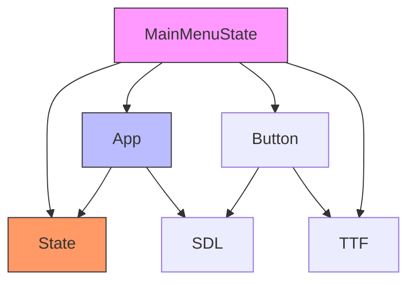

# 数字雨效果实现

<cite>
**Referenced Files in This Document**   
- [MainMenuState.cpp](file://Tracer/src/states/MainMenuState.cpp)
- [MainMenuState.h](file://Tracer/src/states/MainMenuState.h)
- [App.h](file://Tracer/src/core/App.h)
- [State.h](file://Tracer/src/core/State.h)
- [Button.h](file://Tracer/src/ui/Button.h)
</cite>

## 目录
1. [引言](#引言)
2. [项目结构](#项目结构)
3. [核心组件](#核心组件)
4. [架构概述](#架构概述)
5. [详细组件分析](#详细组件分析)
6. [依赖分析](#依赖分析)
7. [性能考量](#性能考量)
8. [故障排除指南](#故障排除指南)
9. [结论](#结论)

## 引言

本文件深入解析了`MainMenuState`类中`DataStream`结构体的实现机制，详细说明了字符流的初始化过程、随机字符生成策略、垂直下落速度控制算法以及透明度渐变逻辑。通过分析`render`函数中如何逐列绘制乱码字符并应用alpha通道实现淡入淡出效果，结合`update`方法中的y坐标更新与屏幕边界重置机制，阐明其循环动画原理。文档还提供了代码示例展示字符集构造、alpha值向量管理及性能优化技巧（如限制流数量与列间距），说明该特效如何模拟黑客帝国风格的视觉氛围，并增强主界面的科技感沉浸体验。

## 项目结构

该项目采用分层架构设计，主要分为核心模块、状态管理模块和用户界面模块。核心模块包含应用程序主控类和状态基类；状态管理模块实现了不同游戏场景的状态类；用户界面模块提供了按钮等交互组件。这种结构清晰地分离了游戏逻辑、状态管理和用户界面，便于维护和扩展。

**Section sources**
- [App.h](file://Tracer/src/core/App.h#L1-L31)
- [State.h](file://Tracer/src/core/State.h#L1-L18)
- [Button.h](file://Tracer/src/ui/Button.h#L1-L34)

## 核心组件

`MainMenuState`是游戏主菜单的核心状态类，负责管理主界面的所有视觉效果和用户交互。其中`DataStream`结构体是实现"数字雨"特效的关键组件，通过多个`DataStream`实例的协同工作，创造出类似《黑客帝国》风格的动态视觉效果。该组件不仅实现了基本的字符下落动画，还通过透明度控制和随机化参数增强了视觉层次感。

**Section sources**
- [MainMenuState.h](file://Tracer/src/states/MainMenuState.h#L1-L70)
- [MainMenuState.cpp](file://Tracer/src/states/MainMenuState.cpp#L1-L402)

## 架构概述

**Diagram sources **
- [App.h](file://Tracer/src/core/App.h#L1-L31)
- [State.h](file://Tracer/src/core/State.h#L1-L18)
- [MainMenuState.h](file://Tracer/src/states/MainMenuState.h#L1-L70)

## 详细组件分析

### DataStream结构体分析

`DataStream`结构体是实现数字雨效果的核心数据结构，包含位置、速度、字符序列和透明度等关键属性。该结构体的设计充分考虑了性能和视觉效果的平衡，通过预生成字符序列和透明度向量，避免了运行时的频繁内存分配。

**Diagram sources **
- [MainMenuState.h](file://Tracer/src/states/MainMenuState.h#L1-L70)
- [MainMenuState.cpp](file://Tracer/src/states/MainMenuState.cpp#L1-L402)

#### 初始化过程分析

`DataStream`的初始化过程在`MainMenuState::onEnter`方法中完成，通过随机化参数创建多个数据流实例。每个数据流的x坐标按固定间距分布，但加入了随机偏移以增加视觉自然感。y坐标随机初始化，使数据流在屏幕上的起始位置各不相同，避免了机械化的整齐排列。

**Section sources**
- [MainMenuState.cpp](file://Tracer/src/states/MainMenuState.cpp#L25-L100)

#### 随机字符生成策略

系统采用预定义的字符集进行随机字符生成，字符集包含数字、大小写字母和特殊符号，确保了视觉效果的丰富性。每个数据流在初始化时生成固定长度的随机字符序列（12-28个字符），并通过独立的透明度向量控制每个字符的显示效果，实现了字符间的明暗变化。

**Section sources**
- [MainMenuState.cpp](file://Tracer/src/states/MainMenuState.cpp#L90-L100)

#### 垂直下落速度控制算法

数据流的下落速度采用120-300像素/秒的随机范围，确保了不同数据流之间的速度差异。速度值在数据流重新生成时随机化，创造了动态变化的视觉节奏。通过将速度与时间增量（dt）相乘来更新y坐标，实现了与帧率无关的平滑动画效果。

**Diagram sources **
- [MainMenuState.cpp](file://Tracer/src/states/MainMenuState.cpp#L180-L195)

#### 透明度渐变逻辑

每个字符的透明度通过独立的alpha值控制，初始化时设置为120-250的随机值，创造了字符间的明暗对比。在渲染过程中，这些alpha值直接应用于字符颜色，实现了自然的透明度变化效果。这种逐字符的透明度控制比整体透明度调整更具视觉层次感。

**Section sources**
- [MainMenuState.cpp](file://Tracer/src/states/MainMenuState.cpp#L95-L98)

#### 循环动画原理

数字雨的循环动画通过边界检测和重置机制实现。当数据流的尾部完全移出屏幕底部时，系统将其y坐标重置到屏幕上方的随机位置，并重新生成字符序列和速度参数。这种"循环利用"的设计既保证了动画的连续性，又避免了频繁的内存分配和释放。

**Diagram sources **
- [MainMenuState.cpp](file://Tracer/src/states/MainMenuState.cpp#L180-L195)

## 依赖分析

**Diagram sources **
- [MainMenuState.h](file://Tracer/src/states/MainMenuState.h#L1-L70)
- [App.h](file://Tracer/src/core/App.h#L1-L31)
- [State.h](file://Tracer/src/core/State.h#L1-L18)
- [Button.h](file://Tracer/src/ui/Button.h#L1-L34)

## 性能考量

`DataStream`实现中包含了多项性能优化措施：通过限制数据流数量（屏幕宽度/12）控制渲染负载；使用预生成的字符序列避免运行时字符串拼接；采用简单的矩形填充而非复杂图形绘制装饰元素。这些优化确保了即使在较低性能设备上也能保持流畅的动画效果。

## 故障排除指南

如果数字雨效果出现异常，应首先检查字体文件"assets/fonts/Sanji.ttf"是否存在且可读。其次验证SDL和SDL_ttf库是否正确初始化。若字符显示异常，可能是字符编码问题，需确保使用UTF-8编码处理中文字符。性能问题通常源于数据流密度过高，可通过调整`streamCount`计算公式来优化。

**Section sources**
- [MainMenuState.cpp](file://Tracer/src/states/MainMenuState.cpp#L30-L35)
- [MainMenuState.cpp](file://Tracer/src/states/MainMenuState.cpp#L70-L80)

## 结论

`DataStream`结构体成功实现了《黑客帝国》风格的数字雨特效，通过精心设计的随机化参数和高效的渲染策略，创造了引人入胜的科技感视觉氛围。该实现不仅美观，而且性能优良，为游戏主界面增添了独特的沉浸式体验。未来可考虑引入色彩变化、动态加速或交互响应等特性进一步提升视觉效果。