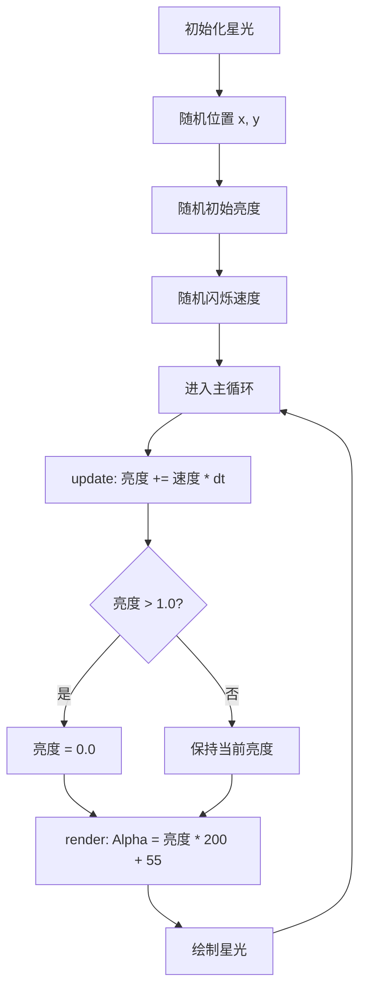

# 星光闪烁动画

<cite>
**Referenced Files in This Document**   
- [MainMenuState.h](file://Tracer\src\states\MainMenuState.h)
- [MainMenuState.cpp](file://Tracer\src\states\MainMenuState.cpp)
</cite>

## Table of Contents
1. [Star结构体设计](#star结构体设计)
2. [星光动画实现](#星光动画实现)
3. [视觉层次与协同效果](#视觉层次与协同效果)
4. [性能优化建议](#性能优化建议)
5. [艺术效果分析](#艺术效果分析)

## Star结构体设计

星光效果的核心是`Star`结构体，它定义了每颗星光的基本属性。该结构体包含位置坐标（x, y）、亮度值（brightness）和闪烁速度（twinkleSpeed）三个关键成员变量，构成了一个简洁而高效的动画数据模型。

**Section sources**
- [MainMenuState.h](file://Tracer\src\states\MainMenuState.h#L60-L64)

## 星光动画实现

### 星光初始化与随机分布
在`MainMenuState::onEnter`方法中，系统初始化一个包含25颗星光的集合。每颗星光的位置通过`rand() % screenW_`和`rand() % screenH_`进行完全随机的二维坐标分配，确保星光在整个屏幕范围内均匀且无规律地分布，模拟了真实夜空中星星的随机性。

### 亮度调制与数学模型
星光的闪烁效果由一个简单的线性递增-重置模型驱动。在`MainMenuState::update`方法中，每帧通过`star.brightness += star.twinkleSpeed * dt`更新亮度值，其中`dt`为帧时间间隔，保证了动画的帧率无关性。当亮度值超过1.0时，立即重置为0.0，形成一个连续的、锯齿波状的亮度变化周期。这种实现方式虽然不是正弦波，但通过`twinkleSpeed`参数的随机化（范围2.0-5.0），使得每颗星光拥有独特的闪烁频率，整体上呈现出类似正弦波的、自然的明暗变化。

### 亮度到颜色的映射
在`MainMenuState::render`方法中，亮度值被映射为SDL渲染器的Alpha（透明度）通道。映射公式为`alpha = star.brightness * 200 + 55`，将0.0-1.0的亮度范围线性转换为55-255的Alpha值。这确保了星光始终可见（最低55的透明度），并能从微弱的光点平滑过渡到最亮的状态。星光本身使用固定的浅蓝色（R:150, G:200, B:255）绘制，结合Alpha通道的变化，实现了从“显现”到“消失”的渐变闪烁效果。

**Diagram sources**
- [MainMenuState.cpp](file://Tracer\src\states\MainMenuState.cpp#L95-L108)
- [MainMenuState.cpp](file://Tracer\src\states\MainMenuState.cpp#L137-L143)
- [MainMenuState.cpp](file://Tracer\src\states\MainMenuState.cpp#L179-L181)

**Section sources**
- [MainMenuState.cpp](file://Tracer\src\states\MainMenuState.cpp#L95-L108)
- [MainMenuState.cpp](file://Tracer\src\states\MainMenuState.cpp#L137-L143)
- [MainMenuState.cpp](file://Tracer\src\states\MainMenuState.cpp#L179-L181)

## 视觉层次与协同效果

星光图层在视觉层次中被精确定位。其绘制顺序位于深色背景和装饰性花纹之后，但在乱码数据流、标题和UI按钮之前。这种分层设计（背景 -> 花纹 -> 星光 -> 数据流 -> 标题/按钮）确保了星光作为环境氛围元素，既不会被背景完全掩盖，也不会干扰前景的UI交互元素。

该星光效果目前与视差滚动效果没有直接的协同作用。代码中存在一个独立的“乱码数据流”（DataStream）系统，它以不同的速度向下滚动，形成了基础的视差感。然而，星光本身是静态的（无位移），并未与数据流的速度或方向进行联动，因此两者是独立运行的视觉元素，共同营造出复杂的背景动态，但未形成深度上的视差关联。

**Section sources**
- [MainMenuState.cpp](file://Tracer\src\states\MainMenuState.cpp#L150-L181)

## 性能优化建议

1.  **控制星光总数**：当前固定为25颗。在性能受限的设备上，可以将此数量作为可配置参数，并根据设备性能动态调整，以维持稳定的帧率。
2.  **使用预渲染纹理**：目前每帧都通过`SDL_RenderFillRect`绘制2x2的矩形。可以预先创建一个代表星光的、带Alpha通道的纹理（例如一个渐变的光点），然后在`render`函数中使用`SDL_RenderCopy`进行绘制。这可以减少渲染调用的开销，尤其是在星光数量较多时。
3.  **批处理绘制**：如果使用预渲染纹理，可以考虑将所有星光的绘制调用合并，利用SDL的批处理功能，进一步减少GPU状态切换的开销。

## 艺术效果分析

星光闪烁动画是营造“梦幻”氛围的关键贡献者。其艺术效果体现在三个方面：首先，随机分布和不同频率的闪烁打破了机械感，赋予了场景生命力和有机感；其次，浅蓝色的冷色调与深色背景形成对比，强化了“科技感”和“神秘感”；最后，持续的、柔和的明暗变化为静态的菜单界面注入了动态的呼吸感，有效缓解了纯静态画面的沉闷，极大地提升了整体的视觉吸引力和沉浸感。