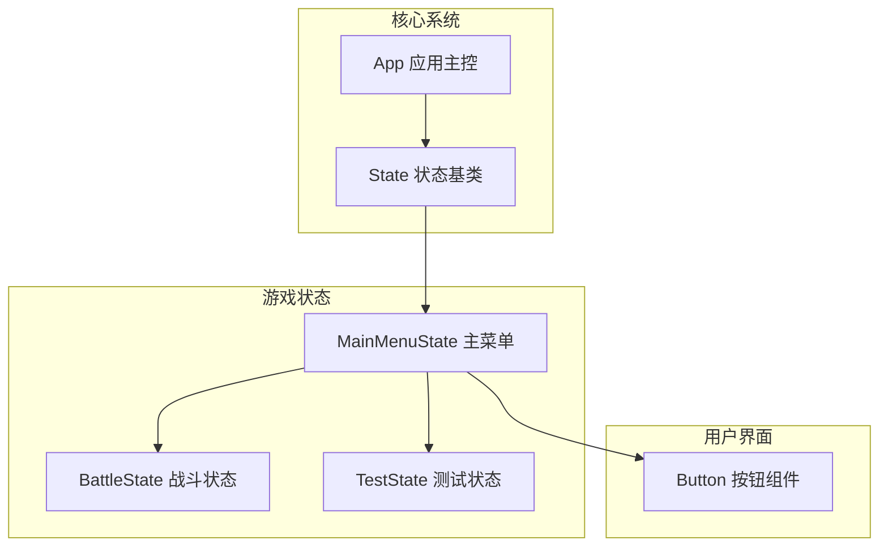

# 标题光晕与科技边框绘制

<cite>
**本文档引用文件**  
- [MainMenuState.cpp](file://Tracer/src/states/MainMenuState.cpp)
- [MainMenuState.h](file://Tracer/src/states/MainMenuState.h)
- [App.h](file://Tracer/src/core/App.h)
- [Button.h](file://Tracer/src/ui/Button.h)
- [State.h](file://Tracer/src/core/State.h)
</cite>

## 目录
1. [引言](#引言)
2. [项目结构](#项目结构)
3. [核心组件](#核心组件)
4. [标题纹理创建过程](#标题纹理创建过程)
5. [多层光晕效果实现策略](#多层光晕效果实现策略)
6. [科技感边框构成方式](#科技感边框构成方式)
7. [视觉增强对品牌识别的影响](#视觉增强对品牌识别的影响)
8. [低性能设备降级方案](#低性能设备降级方案)
9. [结论](#结论)

## 引言
本项目为一个基于SDL2与TTF字体渲染技术的C++游戏框架，主菜单界面以“溯洄遗梦”为核心视觉元素，采用高级图形渲染技术打造沉浸式科技美学风格。本文档重点剖析该标题的高级渲染机制，包括文字纹理生成、多层光晕模拟、动态边框装饰等关键技术实现，并探讨其在不同硬件环境下的适配策略。

## 项目结构
项目采用模块化分层架构，主要分为核心系统、游戏状态管理和用户界面三大模块。主菜单状态（`MainMenuState`）作为入口界面，集中体现了复杂的视觉渲染逻辑。

**图示来源**  
- [App.h](file://Tracer/src/core/App.h#L1-L30)
- [State.h](file://Tracer/src/core/State.h#L1-L17)
- [MainMenuState.h](file://Tracer/src/states/MainMenuState.h#L1-L69)

**本节来源**  
- [project_structure](#project_structure)

## 核心组件
主菜单状态类 `MainMenuState` 继承自通用状态基类 `State`，负责管理界面初始化、事件处理、更新逻辑与渲染流程。其核心视觉组件包括：
- **字体管理**：使用 `_TTF_Font` 指针加载中文字体文件，支持大标题与小字号渲染。
- **纹理缓存**：通过 `SDL_Texture* titleTex_` 缓存已渲染的文字表面，避免每帧重复生成。
- **动态元素**：包含数据流、装饰花纹和闪烁星光三类动态视觉元素，增强界面活力。

**本节来源**  
- [MainMenuState.h](file://Tracer/src/states/MainMenuState.h#L15-L66)
- [App.h](file://Tracer/src/core/App.h#L1-L30)

## 标题纹理创建过程
“溯洄遗梦”标题的纹理创建发生在 `onEnter` 方法中，具体流程如下：

1. **字体加载**：调用 `TTF_OpenFont` 加载 `Sanji.ttf` 字体文件，设置120pt字号用于标题。
2. **颜色定义**：指定 `SDL_Color` 为 (170, 210, 255)，呈现淡蓝色渐变感。
3. **文字表面生成**：使用 `TTF_RenderUTF8_Blended` 函数将UTF-8编码的中文文本渲染为带有抗锯齿和透明通道的 `SDL_Surface`。
4. **纹理转换**：通过 `SDL_CreateTextureFromSurface` 将表面转换为GPU可高效绘制的 `SDL_Texture` 对象。
5. **资源释放**：立即释放临时的 `SDL_Surface`，仅保留纹理句柄以节省内存。

此过程确保了高质量文字输出，同时利用SDL纹理机制实现高性能重复绘制。

**本节来源**  
- [MainMenuState.cpp](file://Tracer/src/states/MainMenuState.cpp#L25-L35)

## 多层光晕效果实现策略
标题的光晕效果并非使用后期处理或着色器，而是通过**多层偏移叠加**的方式模拟真实发光效果，其实现策略如下：

### 光晕结构设计
定义 `TextShadow` 结构体，包含：
- `offsetX`, `offsetY`：阴影偏移量
- `alpha`：透明度（控制光晕强度）
- `scale`：缩放因子（制造模糊扩散感）
- `color`：颜色（由内到外逐渐变暗）

### 多层渲染流程
在 `render` 方法中，遍历预设的15层阴影配置，对每一层执行：
1. 调用 `TTF_RenderUTF8_Blended` 重新生成对应颜色的文字表面
2. 设置表面透明度（`SDL_SetSurfaceAlphaMod`）
3. 创建临时纹理并查询尺寸
4. 根据偏移与缩放计算目标矩形
5. 使用 `SDL_RenderCopy` 绘制该层光晕

最终通过**加法混合模式**（`SDL_BLENDMODE_ADD`）叠加所有光晕层，形成明亮扩散的视觉效果，再切换回普通混合模式绘制原始标题文字。

**本节来源**  
- [MainMenuState.cpp](file://Tracer/src/states/MainMenuState.cpp#L250-L320)

## 科技感边框构成方式
标题区域的科技感边框由多种装饰元素组合而成，形成环绕式动态视觉框架。

### 数据流装饰（DataStream）
- **字符序列**：从预设字符集（数字、字母、符号）中随机生成12-28个字符。
- **垂直滚动**：每个字符列以不同速度（120-300px/s）向下滚动，超出屏幕后重置。
- **透明度变化**：每个字符拥有独立透明度（120-250），模拟数据流动感。
- **实时渲染**：每帧动态调用 `TTF_RenderUTF8_Blended` 生成单个字符纹理并立即绘制，随后销毁。

### 静态装饰元素
- **弧线与圆点**：使用 `Decoration` 结构体在随机位置绘制小型弧线或圆点，呈现电路板式纹路。
- **星光闪烁**：`Star` 结构体控制光点亮度按正弦规律变化，模拟星空闪烁效果。

### 标题专属装饰
- **侧边光点阵列**：在标题左右两侧绘制6个渐变排列的小方块，形成对称装饰。
- **底部科技线条**：在标题下方绘制点状虚线，间隔闪烁，增强科技氛围。

这些元素共同构建出复杂而有序的视觉层次，强化“数字世界”的沉浸感。

**本节来源**  
- [MainMenuState.h](file://Tracer/src/states/MainMenuState.h#L40-L66)
- [MainMenuState.cpp](file://Tracer/src/states/MainMenuState.cpp#L75-L100)
- [MainMenuState.cpp](file://Tracer/src/states/MainMenuState.cpp#L325-L350)

## 视觉增强对品牌识别的影响
“溯洄遗梦”的高级渲染技术显著提升了界面的品牌识别度与整体质感：

1. **情感传达**：淡蓝渐变色与光晕效果传递出“回忆”“梦境”“科技”三重意象，契合“溯洄遗梦”主题。
2. **视觉焦点**：强烈的发光文字在深色背景下极具吸引力，自然引导用户注意力至核心标题。
3. **风格统一**：数据流、星光、装饰线等元素贯穿整个界面，形成一致的赛博朋克美学风格。
4. **专业印象**：精细的渲染细节展现出开发团队的技术实力，提升产品专业形象。

这些视觉设计不仅美化界面，更成为品牌语言的一部分，强化用户对产品的第一印象与情感连接。

**本节来源**  
- [MainMenuState.cpp](file://Tracer/src/states/MainMenuState.cpp#L250-L350)

## 低性能设备降级方案
尽管当前实现未显式包含性能检测逻辑，但可通过以下策略实现降级：

### 可行降级措施
| 特性 | 降级方案 | 实现方式 |
|------|----------|----------|
| 光晕效果 | 禁用或减少层数 | 注释掉部分 `titleShadows` 条目或跳过光晕渲染块 |
| 数据流 | 降低密度与速度 | 减少 `streamCount`，降低 `speed` 范围 |
| 星光闪烁 | 完全禁用 | 不初始化 `stars_` 向量，跳过更新与渲染 |
| 实时字符渲染 | 改为预渲染纹理 | 将滚动字符改为静态纹理动画 |

### 推荐优化方向
- **条件编译**：通过 `#ifdef LOW_PERFORMANCE` 区分不同构建版本。
- **运行时检测**：根据FPS或设备信息动态调整渲染复杂度。
- **纹理缓存扩展**：将光晕层也缓存为纹理，避免每帧重复生成。

这些策略可在保证基本视觉风格的前提下，大幅提升低端设备的运行流畅度。

**本节来源**  
- [MainMenuState.cpp](file://Tracer/src/states/MainMenuState.cpp#L150-L160)
- [MainMenuState.cpp](file://Tracer/src/states/MainMenuState.cpp#L250-L320)

## 结论
“溯洄遗梦”标题的渲染技术充分展现了SDL2在2D图形渲染方面的灵活性与表现力。通过 `TTF_RenderText_Blended` 生成高质量文字表面，并结合多层偏移光晕、动态数据流与装饰元素，成功构建出富有科技感与艺术美感的主界面。该实现虽在性能上存在优化空间，但其模块化设计为后续降级与扩展提供了良好基础。建议未来引入性能监控机制，实现自适应渲染质量调节，以兼顾视觉效果与跨平台兼容性。