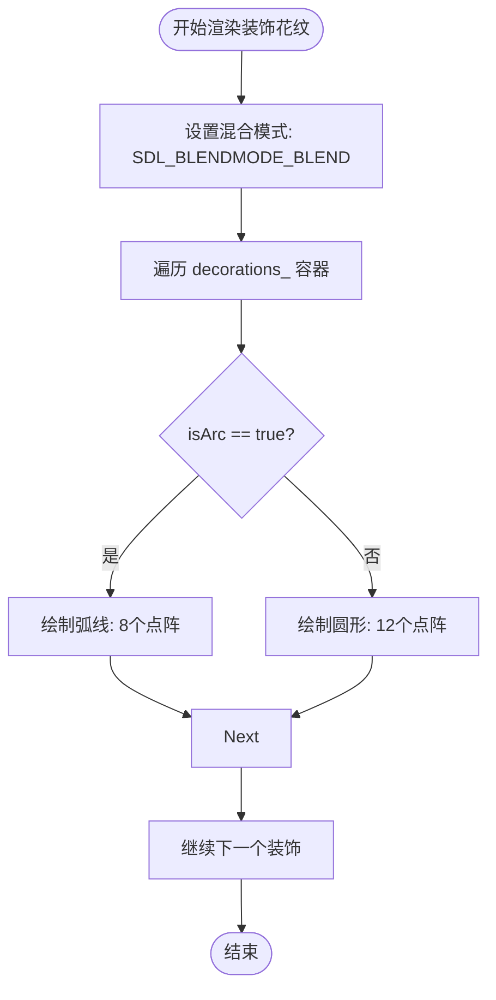

<cite>
**Referenced Files in This Document**  
- [MainMenuState.h](file://d:\\C++Project\\Tracer - 副本\\Tracer\\src\\states\\MainMenuState.h)
- [MainMenuState.cpp](file://d:\\C++Project\\Tracer - 副本\\Tracer\\src\\states\\MainMenuState.cpp)
</cite>

# 装饰性花纹渲染

## Table of Contents
1. [Decoration结构体详解](#decoration结构体详解)
2. [花纹渲染逻辑](#花纹渲染逻辑)
3. [布局与美学设计](#布局与美学设计)
4. [透明度与视觉效果](#透明度与视觉效果)
5. [性能优化建议](#性能优化建议)

## Decoration结构体详解

`Decoration`结构体定义于`MainMenuState.h`中，用于描述主菜单界面中的装饰性图案元素。该结构体包含以下字段：

- `x`, `y`: 整型坐标值，表示花纹中心点在屏幕上的位置。
- `radius`: 整型值，表示花纹的半径大小。
- `alpha`: 无符号8位整数，表示花纹的透明度（0-255），用于实现半透明叠加效果。
- `isArc`: 布尔标志位，控制图案类型：`true`时绘制弧线，`false`时绘制圆形。

此结构体作为非交互性的背景装饰元素，通过`std::vector<Decoration>`容器`decorations_`进行管理，增强了界面的艺术表现力和科技感氛围。

**Section sources**
- [MainMenuState.h](file://d:\\C++Project\\Tracer - 副本\\Tracer\\src\\states\\MainMenuState.h#L52-L56)

## 花纹渲染逻辑

在`MainMenuState::render`函数中，系统遍历`decorations_`容器中的每个`Decoration`对象，并根据`isArc`标志位决定绘制弧线或圆形。值得注意的是，项目并未直接使用`SDL_RenderDrawArc`或`SDL_RenderDrawCircle`等原生SDL弧线/圆形绘制函数，而是通过点阵模拟的方式实现。

**Diagram sources**
- [MainMenuState.cpp](file://d:\\C++Project\\Tracer - 副本\\Tracer\\src\\states\\MainMenuState.cpp#L178-L208)

**Section sources**
- [MainMenuState.cpp](file://d:\\C++Project\\Tracer - 副本\\Tracer\\src\\states\\MainMenuState.cpp#L170-L208)

## 布局与美学设计

装饰花纹在屏幕上的布局采用随机分布策略。在`onEnter`函数中，通过`rand() % screenW_`和`rand() % screenH_`生成随机坐标，确保每次进入主菜单时花纹位置略有不同，增加视觉新鲜感。同时，半径和透明度也通过随机函数初始化，形成层次丰富的背景效果。

这些花纹作为非交互性的背景元素，与标题光晕、数据流、按钮装饰等共同构成统一的科技美学风格。它们不仅填补了视觉空白，还通过点阵的疏密和透明度变化引导用户视觉焦点，强化了主菜单的沉浸式体验。

**Section sources**
- [MainMenuState.cpp](file://d:\\C++Project\\Tracer - 副本\\Tracer\\src\\states\\MainMenuState.cpp#L308-L322)

## 透明度与视觉效果

项目充分利用alpha通道实现半透明叠加效果。`alpha`字段直接传递给`SDL_SetRenderDrawColor`函数，与`SDL_BLENDMODE_BLEND`混合模式配合，使多个花纹叠加时产生柔和的渐变效果。这种半透明特性使得花纹能够与深色背景（RGB: 8,10,16）和谐共存，既保持了视觉存在感，又不会干扰前景内容。

此外，星光（`Star`结构体）也采用动态alpha值（`star.brightness * 200 + 55`），实现闪烁效果，与静态的装饰花纹形成动静结合的视觉层次。

**Section sources**
- [MainMenuState.cpp](file://d:\\C++Project\\Tracer - 副本\\Tracer\\src\\states\\MainMenuState.cpp#L177-L178)
- [MainMenuState.cpp](file://d:\\C++Project\\Tracer - 副本\\Tracer\\src\\states\\MainMenuState.cpp#L199-L200)

## 性能优化建议

当前实现通过循环生成点阵来模拟弧线和圆形，虽然避免了SDL原生弧线绘制函数的缺失，但存在性能优化空间：

1. **预计算几何路径**：可预先计算弧线和圆形的点坐标序列，存储为模板，在渲染时直接引用，避免每次重复三角函数计算。
2. **纹理复用**：将常见的花纹图案（如圆形、弧线）预先渲染到`SDL_Texture`中，后续通过`SDL_RenderCopy`进行批量绘制，显著提升渲染效率。
3. **批处理绘制**：考虑使用`SDL_RenderGeometry`或自定义着色器进行批量点绘制，减少API调用开销。

这些优化措施可在保持视觉效果的同时，提升主菜单的渲染性能，特别是在高分辨率或大量装饰元素的场景下。

**Section sources**
- [MainMenuState.cpp](file://d:\\C++Project\\Tracer - 副本\\Tracer\\src\\states\\MainMenuState.cpp#L184-L207)