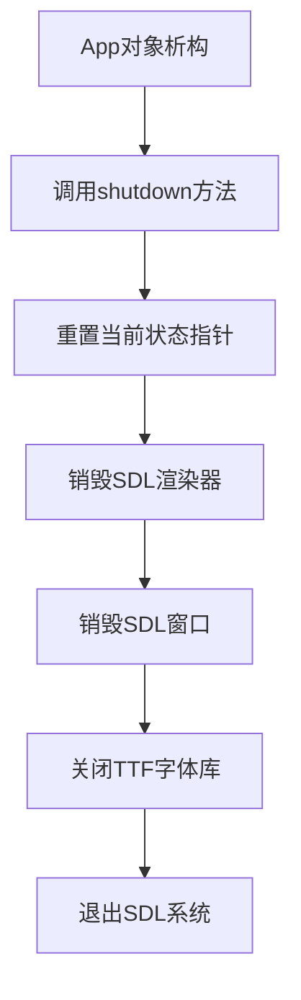
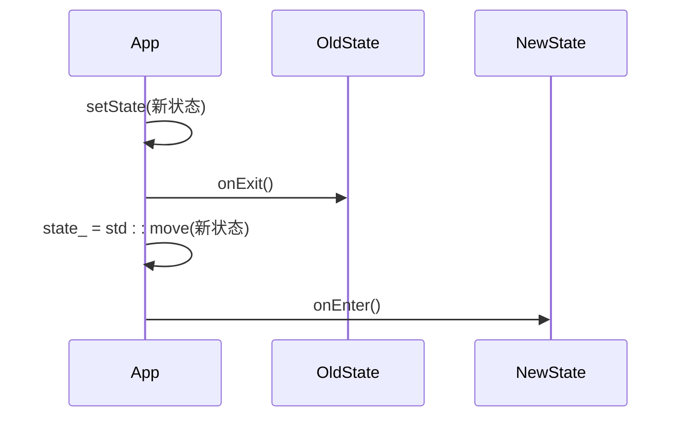
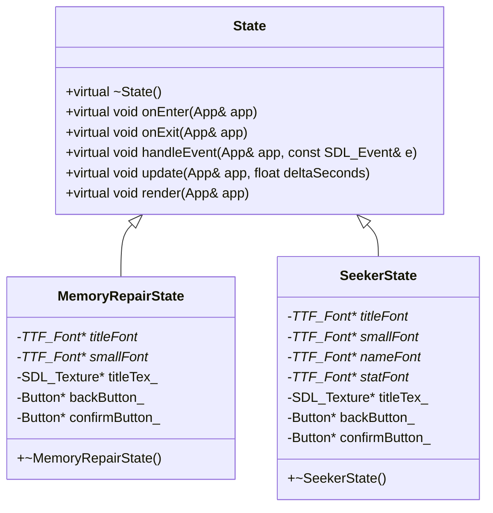

# 内存释放与资源清理

<cite>
**本文档引用的文件**  
- [App.h](file://Tracer/src/core/App.h)
- [App.cpp](file://Tracer/src/core/App.cpp)
- [State.h](file://Tracer/src/core/State.h)
- [MemoryRepairState.cpp](file://Tracer/src/states/MemoryRepairState.cpp)
- [SeekerState.cpp](file://Tracer/src/states/SeekerState.cpp)
- [BattleState.cpp](file://Tracer/src/states/BattleState.cpp)
- [MapExploreState.cpp](file://Tracer/src/states/MapExploreState.cpp)
- [MainMenuState.cpp](file://Tracer/src/states/MainMenuState.cpp)
- [TestState.cpp](file://Tracer/src/states/TestState.cpp)
</cite>

## 目录
1. [引言](#引言)
2. [RAII机制与App类析构函数](#raii机制与app类析构函数)
3. [智能指针在状态管理中的应用](#智能指针在状态管理中的应用)
4. [State派生类的本地资源释放实践](#state派生类的本地资源释放实践)
5. [异常安全与shutdown函数的健壮性](#异常安全与shutdown函数的健壮性)
6. [资源泄漏调试方法](#资源泄漏调试方法)
7. [运行时资源监控建议](#运行时资源监控建议)
8. [结论](#结论)

## 引言
本项目采用基于RAII（Resource Acquisition Is Initialization）的资源管理机制，确保SDL图形资源、字体及动态分配的UI组件在程序生命周期内得到安全、自动的释放。核心设计围绕`App`类的析构函数和`shutdown`方法展开，结合`std::unique_ptr`智能指针管理状态对象，实现了从窗口、渲染器到具体游戏状态中纹理、字体等资源的全面清理。本文档将系统阐述该机制的实现细节，并提供最佳实践与调试建议。

## RAII机制与App类析构函数
项目严格遵循RAII原则，将资源的获取与释放绑定到对象的构造与析构过程。`App`类作为程序的主控中心，其析构函数是资源清理的最终保障。

`App`类的析构函数在`App.cpp`中定义，其核心逻辑是调用`shutdown`方法。此设计确保了即使程序因异常而终止，只要`App`对象的生命周期结束，其析构函数就会被自动触发，从而执行清理流程。

**图示来源**
- [App.cpp](file://Tracer/src/core/App.cpp#L11-L11)

**本节来源**
- [App.h](file://Tracer/src/core/App.h#L7-L27)
- [App.cpp](file://Tracer/src/core/App.cpp#L11-L11)

## 智能指针在状态管理中的应用
状态管理是游戏逻辑的核心，`App`类通过`std::unique_ptr<State>`来持有当前的游戏状态。这种设计不仅实现了状态的动态切换，更重要的是保证了状态对象的自动销毁。

`App`类的`setState`方法是状态切换的入口。在设置新状态前，它会检查当前是否存在旧状态。如果存在，则调用旧状态的`onExit`方法，为旧状态提供一个执行清理逻辑的机会。随后，`std::unique_ptr`的赋值操作会自动释放旧状态对象所占用的内存，确保无内存泄漏。

**图示来源**
- [App.cpp](file://Tracer/src/core/App.cpp#L65-L70)

**本节来源**
- [App.h](file://Tracer/src/core/App.h#L7-L27)
- [App.cpp](file://Tracer/src/core/App.cpp#L65-L70)
- [State.h](file://Tracer/src/core/State.h#L6-L14)

## State派生类的本地资源释放实践
每个`State`派生类都可能持有其特有的本地资源，如字体、纹理和UI控件。这些资源的释放遵循统一的模式：在析构函数中进行清理。

以`MemoryRepairState`为例，其析构函数明确地释放了所有动态分配的资源。它首先检查指针是否非空，然后调用相应的SDL和TTF API进行销毁。这种“先检查后销毁”的模式是异常安全的，即使指针为`nullptr`，`SDL_DestroyTexture`等函数也能安全处理。

**图示来源**
- [MemoryRepairState.cpp](file://Tracer/src/states/MemoryRepairState.cpp#L3-L13)
- [SeekerState.cpp](file://Tracer/src/states/SeekerState.cpp#L3-L15)

**本节来源**
- [MemoryRepairState.cpp](file://Tracer/src/states/MemoryRepairState.cpp#L3-L13)
- [SeekerState.cpp](file://Tracer/src/states/SeekerState.cpp#L3-L15)
- [BattleState.cpp](file://Tracer/src/states/BattleState.cpp#L3-L10)
- [MapExploreState.cpp](file://Tracer/src/states/MapExploreState.cpp#L3-L15)
- [MainMenuState.cpp](file://Tracer/src/states/MainMenuState.cpp#L3-L10)
- [TestState.cpp](file://Tracer/src/states/TestState.cpp#L3-L15)

## 异常安全与shutdown函数的健壮性
`shutdown`函数的设计充分考虑了异常安全。其核心在于幂等性（idempotency）和防御性编程。

`shutdown`函数中的所有资源销毁操作都包裹在`if (pointer)`的条件判断中。这意味着，无论`shutdown`被调用一次还是多次，结果都是相同的：资源被安全释放，且不会对已释放的资源进行二次释放。这在程序初始化失败或异常中断后需要清理时至关重要。

此外，`App`的析构函数直接调用`shutdown`，这确保了`App`对象的生命周期终点就是资源清理的终点。即使`init`方法失败，`App`对象的析构仍会执行，从而保证了`SDL_Quit`和`TTF_Quit`的调用，避免了SDL子系统的资源泄漏。

**本节来源**
- [App.cpp](file://Tracer/src/core/App.cpp#L40-L46)

## 资源泄漏调试方法
为了确保资源管理的正确性，推荐使用以下工具进行调试：

1.  **Valgrind (Linux/macOS)**：这是检测内存泄漏的黄金标准。在程序退出后，Valgrind会报告所有未释放的内存块。使用`valgrind --leak-check=full ./your_program`运行程序，仔细检查输出。
2.  **SDL自带的内存检测**：在编译SDL时启用调试模式，它可以提供更详细的内存分配日志。虽然不如Valgrind强大，但可以作为初步检查。
3.  **代码审查与日志**：在`shutdown`函数和各个`State`的析构函数中添加`SDL_Log`日志，确认清理代码被执行。通过日志可以追踪资源的创建与销毁时间点。

**本节来源**
- [App.cpp](file://Tracer/src/core/App.cpp#L40-L46)
- [MemoryRepairState.cpp](file://Tracer/src/states/MemoryRepairState.cpp#L3-L13)

## 运行时资源监控建议
为了便于开发者实时监控内存使用情况，建议添加一个运行时资源监控接口。

一个简单的实现方案是在`App`类中增加一个`getMemoryUsage`方法，该方法可以返回一个包含当前状态、窗口、渲染器、字体和纹理数量的结构体。这个信息可以通过一个调试UI（例如，按`F3`键切换显示）呈现给开发者。这有助于在开发过程中快速识别资源增长的异常情况。

**本节来源**
- [App.h](file://Tracer/src/core/App.h#L7-L27)

## 结论
本项目通过`App`类的析构函数和`shutdown`方法，结合`std::unique_ptr`智能指针，构建了一个健壮的RAII资源管理框架。`App`负责全局资源（窗口、渲染器、SDL系统）的清理，而各个`State`派生类则负责其本地资源（字体、纹理、按钮）的释放。`shutdown`函数的幂等性设计确保了在任何异常情况下都能安全执行清理。通过遵循此模式并利用Valgrind等工具进行验证，可以有效杜绝资源泄漏，保证程序的稳定运行。