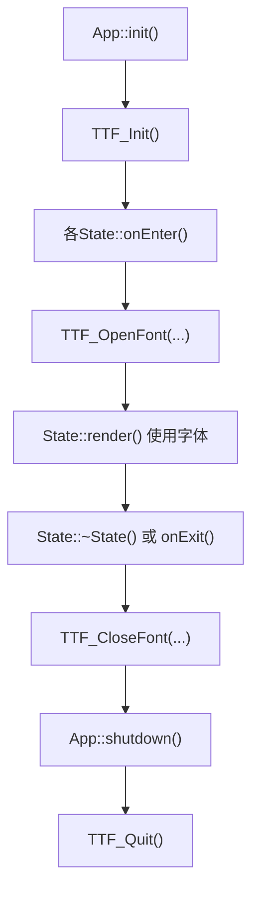
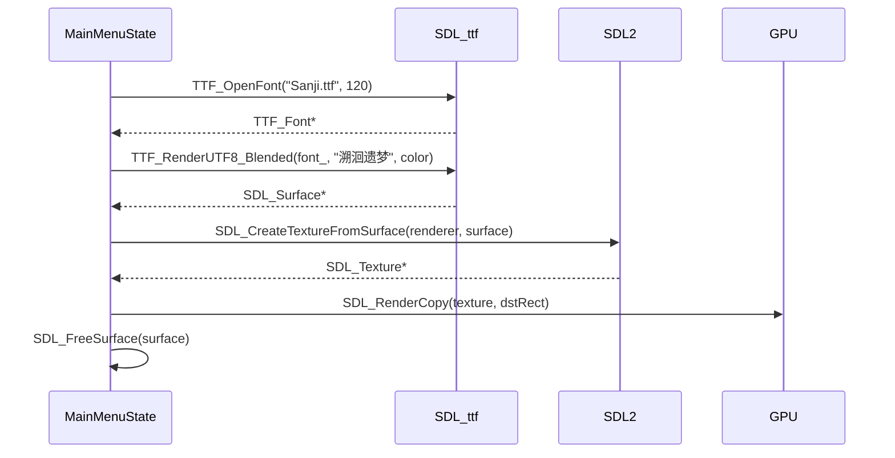

# 字体管理

<cite>
**本文档引用的文件**  
- [App.cpp](file://Tracer/src/core/App.cpp)
- [App.h](file://Tracer/src/core/App.h)
- [MainMenuState.cpp](file://Tracer/src/states/MainMenuState.cpp)
- [MainMenuState.h](file://Tracer/src/states/MainMenuState.h)
- [State.h](file://Tracer/src/core/State.h)
- [BarterState.cpp](file://Tracer/src/states/BarterState.cpp)
- [BurnState.cpp](file://Tracer/src/states/BurnState.cpp)
- [DeckState.cpp](file://Tracer/src/states/DeckState.cpp)
- [EngraveState.cpp](file://Tracer/src/states/EngraveState.cpp)
- [HeritageState.cpp](file://Tracer/src/states/HeritageState.cpp)
- [InkShopState.cpp](file://Tracer/src/states/InkShopState.cpp)
- [MapExploreState.cpp](file://Tracer/src/states/MapExploreState.cpp)
- [MemoryRepairState.cpp](file://Tracer/src/states/MemoryRepairState.cpp)
</cite>

## 目录
1. [引言](#引言)
2. [字体资源加载机制](#字体资源加载机制)
3. [字体共享机制分析](#字体共享机制分析)
4. [字体销毁与RAII原则](#字体销毁与raii原则)
5. [错误处理与备用方案](#错误处理与备用方案)
6. [字体路径硬编码问题与改进建议](#字体路径硬编码问题与改进建议)
7. [UI文本渲染流程示例](#ui文本渲染流程示例)
8. [字体缓存策略与性能优化](#字体缓存策略与性能优化)
9. [总结](#总结)

## 引言
本项目基于SDL2与SDL_ttf库实现中文界面渲染，通过TTF_OpenFont加载中文字体文件以支持UTF-8文本显示。字体资源在多个游戏状态（State）中被频繁使用，当前实现存在资源管理分散、路径硬编码等问题。本文详细分析字体的加载、共享、销毁机制，并提出优化建议，确保资源安全释放，提升可维护性与运行效率。

## 字体资源加载机制

项目中字体资源的加载由各个`State`子类在其`onEnter`方法中独立完成，通过调用`TTF_OpenFont`函数加载位于`assets/fonts/Sanji.ttf`的中文字体文件。该字体被用于渲染中文标题、按钮文本及动态UI元素。

例如，在`MainMenuState::onEnter`中：
```cpp
font_ = TTF_OpenFont("assets/fonts/Sanji.ttf", 120);
smallFont_ = TTF_OpenFont("assets/fonts/Sanji.ttf", 20);
```
其他状态如`BarterState`、`BurnState`等也采用相同方式加载不同字号的字体实例，用于满足各自界面需求。

**Section sources**
- [MainMenuState.cpp](file://Tracer/src/states/MainMenuState.cpp#L21-L23)
- [BarterState.cpp](file://Tracer/src/states/BarterState.cpp#L19-L22)
- [BurnState.cpp](file://Tracer/src/states/BurnState.cpp#L19-L22)

## 字体共享机制分析

当前实现中，字体资源并未在`App`类中作为全局共享资源进行集中管理，而是由每个`State`在进入时自行加载，导致以下问题：

1. **重复加载**：多个状态均加载同一字体文件，造成不必要的I/O开销。
2. **内存浪费**：虽然TTF库可能对字体文件进行内部缓存，但每个`TTF_Font`指针仍占用独立内存空间。
3. **状态切换性能下降**：每次切换状态都需重新加载字体，影响用户体验。

理想的设计应由`App`类在初始化时统一加载常用字体，并提供接口供各状态获取字体指针，实现真正的资源共享。

**Section sources**
- [MainMenuState.cpp](file://Tracer/src/states/MainMenuState.cpp#L21-L23)
- [DeckState.cpp](file://Tracer/src/states/DeckState.cpp#L17-L20)
- [MapExploreState.cpp](file://Tracer/src/states/MapExploreState.cpp#L28-L29)

## 字体销毁与RAII原则

项目遵循RAII（Resource Acquisition Is Initialization）原则，在每个`State`的析构或`onExit`阶段确保调用`TTF_CloseFont`释放已加载的字体资源，防止内存泄漏。

例如，`BarterState`的析构逻辑：
```cpp
if (titleFont_) TTF_CloseFont(titleFont_);
if (smallFont_) TTF_CloseFont(smallFont_);
```
此模式在`BurnState`、`DeckState`等多个状态中一致应用，确保了资源的及时释放。

然而，SDL_ttf的全局初始化（`TTF_Init`）由`App::init`负责，其清理在`App::shutdown`中通过`TTF_Quit()`完成，形成完整的资源生命周期管理。



**Diagram sources**
- [App.cpp](file://Tracer/src/core/App.cpp#L15-L25)
- [BarterState.cpp](file://Tracer/src/states/BarterState.cpp#L9-L12)

**Section sources**
- [App.cpp](file://Tracer/src/core/App.cpp#L65-L70)
- [BarterState.cpp](file://Tracer/src/states/BarterState.cpp#L9-L12)
- [BurnState.cpp](file://Tracer/src/states/BurnState.cpp#L9-L12)

## 错误处理与备用方案

项目在字体加载后检查指针有效性，并通过`SDL_Log`输出错误信息：
```cpp
if (!font_ || !smallFont_) { 
    SDL_Log("TTF_OpenFont failed: %s", TTF_GetError()); 
}
```
但当前实现**缺乏备用方案**。若字体文件缺失或加载失败，将导致UI文本无法渲染，影响程序健壮性。

**建议的错误处理最佳实践**：
1. **提供默认字体**：准备一个备用字体文件（如`fallback.ttf`）。
2. **使用系统字体**：在Windows/Linux/macOS上尝试加载系统默认中文字体。
3. **降级渲染**：使用纯色矩形或ASCII字符替代，确保基本功能可用。
4. **用户提示**：弹出对话框提示“字体加载失败，请检查资源文件”。

**Section sources**
- [MainMenuState.cpp](file://Tracer/src/states/MainMenuState.cpp#L23-L24)
- [MapExploreState.cpp](file://Tracer/src/states/MapExploreState.cpp#L31)

## 字体路径硬编码问题与改进建议

当前所有状态均**硬编码**字体路径：
```cpp
TTF_OpenFont("assets/fonts/Sanji.ttf", size);
```
此设计存在严重缺陷：
- **可移植性差**：路径变更需修改所有源文件。
- **维护困难**：无法集中管理资源路径。
- **不利于多语言支持**：不同语言可能需要不同字体。

**改进建议**：

### 方案一：引入资源路径配置
创建`Config`类或使用JSON文件定义资源路径：
```json
{
  "font_path": "assets/fonts/Sanji.ttf"
}
```
各状态通过`Config::getFontPath()`获取路径。

### 方案二：实现资源管理器单例
创建`ResourceManager`单例，统一管理字体、纹理等资源：
```cpp
class ResourceManager {
public:
    static ResourceManager& getInstance();
    TTF_Font* getFont(const std::string& name, int size);
private:
    std::map<std::string, std::unique_ptr<TTF_Font, decltype(&TTF_CloseFont)>> fonts_;
};
```
`App`初始化时创建`ResourceManager`，各状态通过`App`获取实例，实现资源的按需加载与自动缓存。

**Section sources**
- [MainMenuState.cpp](file://Tracer/src/states/MainMenuState.cpp#L21)
- [BarterState.cpp](file://Tracer/src/states/BarterState.cpp#L19)

## UI文本渲染流程示例

以`MainMenuState`中的标题渲染为例，展示字体在UI中的实际调用流程：

1. **加载字体**：`onEnter`中调用`TTF_OpenFont`获取`font_`。
2. **创建文本纹理**：使用`TTF_RenderUTF8_Blended`将UTF-8字符串渲染为`SDL_Surface`。
3. **转换为纹理**：调用`SDL_CreateTextureFromSurface`生成GPU纹理`titleTex_`。
4. **渲染到屏幕**：在`render`方法中通过`SDL_RenderCopy`将纹理绘制到指定位置。
5. **释放中间资源**：立即调用`SDL_FreeSurface`释放CPU端表面内存。

此流程在按钮文本、动态数据流等渲染中重复应用，体现了SDL2字体渲染的标准模式。



**Diagram sources**
- [MainMenuState.cpp](file://Tracer/src/states/MainMenuState.cpp#L25-L35)
- [MainMenuState.cpp](file://Tracer/src/states/MainMenuState.cpp#L230-L235)

**Section sources**
- [MainMenuState.cpp](file://Tracer/src/states/MainMenuState.cpp#L21-L35)
- [MainMenuState.cpp](file://Tracer/src/states/MainMenuState.cpp#L230-L240)

## 字体缓存策略与性能优化

当前实现中，每个状态独立加载字体，且在`render`循环内频繁调用`TTF_RenderUTF8_Blended`生成临时纹理，存在显著性能瓶颈：

- **CPU开销大**：文本渲染在CPU端完成，频繁调用消耗大量时间。
- **内存碎片化**：每帧创建/销毁`SDL_Surface`和`SDL_Texture`。
- **GPU提交频繁**：大量小纹理增加渲染批次。

**建议的缓存策略**：

1. **静态文本缓存**：将不经常变化的文本（如按钮标签、标题）在`onEnter`时预渲染为纹理并缓存，`render`时直接复用。
2. **动态文本池**：对频繁更新的文本（如计数器），采用对象池技术复用`SDL_Texture`。
3. **字体管理器缓存**：`ResourceManager`应缓存已加载的`TTF_Font`指针，避免重复打开同一文件。

通过上述优化，可显著降低CPU占用，提升多状态切换下的流畅度。

**Section sources**
- [MainMenuState.cpp](file://Tracer/src/states/MainMenuState.cpp#L25-L35)
- [MainMenuState.cpp](file://Tracer/src/states/MainMenuState.cpp#L300-L310)

## 总结

本项目实现了基本的中文字体支持，但在资源管理方面存在改进空间。当前字体加载分散、路径硬编码，虽通过RAII确保了资源释放，但缺乏全局共享与缓存机制。建议引入`ResourceManager`单例模式，集中管理字体资源，解耦路径依赖，并实现文本纹理的预缓存，以提升性能与可维护性。同时，应完善字体加载失败的备用方案，增强程序鲁棒性。