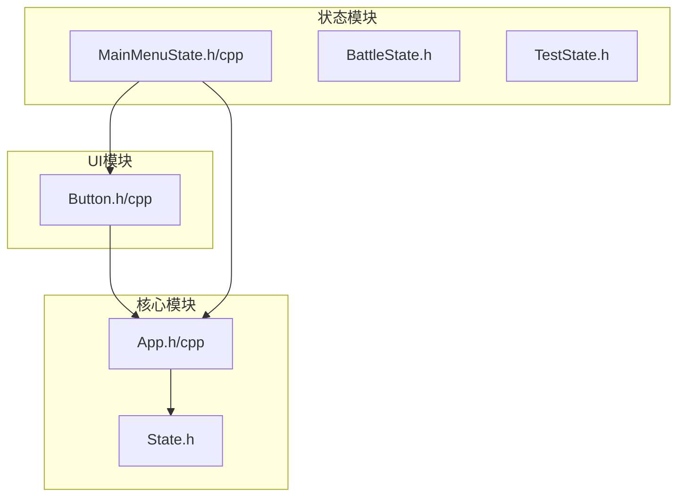
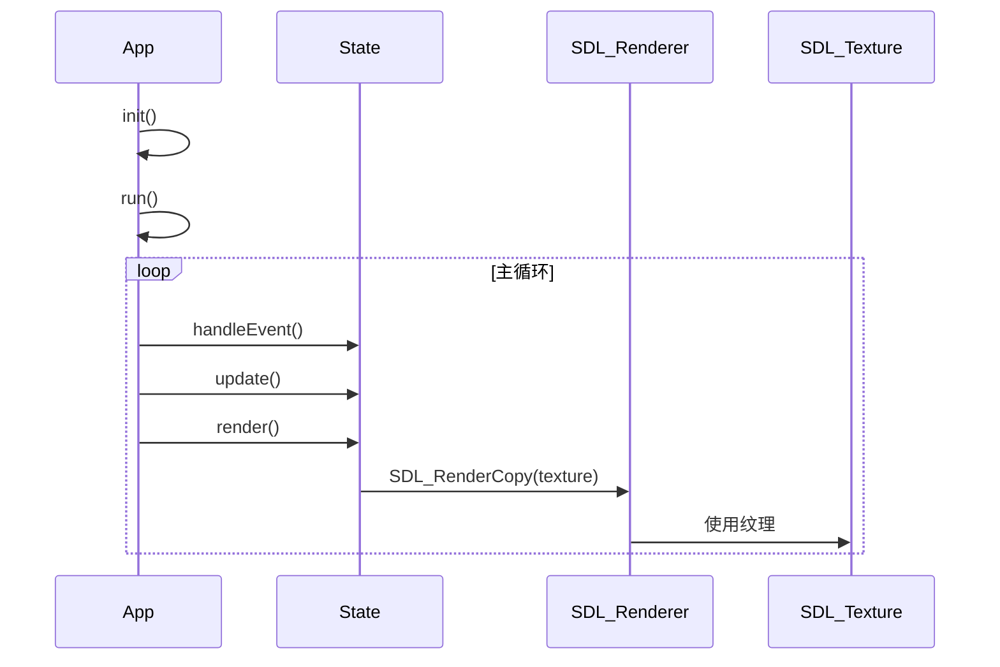
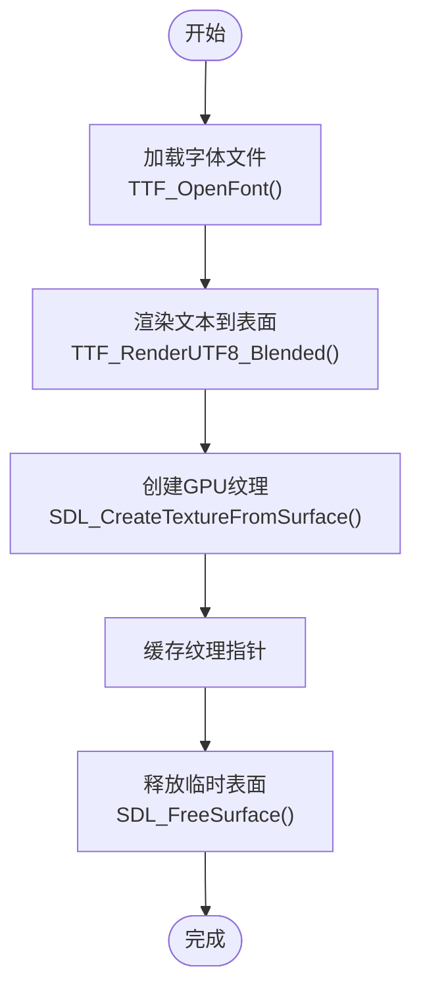
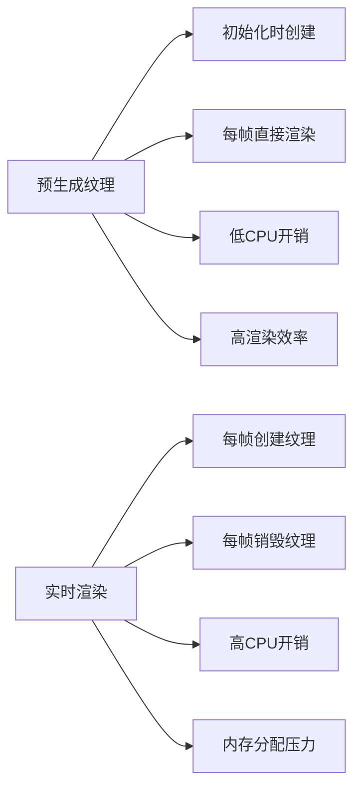
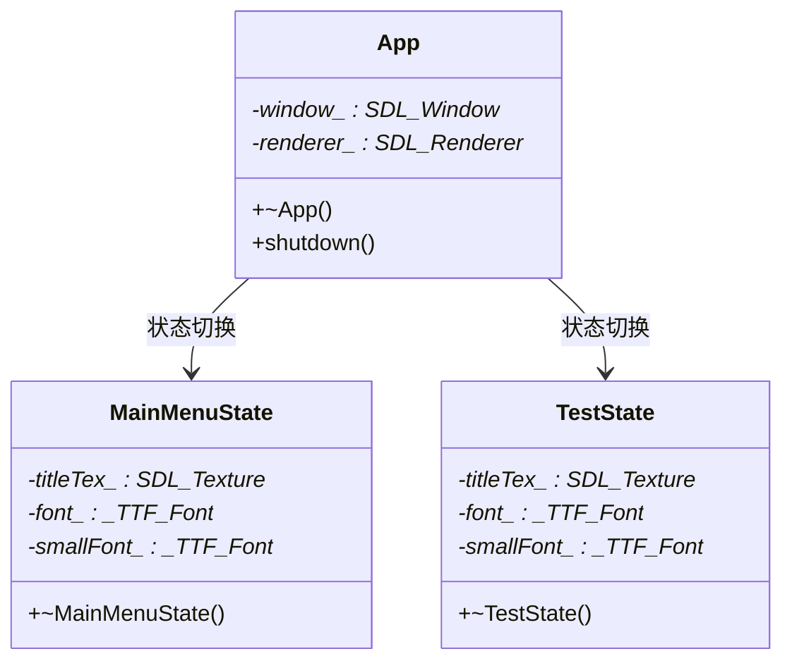
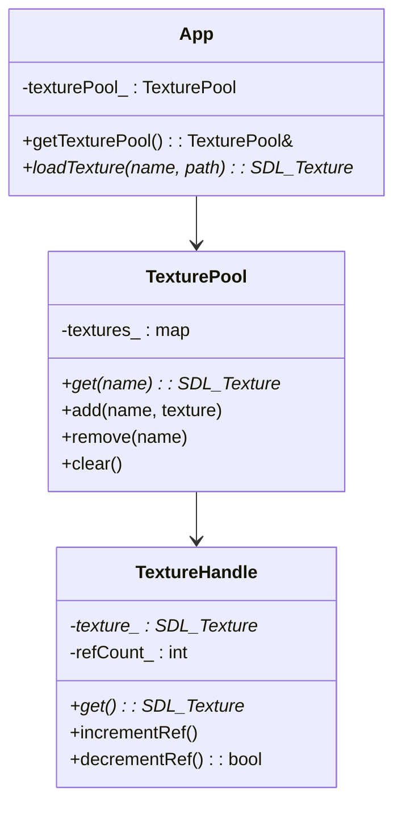
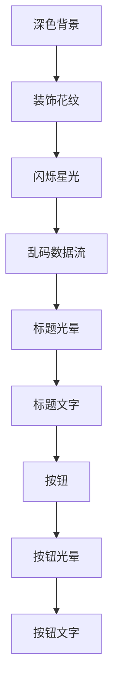
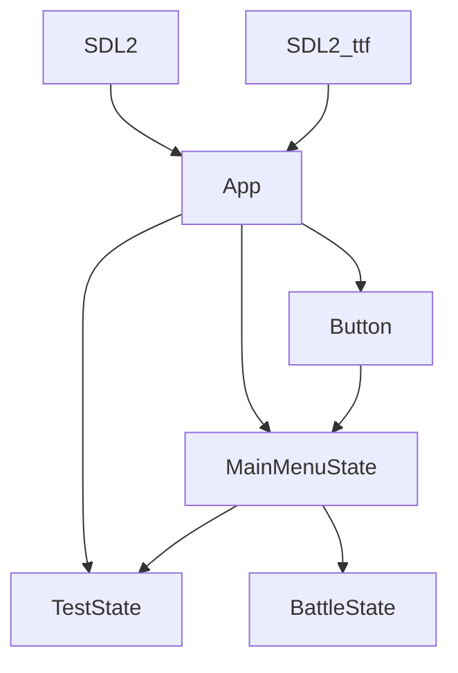

# 纹理管理

<cite>
**本文档引用的文件**  
- [App.h](file://Tracer/src/core/App.h)
- [App.cpp](file://Tracer/src/core/App.cpp)
- [MainMenuState.cpp](file://Tracer/src/states/MainMenuState.cpp)
- [MainMenuState.h](file://Tracer/src/states/MainMenuState.h)
- [Button.cpp](file://Tracer/src/ui/Button.cpp)
- [Button.h](file://Tracer/src/ui/Button.h)
</cite>

## 目录
1. [引言](#引言)
2. [项目结构](#项目结构)
3. [核心组件](#核心组件)
4. [架构概述](#架构概述)
5. [详细组件分析](#详细组件分析)
6. [依赖分析](#依赖分析)
7. [性能考量](#性能考量)
8. [故障排除指南](#故障排除指南)
9. [结论](#结论)

## 引言
本文档深入解析SDL_Texture的创建与管理流程，重点描述从TTF_Font生成SDL_Surface，再通过SDL_CreateTextureFromSurface转换为GPU纹理的完整链路。说明预生成纹理在高频渲染场景（如按钮文本、动态特效）中的性能优势，并对比实时渲染与纹理缓存的开销差异。分析App类中纹理资源的生命周期控制机制，强调在程序退出前必须调用SDL_DestroyTexture进行清理。探讨纹理资源的集中管理策略，建议扩展App类以维护纹理资源池，支持按名称引用与引用计数。结合MainMenuState中的标题光晕与装饰元素，展示复杂纹理组合的渲染顺序与Z轴管理。提供纹理内存优化建议，如使用合适的像素格式、及时释放不使用的纹理。

## 项目结构
本项目采用分层模块化结构，主要分为核心引擎、用户界面和游戏状态三大模块。核心模块（core）包含应用程序主控类App和状态基类State；UI模块（ui）实现可复用的交互组件Button；状态模块（states）则封装了不同游戏场景的具体逻辑。

**图示来源**  
- [App.h](file://Tracer/src/core/App.h#L1-L30)
- [Button.h](file://Tracer/src/ui/Button.h#L1-L33)
- [MainMenuState.h](file://Tracer/src/states/MainMenuState.h#L1-L69)

**本节来源**  
- [App.h](file://Tracer/src/core/App.h#L1-L30)
- [Button.h](file://Tracer/src/ui/Button.h#L1-L33)
- [MainMenuState.h](file://Tracer/src/states/MainMenuState.h#L1-L69)

## 核心组件
核心组件包括App类作为主控中心，负责初始化SDL系统、管理渲染上下文和状态切换；State类作为所有游戏状态的抽象基类；Button类提供可交互的UI元素；TTF字体系统支持中文渲染。其中，App类通过getRenderer()暴露SDL_Renderer指针，供各状态和UI组件进行GPU纹理操作。

**本节来源**  
- [App.h](file://Tracer/src/core/App.h#L1-L30)
- [App.cpp](file://Tracer/src/core/App.cpp#L1-L77)
- [Button.h](file://Tracer/src/ui/Button.h#L1-L33)

## 架构概述
系统采用状态机架构，由App类驱动主循环，根据当前状态调用相应的onEnter、handleEvent、update和render方法。纹理资源主要在状态进入时预创建（如MainMenuState中的标题纹理），在状态退出时销毁。UI组件如Button则在其setFont方法中创建文本纹理并缓存。

**图示来源**  
- [App.cpp](file://Tracer/src/core/App.cpp#L50-L77)
- [MainMenuState.cpp](file://Tracer/src/states/MainMenuState.cpp#L20-L401)

## 详细组件分析

### SDL_Texture创建链路分析
纹理创建遵循标准SDL_ttf流程：首先通过TTF_OpenFont加载字体文件，然后使用TTF_RenderUTF8_Blended将UTF-8文本渲染为SDL_Surface，最后调用SDL_CreateTextureFromSurface将CPU表面转换为GPU纹理。此过程在MainMenuState::onEnter中用于创建标题纹理，在Button::setFont中用于创建按钮文本纹理。

**图示来源**  
- [MainMenuState.cpp](file://Tracer/src/states/MainMenuState.cpp#L25-L40)
- [Button.cpp](file://Tracer/src/ui/Button.cpp#L30-L35)

**本节来源**  
- [MainMenuState.cpp](file://Tracer/src/states/MainMenuState.cpp#L20-L401)
- [Button.cpp](file://Tracer/src/ui/Button.cpp#L1-L156)

### 预生成纹理性能优势
预生成纹理在高频渲染场景中具有显著性能优势。以MainMenuState中的标题"溯洄遗梦"为例，该纹理在onEnter阶段一次性创建，后续每帧渲染仅需调用SDL_RenderCopy，避免了每帧重复的字体渲染开销。相比之下，乱码数据流中的单个字符采用实时渲染策略，在render方法中每帧动态创建和销毁纹理，虽然实现了动态效果，但增加了CPU和GPU的负担。

**图示来源**  
- [MainMenuState.cpp](file://Tracer/src/states/MainMenuState.cpp#L25-L40)
- [MainMenuState.cpp](file://Tracer/src/states/MainMenuState.cpp#L215-L260)

### 纹理生命周期管理
App类通过RAII机制管理核心资源的生命周期。App的析构函数确保在程序退出前调用shutdown()，依次销毁renderer_和window_。各状态类（如MainMenuState、TestState）在其析构函数中负责清理自身创建的纹理资源，如titleTex_、font_等，防止内存泄漏。

**图示来源**  
- [App.cpp](file://Tracer/src/core/App.cpp#L15-L25)
- [MainMenuState.cpp](file://Tracer/src/states/MainMenuState.cpp#L1-L401)
- [TestState.cpp](file://Tracer/src/states/TestState.cpp#L1-L40)

**本节来源**  
- [App.cpp](file://Tracer/src/core/App.cpp#L1-L77)
- [MainMenuState.cpp](file://Tracer/src/states/MainMenuState.cpp#L1-L401)
- [TestState.cpp](file://Tracer/src/states/TestState.cpp#L1-L40)

### 纹理集中管理策略
当前实现中，纹理资源分散在各个状态类中管理。建议扩展App类，添加纹理资源池功能，支持按名称引用和引用计数。这将提高纹理复用率，减少重复创建，并便于统一管理和调试。

**图示来源**  
- [App.h](file://Tracer/src/core/App.h#L1-L30)
- [App.cpp](file://Tracer/src/core/App.cpp#L1-L77)

### 复杂纹理组合渲染
MainMenuState展示了复杂的纹理与图元混合渲染。渲染顺序遵循Z轴分层：背景 → 装饰花纹 → 动态特效 → 标题纹理 → 按钮。标题的光晕效果通过多层阴影纹理实现，使用SDL_BLENDMODE_ADD混合模式叠加，形成类似CSS text-shadow的发光效果。

**图示来源**  
- [MainMenuState.cpp](file://Tracer/src/states/MainMenuState.cpp#L100-L401)

**本节来源**  
- [MainMenuState.cpp](file://Tracer/src/states/MainMenuState.cpp#L1-L401)

## 依赖分析
系统依赖SDL2和SDL2_ttf库。App类是核心依赖枢纽，被所有状态类和UI组件依赖。Button类依赖App以获取渲染器，依赖TTF以渲染文本。各状态类依赖App进行状态切换和资源访问。

**图示来源**  
- [App.h](file://Tracer/src/core/App.h#L1-L30)
- [MainMenuState.cpp](file://Tracer/src/states/MainMenuState.cpp#L1-L401)
- [Button.cpp](file://Tracer/src/ui/Button.cpp#L1-L156)

**本节来源**  
- [App.h](file://Tracer/src/core/App.h#L1-L30)
- [App.cpp](file://Tracer/src/core/App.cpp#L1-L77)
- [MainMenuState.cpp](file://Tracer/src/states/MainMenuState.cpp#L1-L401)
- [Button.cpp](file://Tracer/src/ui/Button.cpp#L1-L156)

## 性能考量
纹理管理对性能有重大影响。建议使用SDL_PIXELFORMAT_ABGR8888等高效像素格式；避免在每帧中创建和销毁纹理，尽可能预生成；对于不常更新的UI元素（如按钮文本），应缓存纹理；在状态切换时及时释放已弃用的纹理。动态内容如乱码流可采用对象池技术复用纹理。

## 故障排除指南
常见纹理问题包括：字体文件路径错误导致TTF_OpenFont失败；未在销毁纹理前释放关联的Surface；状态切换时未正确清理资源导致内存泄漏；混合模式设置不当导致渲染异常。调试时应检查SDL错误日志，使用RAII确保资源释放，通过析构函数统一清理资源。

**本节来源**  
- [App.cpp](file://Tracer/src/core/App.cpp#L1-L77)
- [MainMenuState.cpp](file://Tracer/src/states/MainMenuState.cpp#L1-L401)
- [TestState.cpp](file://Tracer/src/states/TestState.cpp#L1-L40)

## 结论
SDL_Texture的高效管理是游戏性能的关键。通过预生成纹理、合理管理生命周期、优化渲染顺序和集中资源管理，可以显著提升渲染效率和内存使用。建议在App类中实现纹理资源池，统一管理所有纹理资源，为未来功能扩展奠定基础。