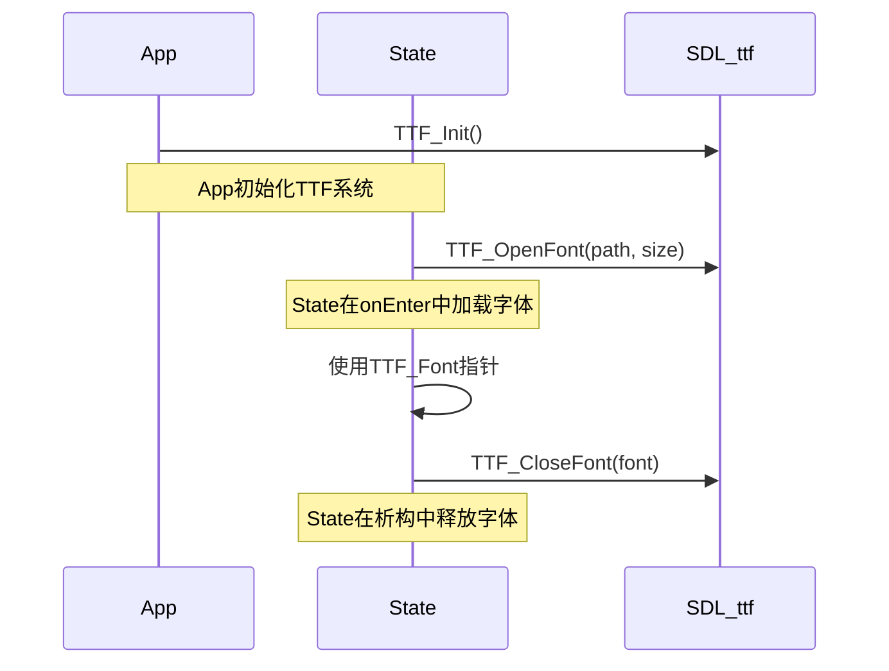
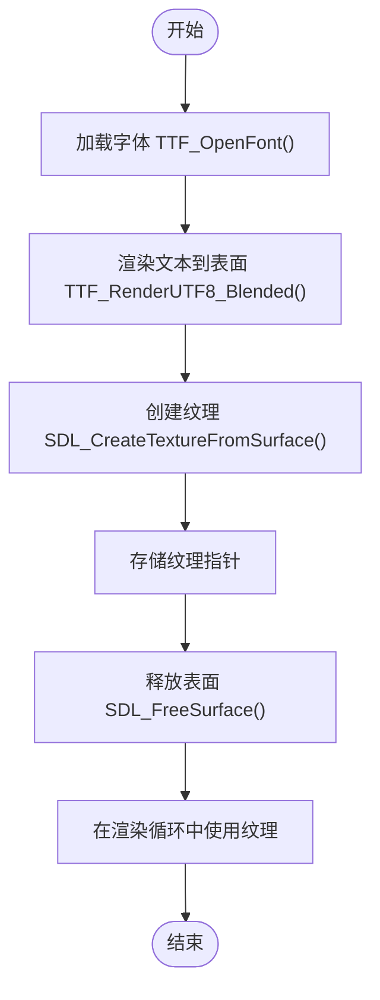

# 资源管理

<cite>
**本文档中引用的文件**   
- [App.h](file://Tracer/src/core/App.h)
- [App.cpp](file://Tracer/src/core/App.cpp)
- [MainMenuState.h](file://Tracer/src/states/MainMenuState.h)
- [MainMenuState.cpp](file://Tracer/src/states/MainMenuState.cpp)
- [TestState.cpp](file://Tracer/src/states/TestState.cpp)
- [State.h](file://Tracer/src/core/State.h)
</cite>

## 目录
1. [引言](#引言)
2. [资源全生命周期管理](#资源全生命周期管理)
3. [App类中的资源集中加载](#app类中的资源集中加载)
4. [纹理创建流程](#纹理创建流程)
5. [RAII原则与资源释放](#raii原则与资源释放)
6. [异常处理与错误恢复](#异常处理与错误恢复)
7. [资源路径管理](#资源路径管理)
8. [内存监控与性能分析](#内存监控与性能分析)
9. [渲染优化策略](#渲染优化策略)
10. [总结](#总结)

## 引言

本项目采用SDL2框架构建游戏系统，涉及大量字体、纹理等图形资源的管理。资源管理是确保程序稳定运行、避免内存泄漏和提升性能的关键环节。本文档旨在系统性地阐述该游戏项目中资源管理的最佳实践，涵盖从资源加载、使用到释放的完整生命周期，并提供具体的优化建议。

## 资源全生命周期管理

游戏资源的管理应遵循明确的生命周期：初始化时加载、运行时共享使用、退出时彻底释放。在本项目中，`App`类作为核心管理器，负责SDL系统的初始化与销毁，而具体的资源（如字体、纹理）则由各个`State`子类在进入时加载，在退出时释放。这种分层管理模式既保证了系统级资源的统一管理，又赋予了各游戏状态对自身资源的控制权。

**Section sources**
- [App.cpp](file://Tracer/src/core/App.cpp#L1-L78)
- [State.h](file://Tracer/src/core/State.h#L1-L16)

## App类中的资源集中加载

尽管`App`类本身不直接加载字体资源，但它为所有`State`提供了统一的资源加载环境。`App`的构造函数通过`init`方法集中初始化SDL和SDL_ttf子系统，这为后续所有状态中字体的加载奠定了基础。`init`方法中调用`TTF_Init()`，确保了TTF库的可用性，使得任何`State`在`onEnter`阶段都能安全地调用`TTF_OpenFont`来获取`TTF_Font`指针。

这种设计模式体现了集中化管理的思想：`App`负责创建和维护一个稳定的运行时环境，而各个`State`则在这个环境中按需加载和使用资源。`App`通过`getRenderer()`方法向所有`State`提供共享的`SDL_Renderer`指针，确保了纹理创建和渲染操作的一致性。

**Diagram sources**
- [App.cpp](file://Tracer/src/core/App.cpp#L15-L20)
- [MainMenuState.cpp](file://Tracer/src/states/MainMenuState.cpp#L21-L23)

**Section sources**
- [App.cpp](file://Tracer/src/core/App.cpp#L15-L20)
- [MainMenuState.cpp](file://Tracer/src/states/MainMenuState.cpp#L21-L23)

## 纹理创建流程

在SDL2中，直接渲染文本效率较低，因为每次渲染都需要调用TTF库进行光栅化。为了提高性能，项目采用了“预生成纹理”的优化策略。该流程分为两个关键步骤：

1.  **从字体生成表面（Surface）**：使用`TTF_RenderUTF8_Blended`函数，将指定的文本字符串和颜色信息传递给TTF库，库会返回一个包含已渲染文本像素数据的`SDL_Surface`。例如，在`MainMenuState`中，标题“溯洄遗梦”就是通过此方法生成一个`SDL_Surface`。
2.  **从表面创建纹理（Texture）**：使用`SDL_CreateTextureFromSurface`函数，将上一步生成的`SDL_Surface`转换为`SDL_Texture`。纹理是GPU优化的资源，可以被`SDL_Renderer`高效地批量绘制和重复使用。

通过将文本一次性渲染到纹理中，后续的渲染操作只需调用`SDL_RenderCopy`来复制该纹理，极大地减少了CPU的计算负担，显著提升了渲染帧率。

**Diagram sources**
- [MainMenuState.cpp](file://Tracer/src/states/MainMenuState.cpp#L25-L30)
- [TestState.cpp](file://Tracer/src/states/TestState.cpp#L50-L55)

**Section sources**
- [MainMenuState.cpp](file://Tracer/src/states/MainMenuState.cpp#L25-L30)
- [TestState.cpp](file://Tracer/src/states/TestState.cpp#L50-L55)

## RAII原则与资源释放

项目严格遵循RAII（Resource Acquisition Is Initialization）原则，确保资源的获取和释放与对象的生命周期绑定，从而防止资源泄漏。

*   **资源获取**：在`State`子类（如`MainMenuState`、`TestState`）的`onEnter`方法中，通过`TTF_OpenFont`和`SDL_CreateTextureFromSurface`等函数获取资源。这些操作通常在对象完全构造后执行。
*   **资源释放**：在`State`子类的析构函数中，通过`TTF_CloseFont`和`SDL_DestroyTexture`等函数显式释放所持有的资源。例如，`TestState`的析构函数会检查`font_`、`smallFont_`和`titleTex_`是否非空，若非空则调用相应的销毁函数。

这种“在析构函数中释放”的模式是RAII的核心。即使程序因异常而提前退出某个`State`，C++的析构机制也能保证其析构函数被调用，从而安全地释放资源。

**Section sources**
- [TestState.cpp](file://Tracer/src/states/TestState.cpp#L6-L15)
- [MainMenuState.h](file://Tracer/src/states/MainMenuState.h#L30-L32)

## 异常处理与错误恢复

项目中的资源加载代码包含了基本的错误处理机制。在调用`TTF_OpenFont`后，会立即检查返回的指针是否为`nullptr`。如果加载失败，代码会通过`SDL_Log`输出错误日志，记录`TTF_GetError()`提供的详细错误信息。

然而，当前的错误处理策略存在改进空间。目前，当字体加载失败时，代码会记录日志并返回，但没有提供默认的回退策略。例如，可以预加载一个系统自带的备用字体（如`DejaVuSans.ttf`），当主字体加载失败时自动切换到备用字体，从而保证游戏界面的基本可读性，而不是出现无文字的界面。

**Section sources**
- [TestState.cpp](file://Tracer/src/states/TestState.cpp#L42-L46)
- [MainMenuState.cpp](file://Tracer/src/states/MainMenuState.cpp#L23-L24)

## 资源路径管理

当前代码中存在一个显著的风险：资源路径被硬编码在源代码中。例如，`TTF_OpenFont("assets/fonts/Sanji.ttf", ...)`直接指定了字体文件的相对路径。这种做法有以下弊端：

1.  **缺乏灵活性**：如果资源文件被移动或重命名，必须修改并重新编译代码。
2.  **难以维护**：路径分散在多个`State`文件中，修改时需要逐一查找。
3.  **不利于配置**：无法通过外部配置文件动态切换资源。

建议引入一个资源管理器类（`ResourceManager`）或使用配置文件（如JSON或XML）来集中管理所有资源的路径。`App`类可以在初始化时读取配置文件，构建一个资源路径映射表。各`State`在需要资源时，通过资源管理器的接口（如`getFontPath("title")`）来获取路径，从而实现代码与资源路径的解耦。

**Section sources**
- [MainMenuState.cpp](file://Tracer/src/states/MainMenuState.cpp#L21-L22)
- [TestState.cpp](file://Tracer/src/states/TestState.cpp#L42-L43)

## 内存监控与性能分析

为了有效管理内存，建议实现一个简单的内存监控系统。可以在`App`类或一个全局的`ResourceManager`中添加以下监控功能：

*   **纹理计数器**：维护一个静态变量`textureCount`，在每次成功调用`SDL_CreateTextureFromSurface`后递增，在调用`SDL_DestroyTexture`后递减。这有助于开发者实时了解当前加载的纹理数量。
*   **内存占用估算**：虽然精确计算GPU内存占用较为复杂，但可以估算CPU端的内存。`SDL_Surface`的内存占用可粗略计算为`width * height * bytes_per_pixel`。在创建和销毁表面时，累加和减去这个估算值，可以得到一个近似的内存使用情况。

这些监控数据可以通过调试菜单或日志输出，帮助开发者识别内存泄漏或资源加载过多的问题。

## 渲染优化策略

项目中已经应用了“预生成纹理”这一重要优化策略。在此基础上，可以根据文本的使用频率进一步优化：

*   **高频文本（如UI标签、标题）**：应采用预生成纹理策略。这些文本内容固定，会被反复渲染，预生成可以带来巨大的性能提升。
*   **低频或动态文本（如玩家名字、实时计数）**：如果文本内容频繁变化，预生成纹理的收益会降低，因为每次变化都需要重新创建纹理，这本身也有开销。对于这类文本，可以考虑直接使用`TTF_RenderText`系列函数进行渲染，或者采用纹理图集（Texture Atlas）技术，将常用字符预先渲染到一张大纹理上，然后通过复制子区域来拼出完整文本。

在`MainMenuState`中渲染“乱码数据流”时，代码对每个字符都单独创建了`SDL_Surface`和`SDL_Texture`，这是一个性能瓶颈。更优的做法是，将一整行字符先渲染到一个`SDL_Surface`上，然后只创建一次`SDL_Texture`，这样可以显著减少API调用次数。

## 总结

本项目在资源管理方面展现了良好的实践，如使用RAII原则防止泄漏、通过预生成纹理优化渲染性能。核心的`App`类为资源加载提供了统一的环境，而各`State`则负责具体资源的生命周期管理。未来的主要改进方向是解决资源路径的硬编码问题，通过引入资源管理器或配置文件来增强项目的可维护性和灵活性。同时，完善错误处理的回退机制和实现内存监控，将使项目更加健壮和易于调试。