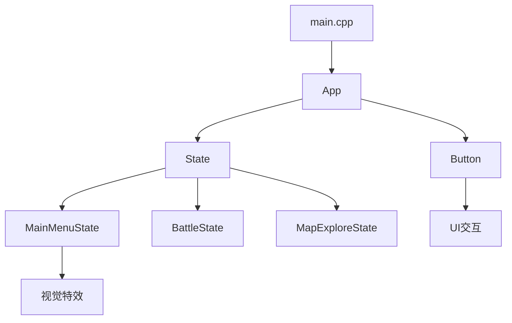
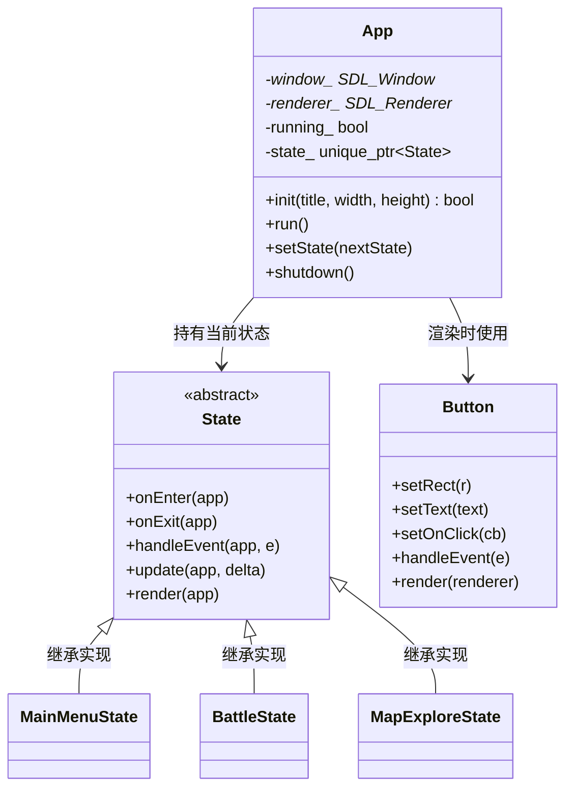
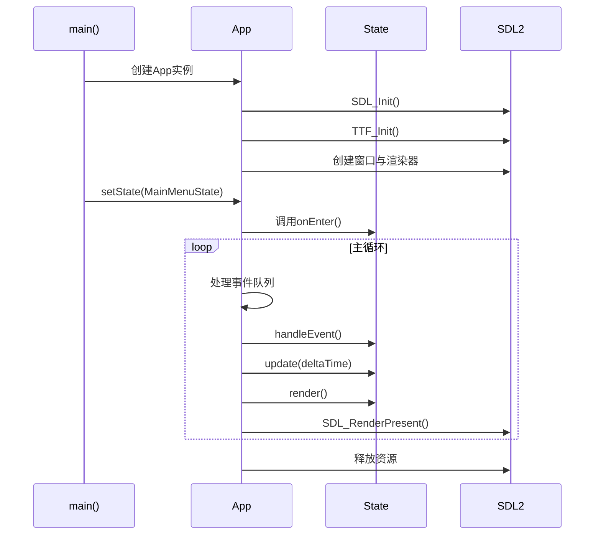
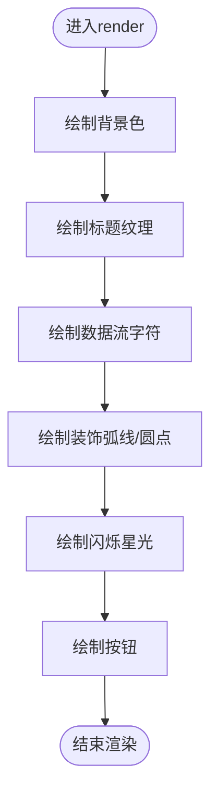
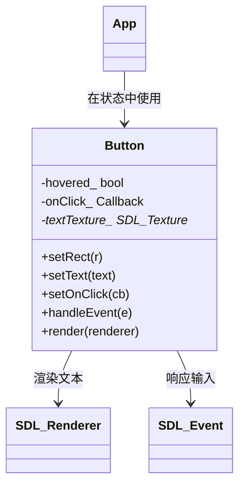
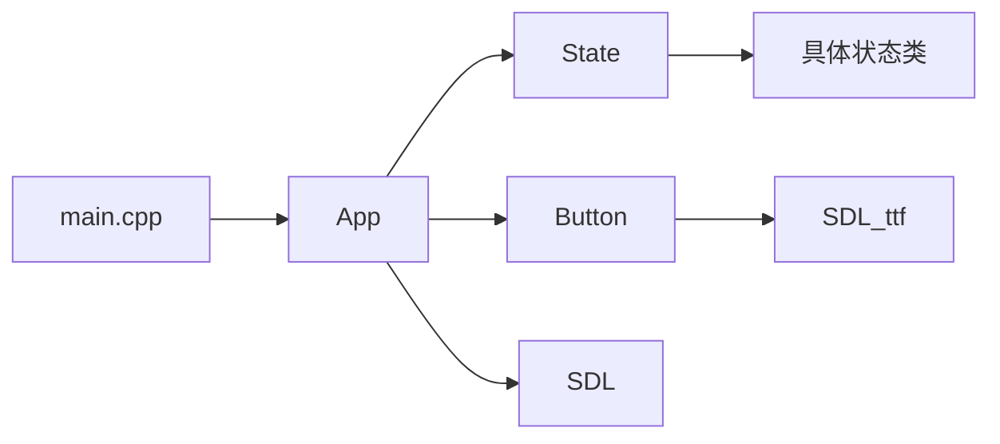

# 项目概述

<cite>
**本文档引用文件**  
- [main.cpp](file://Tracer/src/main.cpp)
- [App.h](file://Tracer/src/core/App.h)
- [App.cpp](file://Tracer/src/core/App.cpp)
- [State.h](file://Tracer/src/core/State.h)
- [Button.h](file://Tracer/src/ui/Button.h)
- [MainMenuState.h](file://Tracer/src/states/MainMenuState.h)
</cite>

## 目录
1. [引言](#引言)
2. [项目结构](#项目结构)
3. [核心组件](#核心组件)
4. [架构概览](#架构概览)
5. [详细组件分析](#详细组件分析)
6. [依赖分析](#依赖分析)
7. [性能考量](#性能考量)
8. [故障排除指南](#故障排除指南)
9. [结论](#结论)

## 引言
《溯洄遗梦》是一个基于C++与SDL2开发的2D叙事类桌面游戏项目，旨在提供一个模块化、可扩展的游戏框架。该项目融合了状态驱动机制与视觉特效系统，支持多场景切换（如主菜单、战斗、探索等），适用于具备C++基础和SDL2使用经验的中级开发者。通过清晰的状态模式实现与UI组件设计，本项目不仅具备实际游戏功能，还具有教学价值，帮助开发者深入理解状态管理、事件处理与渲染流程。

## 项目结构
项目采用分层模块化结构，主要分为`core`、`states`和`ui`三大目录：
- `core`：包含核心应用类`App`与状态基类`State`
- `states`：存放所有游戏状态类，如`MainMenuState`、`BattleState`等
- `ui`：封装用户界面组件，如`Button`
- `main.cpp`：程序入口点

该结构清晰分离关注点，便于维护与扩展。

**Diagram sources**
- [main.cpp](file://Tracer/src/main.cpp#L1-L13)
- [App.h](file://Tracer/src/core/App.h#L1-L30)

**Section sources**
- [main.cpp](file://Tracer/src/main.cpp#L1-L13)
- [App.h](file://Tracer/src/core/App.h#L1-L30)

## 核心组件
本项目三大核心组件为`App`、`State`与`Button`。`App`作为单例管理整个游戏生命周期；`State`定义状态接口，实现多场景切换；`Button`提供可复用的UI交互元素。这些组件共同构成一个灵活且易于扩展的游戏架构。

**Section sources**
- [App.h](file://Tracer/src/core/App.h#L1-L30)
- [State.h](file://Tracer/src/core/State.h#L1-L17)
- [Button.h](file://Tracer/src/ui/Button.h#L1-L33)

## 架构概览
系统采用状态模式驱动整体流程。`App`类初始化SDL环境后进入主循环，持续分发事件、更新状态并渲染画面。当前状态由`std::unique_ptr<State>`持有，通过`setState()`实现无缝切换。每个状态需实现`onEnter`、`onExit`、`handleEvent`、`update`和`render`方法，确保行为一致性。

**Diagram sources**
- [App.h](file://Tracer/src/core/App.h#L1-L30)
- [State.h](file://Tracer/src/core/State.h#L1-L17)
- [Button.h](file://Tracer/src/ui/Button.h#L1-L33)

## 详细组件分析

### App类分析
`App`类是整个游戏的主控中心，负责SDL初始化、窗口创建、主循环执行与资源释放。其`run()`方法实现标准游戏循环：事件处理 → 更新逻辑 → 渲染画面。

#### 程序启动流程
从`main()`函数开始：
1. 创建`App`实例
2. 调用`init()`初始化SDL与窗口
3. 设置初始状态为`MainMenuState`
4. 启动主循环`run()`

此流程确保资源安全初始化与释放，符合RAII原则。

**Diagram sources**
- [main.cpp](file://Tracer/src/main.cpp#L5-L12)
- [App.cpp](file://Tracer/src/core/App.cpp#L15-L77)
- [App.h](file://Tracer/src/core/App.h#L1-L30)

**Section sources**
- [main.cpp](file://Tracer/src/main.cpp#L5-L12)
- [App.cpp](file://Tracer/src/core/App.cpp#L15-L77)

### State状态系统分析
`State`基类定义五种虚方法，所有具体状态（如`MainMenuState`）必须实现。`setState()`方法在切换时自动调用旧状态的`onExit()`与新状态的`onEnter()`，实现资源准备与清理。

#### 视觉特效实现
以`MainMenuState`为例，其内部维护数据流、装饰图案与闪烁星光等视觉元素，在`render()`中逐帧绘制，营造科技感氛围。

**Diagram sources**
- [State.h](file://Tracer/src/core/State.h#L1-L17)
- [MainMenuState.h](file://Tracer/src/states/MainMenuState.h#L1-L69)

**Section sources**
- [State.h](file://Tracer/src/core/State.h#L1-L17)
- [MainMenuState.h](file://Tracer/src/states/MainMenuState.h#L1-L69)

### Button UI组件分析
`Button`类封装矩形区域、文本、点击回调与悬停状态，支持字体设置与纹理缓存。通过`handleEvent()`检测鼠标进入、离开与点击事件，实现交互逻辑。

**Diagram sources**
- [Button.h](file://Tracer/src/ui/Button.h#L1-L33)
- [Button.cpp](file://Tracer/src/ui/Button.cpp#L1-L50)

**Section sources**
- [Button.h](file://Tracer/src/ui/Button.h#L1-L33)

## 依赖分析
项目依赖SDL2与SDL2_ttf库，通过条件编译兼容不同安装路径。核心组件间依赖清晰：
- `App`依赖`State`与`Button`
- 所有具体状态依赖`State`与`Button`
- `Button`依赖SDL2与TTF字体系统

**Diagram sources**
- [go.mod](file://Tracer/go.mod#L1-L10)
- [App.h](file://Tracer/src/core/App.h#L1-L30)

**Section sources**
- [App.h](file://Tracer/src/core/App.h#L1-L30)
- [Button.h](file://Tracer/src/ui/Button.h#L1-L33)

## 性能考量
- 使用`SDL_RENDERER_ACCELERATED | SDL_RENDERER_PRESENTVSYNC`确保硬件加速与垂直同步
- `deltaSeconds`基于`SDL_GetPerformanceCounter()`计算，保证帧率稳定
- 纹理缓存避免重复创建，提升渲染效率
- 事件轮询采用`SDL_PollEvent`非阻塞模式，响应及时

## 故障排除指南
常见问题包括SDL初始化失败、字体加载异常、纹理创建失败等。建议检查：
- SDL2与TTF库是否正确链接
- 字体文件路径是否正确
- 显卡驱动是否支持硬件渲染
- 内存泄漏（确保`shutdown()`被调用）

**Section sources**
- [App.cpp](file://Tracer/src/core/App.cpp#L15-L77)
- [App.h](file://Tracer/src/core/App.h#L1-L30)

## 结论
《溯洄遗梦》项目提供了一个结构清晰、可扩展性强的C++游戏框架。其状态驱动架构便于添加新场景，UI组件设计利于复用，视觉特效系统增强表现力。对于中级C++开发者而言，该项目是学习状态模式、事件驱动编程与SDL2图形渲染的优秀实践案例。未来可扩展网络功能、资源管理器或脚本系统，进一步提升框架能力。